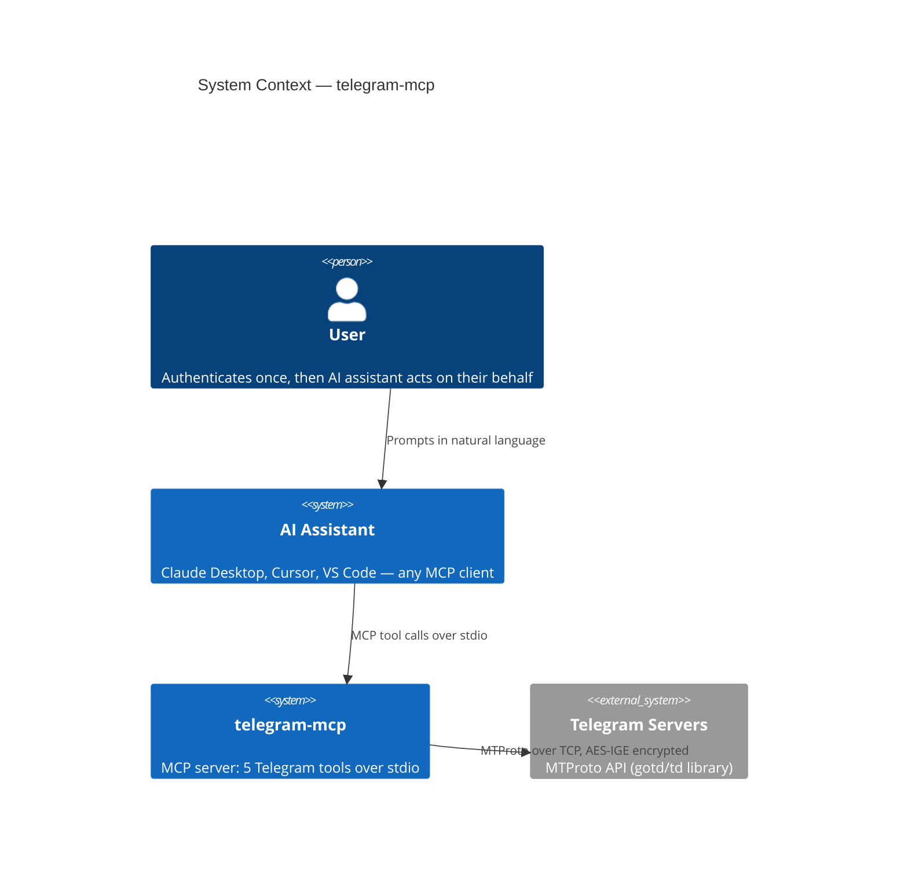
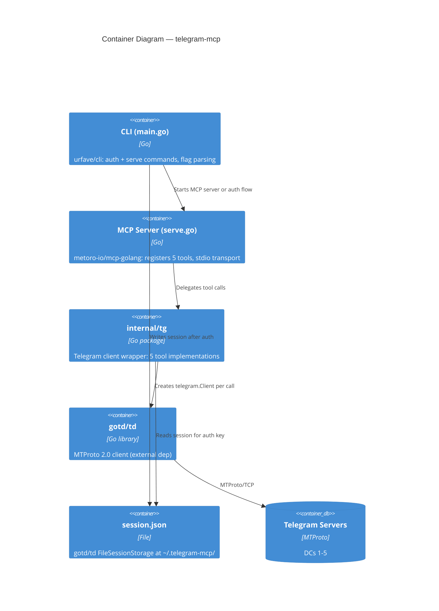
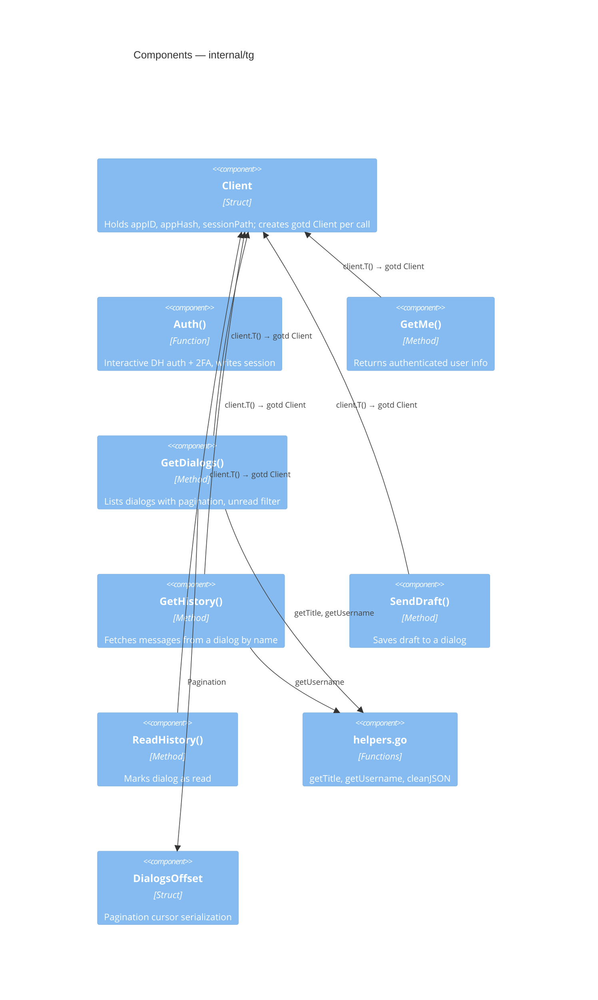
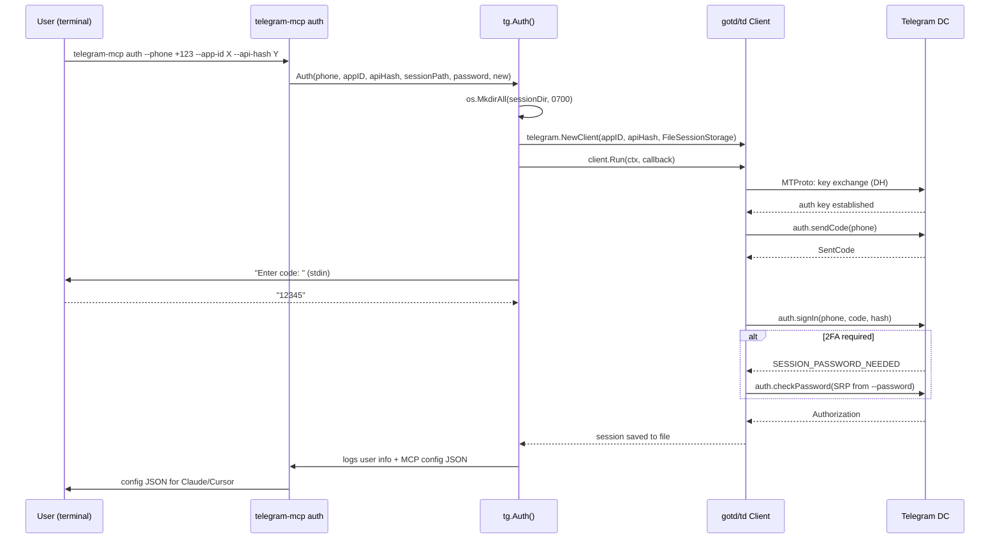
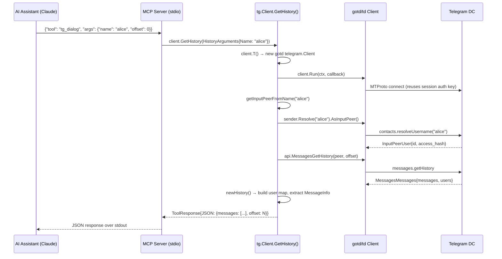
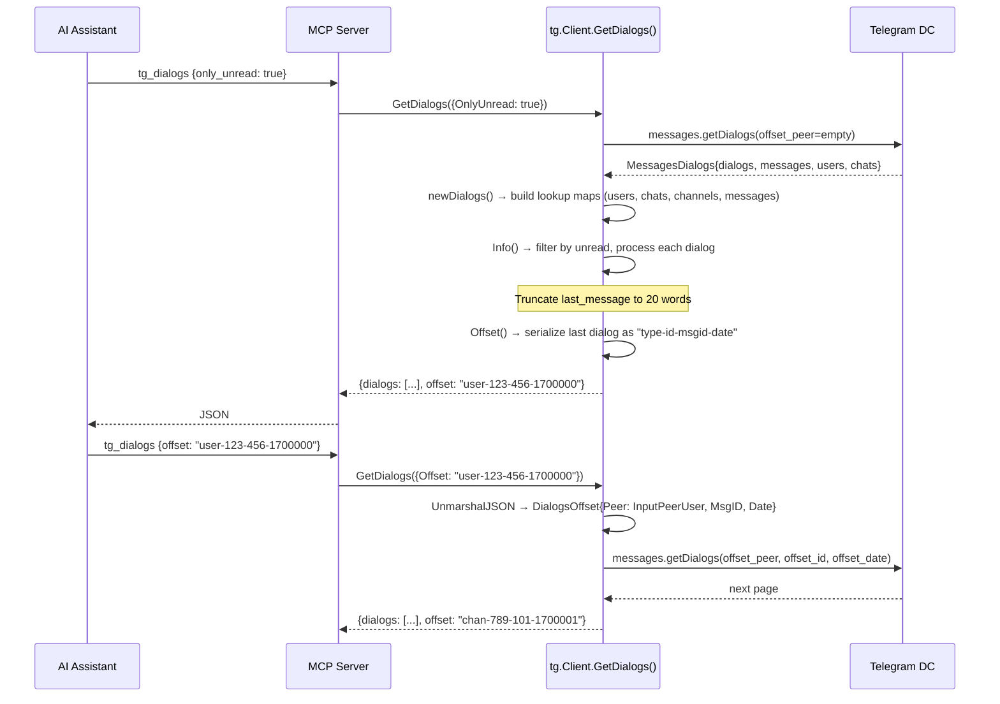
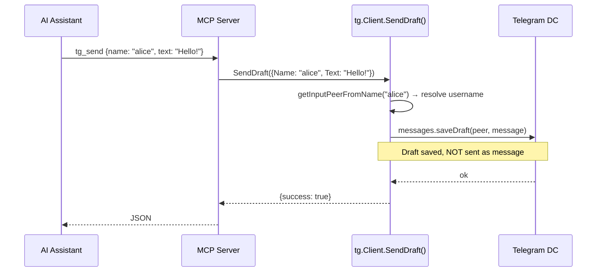
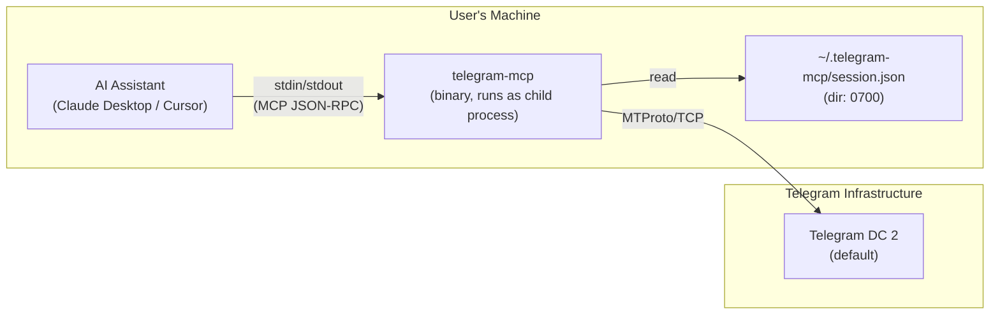

# PROJECT BRIEF: chaindead/telegram-mcp

> **Change log**: 2026-04-24 — initial version.

---

## 1. TL;DR

**telegram-mcp** (`github.com/chaindead/telegram-mcp`) is a Go-based **MCP (Model Context
Protocol) server** that bridges Telegram with AI assistants (Claude, Cursor). It exposes
5 tools over stdio transport: get account info, list dialogs, fetch message history,
save drafts, and mark as read. The stack is Go 1.24, `gotd/td` for MTProto, and
`metoro-io/mcp-golang` for the MCP protocol. It is deployed as a single binary
(Homebrew, npm, GitHub Releases). The main risk is **no authorization layer between the
AI assistant and the user's full Telegram account** — any MCP client can read all
messages and save drafts on behalf of the authenticated user.

---

## 2. Glossary

| Term | Meaning in this codebase |
|------|--------------------------|
| **MCP** | Model Context Protocol — standard for AI assistant ↔ tool communication |
| **Tool** | MCP concept: a callable function exposed to AI assistants |
| **Dialog** | Telegram conversation: DM (user/bot), group chat, or channel |
| **Draft** | Unsent message saved in a dialog (Telegram's native draft feature) |
| **InputPeer** | gotd/td type identifying a dialog target (user, chat, or channel) |
| **Session** | JSON file storing the gotd/td auth key for persistent login |
| **Offset** | Pagination cursor, serialized as `{type}-{id}-{msg_id}-{date}` |
| **Access hash** | Telegram's per-entity authorization token (required for channels) |
| **gotd/td** | Go MTProto client library (see `research/gotd-cc.md`) |
| **stdio transport** | MCP communication over stdin/stdout (no network) |

---

## 3. Quick start

```bash
# Already present at research/mcp/chaindead
cd research/mcp/chaindead

# Build
CGO_ENABLED=0 go build -o ./bin/telegram-mcp .

# Create a Telegram app at https://my.telegram.org/auth
# Get APP_ID and API_HASH

# Authenticate (interactive — will prompt for code)
./bin/telegram-mcp auth \
  --app-id YOUR_APP_ID \
  --api-hash YOUR_API_HASH \
  --phone +1234567890

# Run as MCP server (stdio mode for Claude/Cursor)
TG_APP_ID=YOUR_APP_ID TG_API_HASH=YOUR_API_HASH ./bin/telegram-mcp

# Dry run — test all tools
TG_APP_ID=YOUR_APP_ID TG_API_HASH=YOUR_API_HASH \
  TG_TEST_USERNAME=some_user ./bin/telegram-mcp --dry

# Or use Task runner
task build
task run -- auth --app-id ... --api-hash ... --phone ...
```

---

## 4. C4: Context



The user authenticates once via CLI (`auth` command). After that, the AI assistant
has full access to the user's Telegram account through 5 MCP tools with no further
authorization checks.

---

## 5. C4: Containers



| Container | Technology | Purpose |
|-----------|-----------|---------|
| CLI (`main.go`, `auth.go`) | Go + urfave/cli v3 | Entry point, flag parsing, auth command |
| MCP Server (`serve.go`) | Go + mcp-golang | Registers tools, runs stdio transport |
| `internal/tg` | Go | 5 tool implementations + helpers |
| `gotd/td` v0.121.0 | Go (external) | MTProto client library |
| `session.json` | File (0700 dir) | Persistent auth key storage |

---

## 6. C4: Components

### 6.1 internal/tg package



---

## 7. Data flows

### 7.1 Authentication (one-time, interactive)



**Trust boundary**: After auth, the session file grants full account access.
Anyone with the file can impersonate the user.

_Source_: `auth.go:14-65`, `internal/tg/auth.go:17-68`.

### 7.2 MCP tool call (e.g., tg_dialog)



**Important**: A new `telegram.Client` is created **per tool call** (`client.T()`
at `internal/tg/client.go:19-28`). This means each call establishes a new MTProto
connection, performs key exchange (or restores from session), and disconnects after.

_Source_: `serve.go:90-117`, `internal/tg/history.go:26-70`.

### 7.3 Dialog listing with pagination



_Source_: `internal/tg/dialogs.go:57-107`, `internal/tg/dialogs_offset.go`.

### 7.4 Send draft



**Critical design choice**: `tg_send` saves a **draft**, not a sent message.
The user must manually send the draft from their Telegram client. This is a
deliberate safety measure.

_Source_: `internal/tg/draft.go:22-52`.

---

## 8. Deployment / runtime topology



**Distribution channels** (`.goreleaser.yaml`):
- Homebrew: `brew install chaindead/tap/telegram-mcp`
- npm: `npx -y @chaindead/telegram-mcp`
- GitHub Releases: Linux/macOS/Windows, x86_64/arm64
- From source: `go install github.com/chaindead/telegram-mcp@latest`

**CI/CD** (`.github/workflows/release.yml`): On tag push → GoReleaser → binaries +
Homebrew + npm publish.

---

## 9. Dependencies and integrations

| Dependency | Version | Purpose | Criticality | Fallback |
|-----------|---------|---------|-------------|----------|
| `gotd/td` | v0.121.0 | Telegram MTProto client | **Critical** | None |
| `metoro-io/mcp-golang` | v0.8.0 | MCP server framework | **Critical** | None |
| `urfave/cli/v3` | v3.1.0 | CLI framework | High | Replace with stdlib |
| `invopop/jsonschema` | v0.12.0 | JSON Schema for MCP tool args | High | Manual schema |
| `rs/zerolog` | v1.34.0 | Structured logging | Medium | `log/slog` |
| `pkg/errors` | v0.9.1 | Error wrapping | Low | `fmt.Errorf` |
| `tidwall/gjson` | v1.18.0 | JSON cleanup for debug output | Low | Remove |
| `spf13/pflag` | v1.0.6 | CLI flags (test command) | Low | stdlib `flag` |
| `x/time` | v0.11.0 | Rate limiting (test command) | Low | Custom |

Transitive: `gotd/ige`, `gotd/neo` (crypto), `coder/websocket`, OpenTelemetry, `klauspost/compress`.

---

## 10. Hot files map

This is a small project (~1,965 lines). Nearly every change touches:

| File | Lines | Description |
|------|-------|-------------|
| `main.go` | 106 | CLI entry, flags, app structure |
| `serve.go` | 123 | MCP server setup, tool registration, dry-run |
| `auth.go` | 66 | Auth CLI command |
| `internal/tg/client.go` | 28 | Client struct, gotd Client factory |
| `internal/tg/auth.go` | 68 | Auth flow: phone → code → 2FA → session |
| `internal/tg/dialogs.go` | 355 | Dialog listing, filtering, type resolution |
| `internal/tg/dialogs_offset.go` | 99 | Pagination offset serialize/deserialize |
| `internal/tg/history.go` | 178 | Message history fetch + InputPeer resolution |
| `internal/tg/draft.go` | 53 | Draft saving |
| `internal/tg/read.go` | 84 | Mark-as-read (users/chats vs channels) |
| `internal/tg/me.go` | 52 | GetMe tool |
| `internal/tg/helpers.go` | 112 | Title/username extraction, JSON cleaning |
| `go.mod` | 59 | Dependencies |

---

## 11. Reading order

The project is small enough to read in ~1 hour:

1. **`README.md`** — what it does, how to install (5 min)
2. **`main.go`** — CLI structure, flags, env vars (5 min)
3. **`auth.go`** — Auth command (3 min)
4. **`serve.go`** — MCP server setup, tool registration, dry-run (5 min)
5. **`internal/tg/client.go`** — Client struct and factory (2 min)
6. **`internal/tg/auth.go`** — Auth flow implementation (5 min)
7. **`internal/tg/me.go`** — Simplest tool: GetMe (3 min)
8. **`internal/tg/dialogs.go`** — Core complexity: dialog processing (15 min)
9. **`internal/tg/dialogs_offset.go`** — Pagination (5 min)
10. **`internal/tg/history.go`** — Message fetch + peer resolution (10 min)
11. **`internal/tg/draft.go`** — Draft saving (3 min)
12. **`internal/tg/read.go`** — Mark as read (5 min)
13. **`internal/tg/helpers.go`** — Utility functions (5 min)
14. **`cmd/test/main.go`** + **`cmd/test/unread.go`** — Test harness (10 min)
15. **`Taskfile.yml`** — Build tasks (2 min)

---

## 12. Invariants and gotchas

1. **New gotd Client per tool call**: `client.T()` at `internal/tg/client.go:19-28`
   creates a **new** `telegram.Client` every time a tool is called. This means a
   fresh MTProto connection is established and torn down per request. There is no
   connection pooling or reuse. Performance-intensive for sequential calls.

2. **Draft, not message**: `tg_send` calls `MessagesSaveDraft`, not `MessagesSendMessage`
   (`internal/tg/draft.go:33`). The AI assistant cannot actually send messages, only
   save drafts. This is a deliberate safety choice.

3. **NoUpdates mode**: The client runs with `NoUpdates: true` (`internal/tg/client.go:24`).
   It does not receive live updates — every call is a stateless request-response.

4. **Dialog name formats**: `getInputPeerFromName()` at `internal/tg/history.go:72-101`
   accepts three formats:
   - Plain username: resolved via Telegram API
   - `cht[{chatID}]`: direct chat ID
   - `chn[{channelID}:{accessHash}]`: channel with access hash
   Mixing these up will cause resolution failures.

5. **Last message truncation**: Dialog listing truncates `last_message.text` to 20 words
   (`internal/tg/dialogs.go:248-251`). Full message requires `tg_dialog`.

6. **Pagination offset format**: `{type}-{id}-{msg_id}-{date}` with dash separator
   (`internal/tg/dialogs_offset.go:57`). If any field contains a dash, parsing breaks.
   Integer fields are safe, but the format is fragile.

7. **Channel read uses synthetic PtsCount**: `ReadHistory` for channels returns a
   synthetic `PtsCount=1` on success (`internal/tg/read.go:52-57`), not the real
   `PtsCount` from the server. This is because `ChannelsReadHistory` returns `bool`,
   not `MessagesAffectedMessages`.

8. **Phone number logged**: `auth.go:22-27` logs the phone number and api-hash to
   stderr. In production, these appear in logs.

9. **Debug log file permissions**: `main.go:23` creates debug log with `0666`
   permissions — world-readable.

10. **Session directory is 0700, but session file permissions are not set**:
    `internal/tg/auth.go:29` creates the directory with 0700, but `gotd/td`'s
    `FileSessionStorage` creates the session file with default umask permissions.

11. **`OptionsFromEnvironment` silently ignored**: `internal/tg/client.go:26` calls
    `telegram.OptionsFromEnvironment(opts)` but ignores the error with `_`. If env
    vars are malformed, the default options are used silently.

---

## 13. Security findings

### Critical: None found

### High

#### S-01: No authorization between AI assistant and Telegram account
- **Category**: STRIDE/Elevation of Privilege; OWASP A01 (Broken Access Control)
- **Severity**: High (impact: full account access; likelihood: high — by design)
- **File**: `serve.go:90-113`
- **Evidence**: All 5 tools are registered without any authorization:
  ```go
  server.RegisterTool("tg_me", "...", client.GetMe)
  server.RegisterTool("tg_dialogs", "...", client.GetDialogs)
  server.RegisterTool("tg_dialog", "...", client.GetHistory)
  server.RegisterTool("tg_send", "...", client.SendDraft)
  server.RegisterTool("tg_read", "...", client.ReadHistory)
  ```
  Any MCP client that can launch the binary gets full read access to all dialogs
  and can save drafts + mark messages as read.
- **Exploit**: A malicious MCP client (or prompt injection in the AI) could read
  private messages, exfiltrate data, or vandalize drafts.
- **Mitigation**: The MCP protocol runs over stdio (local only), and `tg_send` only
  saves drafts. But there is no per-tool authorization, dialog allowlist, or
  confirmation mechanism.
- **Recommendation**: Add a configurable allowlist of dialog names/IDs. Consider
  requiring user confirmation for sensitive operations.

#### S-02: Session file grants full account access without protection
- **Category**: STRIDE/Information Disclosure; CWE-522
- **Severity**: High (impact: full account takeover; likelihood: medium — local
  file access required)
- **File**: `internal/tg/client.go:21-23`
- **Evidence**: Session file is used by `FileSessionStorage` with no encryption.
  Directory is 0700 (`internal/tg/auth.go:29`), but the file itself inherits
  default umask.
- **Exploit**: Copy `~/.telegram-mcp/session.json` → full access to Telegram account.
- **Recommendation**: Set explicit 0600 permissions on session file. Consider
  encrypting the session at rest. Document the risk clearly.

### Medium

#### S-03: Phone number and API hash logged to stderr
- **Category**: STRIDE/Information Disclosure; CWE-532
- **Severity**: Medium (impact: credential exposure in logs; likelihood: medium)
- **File**: `auth.go:22-27`
- **Evidence**:
  ```go
  log.Info().
      Str("phone", phone).
      Str("api-hash", apiHash).
      ...
      Msg("Authenticate with Telegram")
  ```
- **Exploit**: Log aggregation or terminal history captures credentials.
- **Recommendation**: Mask phone number (show last 4 digits) and never log api-hash.

#### S-04: Debug log file created with 0666 permissions
- **Category**: STRIDE/Information Disclosure; CWE-732
- **Severity**: Medium (impact: log data exposure; likelihood: low — only when
  `TG_DEBUG_LOG` is set)
- **File**: `main.go:23`
- **Evidence**:
  ```go
  logFile, err := os.OpenFile(debugPath, os.O_CREATE|os.O_WRONLY|os.O_APPEND, 0666)
  ```
- **Exploit**: Any user on the system can read debug logs, which may contain
  message content and user IDs.
- **Recommendation**: Use `0600` permissions.

#### S-05: New connection per tool call (DoS surface)
- **Category**: STRIDE/Denial of Service; CWE-400
- **Severity**: Medium (impact: rate limiting / account ban; likelihood: medium —
  AI assistants may call tools rapidly)
- **File**: `internal/tg/client.go:19-28`
- **Evidence**: `T()` creates a new `telegram.Client` per call. No connection
  reuse, no rate limiting.
- **Exploit**: AI assistant making many rapid tool calls → Telegram rate limits
  (`FloodWaitError`) → temporary account ban.
- **Recommendation**: Reuse a single `telegram.Client` instance. Add rate limiting
  between tool calls.

#### S-06: InputPeer resolution from untrusted AI input
- **Category**: STRIDE/Spoofing; OWASP A03 (Injection)
- **Severity**: Medium (impact: access wrong dialog; likelihood: low)
- **File**: `internal/tg/history.go:72-101`
- **Evidence**: `getInputPeerFromName()` parses AI-provided `name` parameter:
  ```go
  case strings.HasPrefix(name, "chn") && isCustom:
      fmt.Sscanf(name, "chn[%d:%d]", &channelPeer.ChannelID, &channelPeer.AccessHash)
  ```
  The AI provides channel ID and access hash directly. A prompt injection could
  craft a `chn[...]` string targeting any channel.
- **Mitigation**: Access hash is required and Telegram validates it server-side.
  But the AI has access to all access hashes via `tg_dialogs`.
- **Recommendation**: Document that the AI can access any dialog the user has
  access to. Consider restricting to dialogs seen in a recent `tg_dialogs` call.

### Low

#### S-07: Error wrapping inconsistency
- **Category**: Code Quality
- **Severity**: Low
- **File**: `internal/tg/draft.go:38,43`
- **Evidence**: Error messages say "failed to get history" but the function is
  `SendDraft`. Copy-paste error.
- **Recommendation**: Fix error messages to match actual operation.

#### S-08: Offset parsing fragility
- **Category**: CWE-20 (Improper Input Validation)
- **Severity**: Low (impact: pagination failure; likelihood: low — integers only)
- **File**: `internal/tg/dialogs_offset.go:60-98`
- **Evidence**: `strings.Split(string(data), "-")` — expects exactly 4 parts.
  No validation that the raw string is properly quoted JSON.
- **Recommendation**: Add input validation and clear error messages.

#### S-09: `OptionsFromEnvironment` error silently ignored
- **Category**: CWE-391 (Unchecked Error Condition)
- **Severity**: Low (impact: silent fallback to defaults; likelihood: low)
- **File**: `internal/tg/client.go:26`
- **Evidence**: `opts, _ = telegram.OptionsFromEnvironment(opts)`
- **Recommendation**: Log a warning if the error is non-nil.

---

## 14. Open questions

1. **No tests**: The project has zero unit tests. The `cmd/test/` directory is a
   manual integration test that requires a live Telegram account, not automated tests.

2. **mcp-golang maturity**: `metoro-io/mcp-golang` v0.8.0 is a young library.
   Its stability, security review status, and MCP spec compliance are unknown.

3. **gotd/td version lag**: The project uses `gotd/td` v0.121.0, while the
   latest analyzed version (in `research/gotd-cc.md`) is newer. Whether the
   version used has known issues is unclear.

4. **Connection-per-call performance**: Whether creating a new `telegram.Client`
   per tool call causes noticeable latency or rate-limiting in practice is
   untested.

5. **Concurrent tool calls**: Whether the MCP server handles concurrent tool
   calls (multiple tools invoked simultaneously by the AI) is unknown. Each call
   creates its own `telegram.Client`, so there should be no shared state issues,
   but race conditions in session file access are possible.

6. **`tg_send` safety**: The draft-only design prevents accidental message sending,
   but whether AI assistants clearly communicate to users that drafts (not messages)
   were saved is unclear.

7. **Channel access hash exposure**: `tg_dialogs` returns channel access hashes
   in `chn[id:hash]` format. Whether this leaks sensitive information to the AI
   context is a design question.

---

## 15. Change log

| Date | Change |
|------|--------|
| 2026-04-24 | Initial document created from source analysis of telegram-mcp at commit `1c2c03a` |
