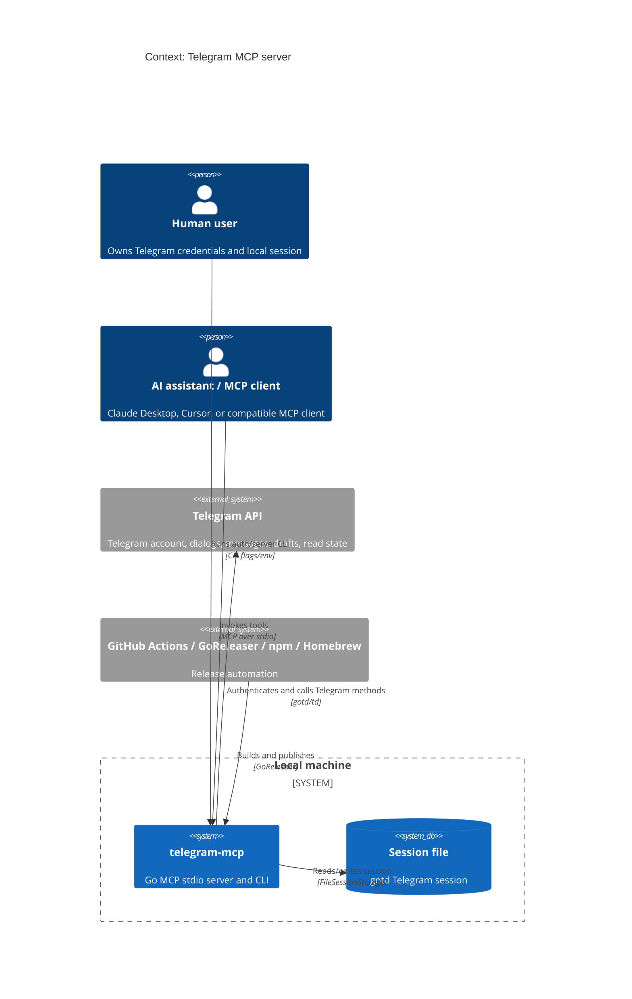
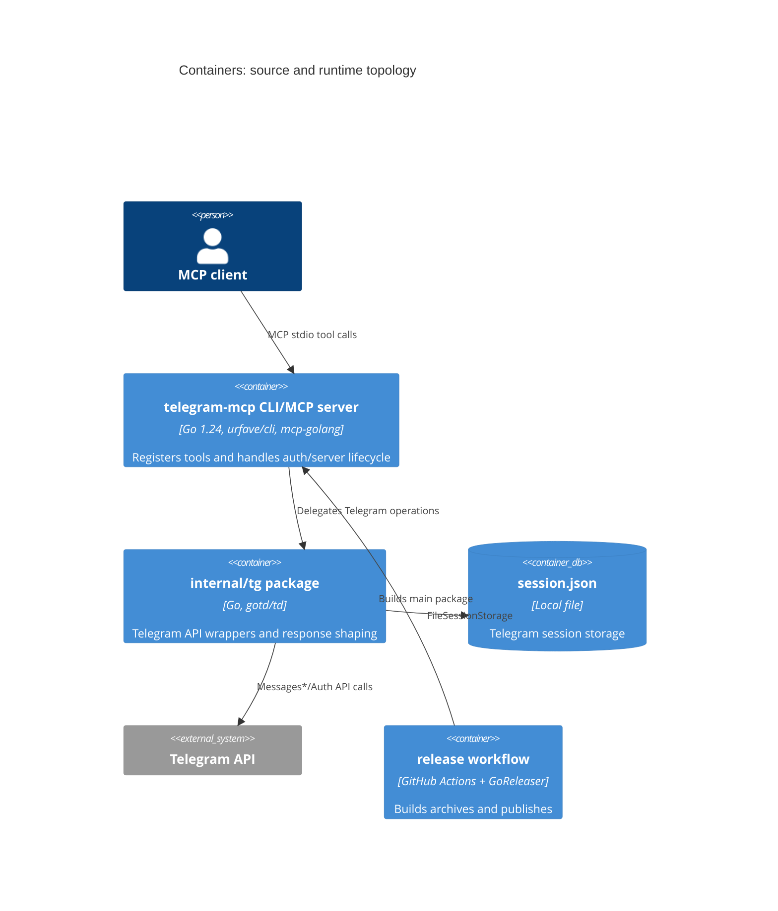
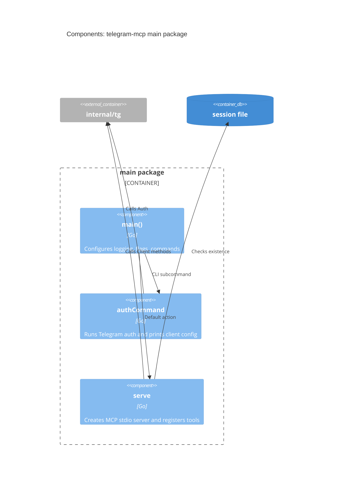
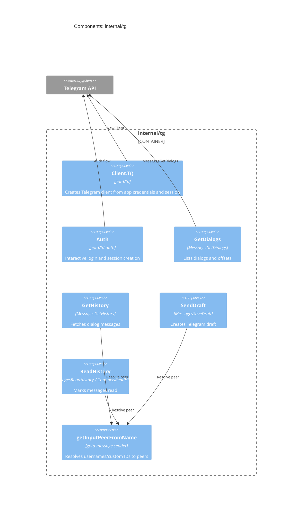
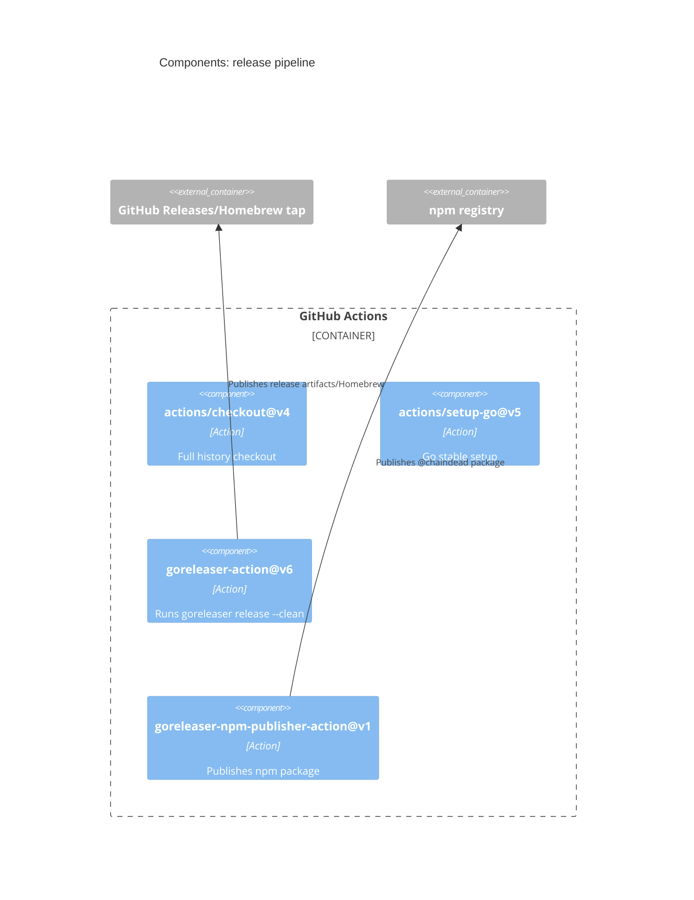
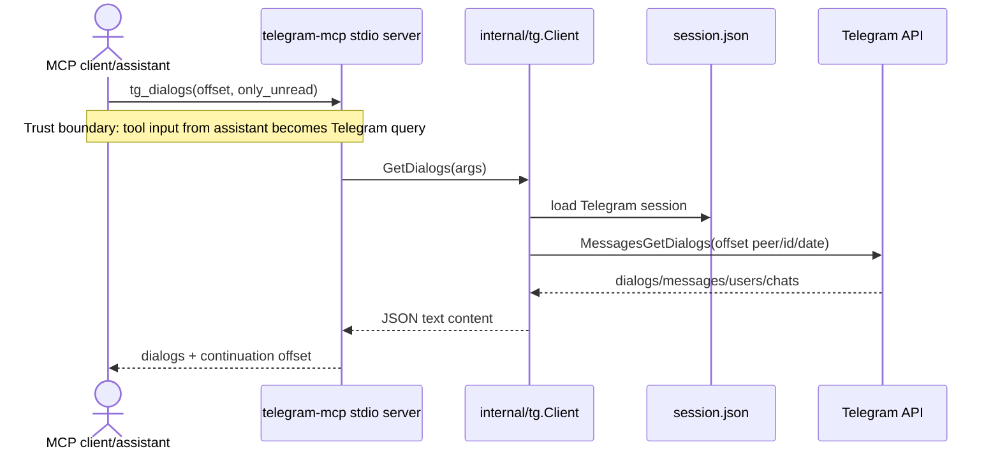
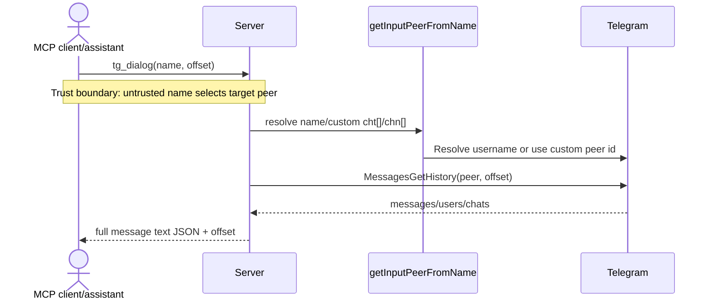
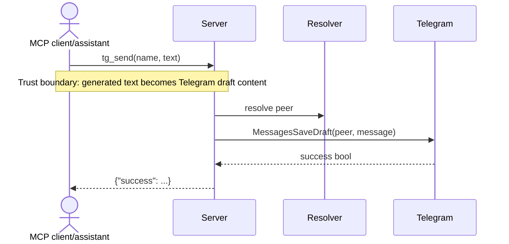
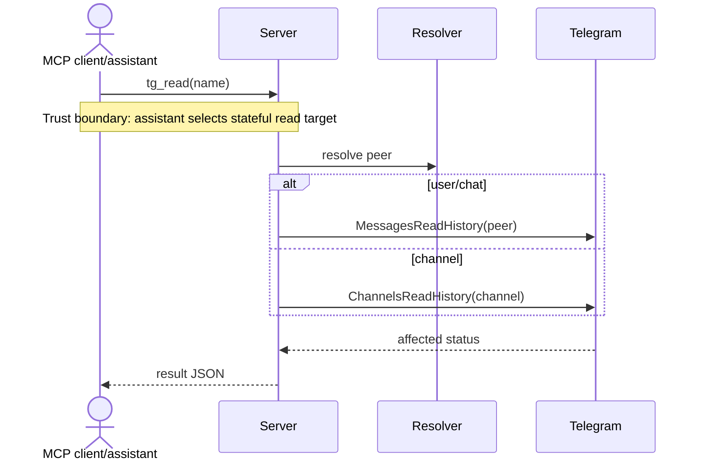
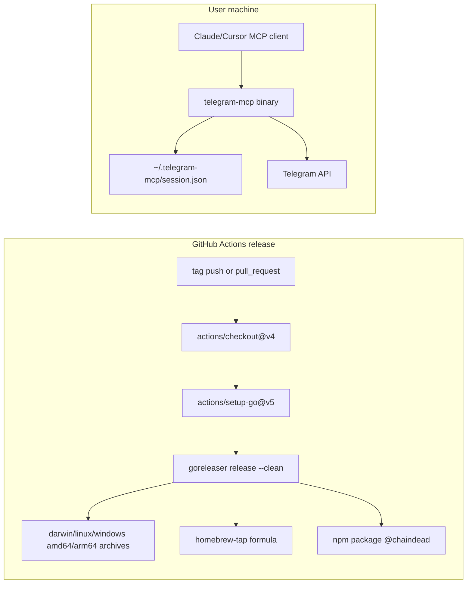

# PROJECT_BRIEF: `research/mcp/chaindead`

Scope: static read-only analysis of `research/mcp/chaindead` on 2026-04-24. No tests, builds, dependency installs, project runs, project API calls, linters, formatters, or network requests were executed from this project.

## 1. TL;DR

`telegram-mcp` is a Go MCP server that bridges AI assistants such as Claude Desktop/Cursor to a user's Telegram account through the Telegram API (`README.md:8`, `serve.go:33`, `serve.go:90`). It exposes local stdio MCP tools for account info, dialogs, dialog history, draft creation, and marking dialogs as read (`README.md:44`, `README.md:45`, `README.md:46`, `README.md:47`, `README.md:48`). It stores Telegram session state in a local file, defaulting to `~/.telegram-mcp/session.json` (`main.go:37`, `main.go:38`, `internal/tg/client.go:21`, `internal/tg/client.go:22`). Release packaging is handled by GitHub Actions plus GoReleaser for Linux, Windows, and Darwin binaries, Homebrew, and npm publication (`.github/workflows/release.yml:24`, `.goreleaser.yaml:6`, `.goreleaser.yaml:7`, `.goreleaser.yaml:8`, `.goreleaser.yaml:9`, `.github/workflows/release.yml:32`). The main risk is that a local MCP client or prompt that can invoke tools can read and mutate Telegram state without additional in-process authorization or confirmation (`serve.go:100`, `serve.go:105`, `serve.go:110`).

What follows for the reader: treat this as a local privileged bridge to Telegram, not as a generic stateless service. Review security boundaries before adding any new tool.

## 2. Glossary

- MCP server: the local stdio process created with `mcp.NewServer(stdio.NewStdioServerTransport())` (`serve.go:33`).
- MCP tool: registered callable operation such as `tg_me`, `tg_dialogs`, `tg_dialog`, `tg_send`, and `tg_read` (`serve.go:90`, `serve.go:95`, `serve.go:100`, `serve.go:105`, `serve.go:110`).
- Telegram session: gotd file-backed session storage at `sessionPath` (`internal/tg/client.go:21`, `internal/tg/client.go:22`).
- App ID / API hash: Telegram application credentials required by CLI flags or environment variables (`main.go:44`, `main.go:48`, `main.go:50`, `main.go:54`).
- Dialog: Telegram user/chat/channel entry returned by `MessagesGetDialogs` and normalized to `DialogInfo` (`internal/tg/dialogs.go:44`, `internal/tg/dialogs.go:73`).
- Dialog name: tool-facing identifier, either a username or custom `cht[...]` / `chn[...]` value (`internal/tg/helpers.go:35`, `internal/tg/helpers.go:39`, `internal/tg/history.go:76`, `internal/tg/history.go:84`).
- Offset: continuation token encoded as `peerType-id-msgID-date` for dialog pagination (`internal/tg/dialogs_offset.go:57`, `internal/tg/dialogs_offset.go:60`).
- Dry run: CLI mode that exercises Telegram reads and draft/read operations when `--dry` is set (`main.go:67`, `serve.go:36`, `serve.go:73`, `serve.go:80`).
- `cmd/test`: manual unread-message probe, not Go unit tests (`cmd/test/main.go:22`, `cmd/test/unread.go:51`).
- Release pipeline: GitHub Actions invokes GoReleaser and npm publishing (`.github/workflows/release.yml:24`, `.github/workflows/release.yml:32`).

What follows for the reader: the code's domain vocabulary maps almost one-to-one to Telegram API concepts. `Name` inputs are especially important because they determine which peer is read or mutated.

## 3. Quick Start

All commands below are `[NOT VERIFIED - read-only analysis]`; they are copied from repository docs/config and were not executed.

```bash
# Install released binary, from README
brew install chaindead/tap/telegram-mcp
npx -y @chaindead/telegram-mcp
go install github.com/chaindead/telegram-mcp@latest

# Authenticate, from README
telegram-mcp auth --app-id <your-api-id> --api-hash <your-api-hash> --phone <your-phone-number>

# Source workflow, from Taskfile
task run -- <CLI_ARGS>
task build
task lint
```

Sources: Homebrew and NPX install are documented in `README.md:76`, `README.md:78`, `README.md:86`, `README.md:89`; source install in `README.md:190`, `README.md:193`, `README.md:197`; auth in `README.md:204`, `README.md:206`, `README.md:215`; Taskfile commands in `Taskfile.yml:19`, `Taskfile.yml:22`, `Taskfile.yml:24`, `Taskfile.yml:29`, `Taskfile.yml:45`, `Taskfile.yml:47`. A first meaningful commit workflow is unknown; no CONTRIBUTING or PR workflow file exists in the observed tree, and Git commands for committing are therefore `[ASSUMPTION]` standard Git usage.

What follows for the reader: do not run `task run:test`, `task run`, `task build`, or `task lint` casually in a sensitive account because these commands execute code, build artifacts, or lint with repo config (`Taskfile.yml:14`, `Taskfile.yml:17`, `Taskfile.yml:19`, `Taskfile.yml:22`, `Taskfile.yml:24`, `Taskfile.yml:29`, `Taskfile.yml:45`, `Taskfile.yml:47`).

## 4. C4: Context



The project states that it is a bridge between Telegram API and AI assistants over Model Context Protocol (`README.md:8`). The runtime transport is stdio, not HTTP, because `serve` creates `stdio.NewStdioServerTransport()` (`serve.go:33`). Telegram API access is via gotd clients created from app credentials and file session storage (`internal/tg/client.go:19`, `internal/tg/client.go:21`, `internal/tg/client.go:27`).

What follows for the reader: the primary trust boundary is local MCP client to `telegram-mcp`, then `telegram-mcp` to Telegram. There is no server-side user model beyond the local Telegram session.

## 5. C4: Containers



| Name | Technology | Purpose | Owner |
|---|---|---|---|
| `telegram-mcp` | Go 1.24 (`go.mod:3`), `urfave/cli` (`go.mod:13`), `mcp-golang` (`go.mod:8`) | CLI entry point, auth command, stdio MCP server (`main.go:40`, `main.go:74`, `serve.go:33`) | unknown; release repo owner is `chaindead` (`.goreleaser.yaml:49`, `.goreleaser.yaml:50`, `.goreleaser.yaml:51`) |
| `internal/tg` | gotd/td (`go.mod:6`) | Telegram client creation and tool implementations (`internal/tg/client.go:11`, `internal/tg/dialogs.go:58`, `internal/tg/history.go:26`) | unknown |
| `session.json` | gotd `FileSessionStorage` | Persists Telegram session (`internal/tg/client.go:21`, `internal/tg/client.go:22`) | local user |
| GitHub release job | GitHub Actions + GoReleaser | Builds/publishes binaries, npm package, Homebrew tap (`.github/workflows/release.yml:24`, `.github/workflows/release.yml:32`, `.goreleaser.yaml:44`) | unknown |

What follows for the reader: most application behavior lives in the `internal/tg` package. Deployment differs from source topology because the shipped artifact is one static Go binary plus local session state.

## 6. C4: Components

### CLI/MCP Server



`main()` configures app flags for `app-id`, `api-hash`, `session`, `schema-version`, and `dry` (`main.go:43`, `main.go:48`, `main.go:54`, `main.go:60`, `main.go:65`, `main.go:67`). It exposes an `auth` command (`main.go:74`, `main.go:76`, `main.go:96`) and otherwise calls `serve` (`main.go:99`). `serve` requires an existing session file, creates `tg.New`, and registers five tools (`serve.go:28`, `serve.go:34`, `serve.go:90`, `serve.go:95`, `serve.go:100`, `serve.go:105`, `serve.go:110`).

What follows for the reader: adding a tool means editing `serve.go` registration and adding/adjusting a `Client` method. Be careful with schema compatibility because `schema-version` mutates global `jsonschema.Version` (`serve.go:24`, `serve.go:25`).

### Telegram Package



`Client.T()` configures `FileSessionStorage` and `NoUpdates: true`, then allows gotd options from environment (`internal/tg/client.go:20`, `internal/tg/client.go:21`, `internal/tg/client.go:24`, `internal/tg/client.go:26`). Read tools call `MessagesGetDialogs` and `MessagesGetHistory` (`internal/tg/dialogs.go:73`, `internal/tg/history.go:37`). Mutation tools call `MessagesSaveDraft`, `MessagesReadHistory`, or `ChannelsReadHistory` (`internal/tg/draft.go:33`, `internal/tg/read.go:36`, `internal/tg/read.go:42`).

What follows for the reader: all tool calls create a new Telegram client and use `context.Background()` in current code paths. Changes that add long-running operations should add explicit limits and cancellation.

### Release Pipeline



The workflow runs on pull requests and tag pushes (`.github/workflows/release.yml:3`, `.github/workflows/release.yml:4`, `.github/workflows/release.yml:5`, `.github/workflows/release.yml:6`). GoReleaser builds from `main: .` into binary `telegram-mcp` for Linux, Windows, and Darwin on amd64/arm64 (`.goreleaser.yaml:6`, `.goreleaser.yaml:10`, `.goreleaser.yaml:13`, `.goreleaser.yaml:14`). npm publication includes `LICENSE` and `README.md` (`.github/workflows/release.yml:32`, `.github/workflows/release.yml:38`, `.github/workflows/release.yml:39`, `.github/workflows/release.yml:40`).

What follows for the reader: release semantics are tied to tags and GoReleaser config, not Docker/Kubernetes manifests. There is no observed container deployment.

## 7. Data Flows

### Flow A: Authentication and Session Creation

```mermaid
sequenceDiagram
    actor User
    participant CLI as telegram-mcp auth
    participant TGAuth as internal/tg.Auth
    participant Session as session.json
    participant Telegram as Telegram API
    User->>CLI: app-id, api-hash, phone, optional password/new
    Note over User,CLI: Trust boundary: human-controlled CLI input enters process
    CLI->>TGAuth: Auth(phone, appID, apiHash, sessionPath, pass, newSession)
    TGAuth->>Session: optionally remove old session; create parent dir
    TGAuth->>Telegram: send auth flow; prompt for code
    Note over TGAuth,Telegram: Trust boundary: Telegram auth challenge/code
    Telegram-->>TGAuth: authenticated self/session
    TGAuth->>Session: FileSessionStorage persists session
    CLI-->>User: logs generated MCP config
```

Evidence: `authCommand` reads phone/password/app credentials/session path (`auth.go:15`, `auth.go:17`, `auth.go:18`, `auth.go:19`, `auth.go:20`), calls `tg.Auth` (`auth.go:29`), and logs generated config (`auth.go:61`, `auth.go:62`). `Auth` optionally removes the session, creates the directory, prompts for code, and calls gotd auth (`internal/tg/auth.go:18`, `internal/tg/auth.go:19`, `internal/tg/auth.go:28`, `internal/tg/auth.go:29`, `internal/tg/auth.go:35`, `internal/tg/auth.go:45`).

What follows for the reader: session creation is interactive and stateful. Logging in this flow must be treated as sensitive.

### Flow B: List Dialogs



Evidence: `tg_dialogs` is registered in `serve.go:95`; `GetDialogs` parses offset (`internal/tg/dialogs.go:59`, `internal/tg/dialogs.go:61`), calls `MessagesGetDialogs` (`internal/tg/dialogs.go:73`), filters unread dialogs (`internal/tg/dialogs.go:188`), truncates last-message previews to 20 words (`internal/tg/dialogs.go:246`, `internal/tg/dialogs.go:249`, `internal/tg/dialogs.go:250`), and returns JSON text (`internal/tg/dialogs.go:101`, `internal/tg/dialogs.go:106`).

What follows for the reader: dialog listing leaks names, identifiers, unread status, timestamps, and message previews to the MCP client. Pagination correctness depends on `DialogsOffset`.

### Flow C: Fetch Dialog History



Evidence: `tg_dialog` is registered in `serve.go:100`; `HistoryArguments.Name` and `Offset` are tool input fields (`internal/tg/history.go:16`, `internal/tg/history.go:17`, `internal/tg/history.go:18`); names are parsed as `chn[...]`, `cht[...]`, or resolved as username (`internal/tg/history.go:72`, `internal/tg/history.go:76`, `internal/tg/history.go:84`, `internal/tg/history.go:93`, `internal/tg/history.go:94`); messages are returned with full `m.Message` text (`internal/tg/history.go:158`, `internal/tg/history.go:161`).

What follows for the reader: this is the most privacy-sensitive read path. There is no ownership check beyond the Telegram account/session itself.

### Flow D: Save Draft



Evidence: `tg_send` is registered in `serve.go:105`; `DraftArguments` requires `name` and `text` (`internal/tg/draft.go:13`, `internal/tg/draft.go:14`, `internal/tg/draft.go:15`); `SendDraft` resolves the peer and calls `MessagesSaveDraft` with `args.Text` (`internal/tg/draft.go:28`, `internal/tg/draft.go:33`, `internal/tg/draft.go:35`).

What follows for the reader: the tool saves drafts rather than sending final messages, which reduces but does not eliminate account-impact risk. Draft content can still appear in Telegram clients.

### Flow E: Mark Dialog Read



Evidence: `tg_read` is registered in `serve.go:110`; `ReadHistory` resolves peer (`internal/tg/read.go:29`) and then calls either `MessagesReadHistory` or `ChannelsReadHistory` (`internal/tg/read.go:34`, `internal/tg/read.go:36`, `internal/tg/read.go:42`). The response is reduced to `done` or `unread messages not found` (`internal/tg/read.go:72`, `internal/tg/read.go:73`, `internal/tg/read.go:74`).

What follows for the reader: this is a write path to account state. Any new automation around it should add explicit user confirmation or policy controls.

## 8. Deployment / Runtime Topology



CI uses full history checkout (`.github/workflows/release.yml:16`, `.github/workflows/release.yml:19`) and Go stable (`.github/workflows/release.yml:20`, `.github/workflows/release.yml:23`). GoReleaser disables CGO and publishes OS/arch archives (`.goreleaser.yaml:4`, `.goreleaser.yaml:5`, `.goreleaser.yaml:6`, `.goreleaser.yaml:10`, `.goreleaser.yaml:18`). The runtime is a local binary launched either directly or by MCP client config from README (`README.md:237`, `README.md:240`, `README.md:252`, `README.md:257`).

What follows for the reader: production is end-user desktops, not a centralized backend. Operational incidents are likely to be local config/session/logging problems or upstream Telegram/API/package issues.

## 9. Dependencies And Integrations

| What | Version/source | Purpose | Criticality | Plan B on failure |
|---|---:|---|---|---|
| Go | `1.24` (`go.mod:3`) | Build/runtime language | High | unknown |
| `github.com/gotd/td` | `v0.121.0` (`go.mod:6`) | Telegram client/API | Critical | no local fallback; Telegram tools fail |
| `github.com/metoro-io/mcp-golang` | `v0.8.0` (`go.mod:8`) | MCP server/tool framework | Critical | unknown |
| `github.com/urfave/cli/v3` | `v3.1.0` (`go.mod:13`) | CLI flags/commands/env | High | unknown |
| `github.com/invopop/jsonschema` | `v0.12.0` (`go.mod:7`) | Tool schema generation/version override | Medium | set `TG_SCHEMA_VERSION` for clients that require Draft-07 (`README.md:269`, `README.md:274`) |
| `github.com/rs/zerolog` | `v1.34.0` (`go.mod:10`) | Logging | Medium | stderr output or no debug file |
| `golang.org/x/time` | `v0.11.0` (`go.mod:14`) | Rate limiter in manual `cmd/test` | Low | not used by production tools |
| Telegram API | README external setup (`README.md:204`, `README.md:206`) | Account auth, dialogs, history, drafts/read state | Critical | none |
| Local filesystem | default session path (`main.go:37`, `main.go:38`) | Session and optional debug log | Critical | set `TG_SESSION_PATH` (`main.go:60`) |
| GitHub Actions / GoReleaser | workflow/config (`.github/workflows/release.yml:24`, `.goreleaser.yaml:1`) | Releases | High | manual `go install`/source build, unverified |
| npm/Homebrew | workflow/config (`.github/workflows/release.yml:32`, `.goreleaser.yaml:44`) | Distribution channels | Medium | download release or build from source, unverified |

Vulnerability status of dependencies is unknown because no `govulncheck`, `go list`, `npm audit`, or external scanner was run. `go.sum` includes checksums for direct and transitive modules, for example gotd, mcp-golang, `x/crypto`, and `x/net` (`go.sum:40`, `go.sum:60`, `go.sum:107`, `go.sum:113`).

What follows for the reader: Telegram and gotd/td are hard dependencies in every meaningful runtime path. Schema-version compatibility is a known client-integration concern.

## 10. Hot Files Map

Frequency source: `git log --name-only --pretty=format:` over available local history; no files changed in `git log --since=2026-03-25`.

| File | Count | Why it is hot |
|---|---:|---|
| `README.md` | 38 | Install/config/capability contract (`README.md:70`, `README.md:200`) |
| `serve.go` | 13 | MCP server setup and tool registration (`serve.go:33`, `serve.go:90`) |
| `.github/workflows/release.yml` | 11 | Release automation (`.github/workflows/release.yml:24`, `.github/workflows/release.yml:32`) |
| `internal/tg/dialogs.go` | 9 | Dialog listing, offsets, presentation (`internal/tg/dialogs.go:58`, `internal/tg/dialogs.go:179`) |
| `Taskfile.yml` | 8 | Local run/build/lint wrappers (`Taskfile.yml:14`, `Taskfile.yml:24`) |
| `.goreleaser.yaml` | 7 | Release artifacts and Homebrew (`.goreleaser.yaml:3`, `.goreleaser.yaml:44`) |
| `internal/tg/helpers.go` | 6 | Title/username encoding (`internal/tg/helpers.go:11`, `internal/tg/helpers.go:29`) |
| `main.go` | 4 | CLI flags and entry point (`main.go:40`, `main.go:102`) |
| `internal/tg/history.go` | 4 | History reads and peer resolution (`internal/tg/history.go:26`, `internal/tg/history.go:72`) |
| `internal/tg/draft.go` | 4 | Draft write path (`internal/tg/draft.go:22`, `internal/tg/draft.go:33`) |
| `go.mod` | 4 | Dependency and Go version contract (`go.mod:3`, `go.mod:5`) |
| `cmd/test/main.go` | 4 | Manual unread probe entry (`cmd/test/main.go:22`, `cmd/test/main.go:56`) |
| `auth.go` | 4 | CLI auth command and config logging (`auth.go:14`, `auth.go:62`) |
| `.gitignore` | 4 | Local secret/build artifact exclusions (`.gitignore:69`, `.gitignore:70`, `.gitignore:71`) |
| `internal/tg/client.go` | 3 | Telegram client construction (`internal/tg/client.go:19`, `internal/tg/client.go:27`) |
| `internal/tg/auth.go` | 3 | gotd auth flow/session creation (`internal/tg/auth.go:17`, `internal/tg/auth.go:35`) |
| `internal/tg/read.go` | 2 | Read-status write path (`internal/tg/read.go:21`, `internal/tg/read.go:36`) |
| `internal/tg/me.go` | 2 | Current-account read path (`internal/tg/me.go:20`, `internal/tg/me.go:31`) |

What follows for the reader: `serve.go`, `internal/tg/*`, and README must stay synchronized. Tool names and argument schemas are user-facing API.

## 11. Reading Order

1. `README.md` for product promise, install paths, capabilities, and client config (`README.md:6`, `README.md:42`, `README.md:70`, `README.md:222`).
2. `go.mod` for stack and direct dependencies (`go.mod:1`, `go.mod:3`, `go.mod:5`).
3. `main.go` for CLI flags, env vars, and default session path (`main.go:37`, `main.go:43`, `main.go:74`).
4. `serve.go` for MCP transport and tool registration (`serve.go:33`, `serve.go:90`).
5. `auth.go` for auth command behavior and logging (`auth.go:14`, `auth.go:22`, `auth.go:62`).
6. `internal/tg/client.go` for gotd client/session setup (`internal/tg/client.go:19`, `internal/tg/client.go:21`).
7. `internal/tg/auth.go` for Telegram login flow (`internal/tg/auth.go:17`, `internal/tg/auth.go:35`).
8. `internal/tg/dialogs.go` for dialog response shaping (`internal/tg/dialogs.go:57`, `internal/tg/dialogs.go:179`).
9. `internal/tg/dialogs_offset.go` for continuation-token encoding (`internal/tg/dialogs_offset.go:31`, `internal/tg/dialogs_offset.go:60`).
10. `internal/tg/history.go` for peer resolution and full-message reads (`internal/tg/history.go:26`, `internal/tg/history.go:72`).
11. `internal/tg/draft.go` for draft mutation (`internal/tg/draft.go:22`, `internal/tg/draft.go:33`).
12. `internal/tg/read.go` for read-status mutation (`internal/tg/read.go:21`, `internal/tg/read.go:34`).
13. `internal/tg/helpers.go` for user/chat/channel naming conventions (`internal/tg/helpers.go:29`, `internal/tg/helpers.go:35`, `internal/tg/helpers.go:39`).
14. `Taskfile.yml` for unsafe-to-run local commands inventory (`Taskfile.yml:8`, `Taskfile.yml:14`, `Taskfile.yml:24`, `Taskfile.yml:45`).
15. `.github/workflows/release.yml` and `.goreleaser.yaml` for release behavior (`.github/workflows/release.yml:3`, `.goreleaser.yaml:3`).
16. `cmd/test/main.go` and `cmd/test/unread.go` only after production paths, because they are manual probes (`cmd/test/main.go:15`, `cmd/test/unread.go:51`).

What follows for the reader: start with README and `serve.go`, then read each tool implementation. Leave `cmd/test` until last because it is not the production MCP server.

## 12. Invariants And Gotchas

1. The server expects an existing session file before serving; missing session aborts startup (`serve.go:28`, `serve.go:30`).
2. Default session path is under the current OS user's home directory (`main.go:32`, `main.go:37`, `main.go:38`).
3. `auth --new` removes whatever path is supplied as `sessionPath` (`internal/tg/auth.go:18`, `internal/tg/auth.go:19`).
4. Tool responses are JSON embedded as MCP text content, not typed Go structs over the wire (`internal/tg/dialogs.go:106`, `internal/tg/history.go:69`, `internal/tg/draft.go:51`, `internal/tg/read.go:82`).
5. `tg_dialogs` offset is a custom string token, but `UnmarshalJSON` splits raw input text without JSON unquoting (`internal/tg/dialogs_offset.go:60`, `internal/tg/dialogs_offset.go:61`); client-provided quoting behavior needs verification.
6. Dialog last-message text is truncated to 20 words, but history returns full message text (`internal/tg/dialogs.go:246`, `internal/tg/dialogs.go:250`, `internal/tg/history.go:161`).
7. `getUsername` uses custom opaque names for chats and channels without usernames (`internal/tg/helpers.go:35`, `internal/tg/helpers.go:39`); do not change these without preserving history/draft/read resolution (`internal/tg/history.go:76`, `internal/tg/history.go:84`).
8. `Client.T()` applies gotd environment options and ignores the returned error (`internal/tg/client.go:26`); environment can affect runtime in ways not visible in project config.
9. Production tools use `context.Background()` and do not expose cancellation/timeout controls (`internal/tg/dialogs.go:71`, `internal/tg/history.go:29`, `internal/tg/draft.go:25`, `internal/tg/read.go:22`, `internal/tg/me.go:24`).
10. Manual `cmd/test` has a rate limiter, but production MCP tools do not (`cmd/test/unread.go:28`, `cmd/test/unread.go:52`).
11. The `dry` flag is labeled "Test configuration" but performs Telegram reads and attempts draft/read mutations (`main.go:68`, `main.go:69`, `serve.go:73`, `serve.go:80`).
12. `Taskfile.yml` includes destructive/user-home commands for install and tag publication; do not run blindly (`Taskfile.yml:31`, `Taskfile.yml:35`, `Taskfile.yml:49`, `Taskfile.yml:52`, `Taskfile.yml:53`).
13. `.gitignore` excludes local `.env`, session, logs, and build output (`.gitignore:69`, `.gitignore:70`, `.gitignore:71`, `.gitignore:73`, `.gitignore:74`).
14. README's Claude config sample has a malformed `HOME` placeholder missing a closing `>`/quote-like bracket in the value text (`README.md:244`, `README.md:245`).

What follows for the reader: small changes can alter user-facing tool API or Telegram account state. Treat `Name`, offset, session path, and logging behavior as sensitive contracts.

## 13. Security Findings

### HIGH: MCP tools can mutate Telegram state without app-level confirmation

- Category: STRIDE Tampering/Elevation of Privilege; OWASP A01 Broken Access Control; ASVS V4 authorization intent.
- Severity: High because impact is direct mutation of a user's Telegram account state and likelihood is credible in an MCP setting where assistant/prompt behavior can trigger tools.
- Evidence: `tg_send` and `tg_read` are registered as tools (`serve.go:105`, `serve.go:110`). `SendDraft` writes `args.Text` to Telegram drafts (`internal/tg/draft.go:33`, `internal/tg/draft.go:35`). `ReadHistory` marks user/chat or channel history as read (`internal/tg/read.go:36`, `internal/tg/read.go:42`).
- Exploit scenario: a malicious prompt or compromised MCP client asks the assistant to save a draft or mark sensitive chats as read. The process performs the operation using the user's authenticated Telegram session.
- Recommendation: add a policy/confirmation layer for mutation tools, allow disabling write tools via config, and log/audit mutation requests without logging secrets or message bodies.

### HIGH: Telegram API hash and phone are logged during auth

- Category: OWASP A02 Cryptographic Failures / sensitive data exposure; STRIDE Information Disclosure; ASVS V7 logging.
- Severity: High because logs can persist in terminal history, MCP client logs, or debug files; the API hash is an application secret and phone number is PII.
- Evidence: `authCommand` logs `phone`, `api-hash`, `session`, and `app-id` (`auth.go:22`, `auth.go:23`, `auth.go:24`, `auth.go:25`, `auth.go:26`). It also marshals a config containing `TG_API_HASH` and logs it as raw JSON (`auth.go:34`, `auth.go:39`, `auth.go:55`, `auth.go:56`, `auth.go:61`, `auth.go:62`).
- Exploit scenario: another local process/user or support bundle obtains logs and recovers the Telegram app hash and phone number. This reduces the secrecy of credentials needed to operate clients for that Telegram app.
- Recommendation: redact `api-hash`, phone, and session path by default; print config only to stdout on explicit request; document secure handling.

### MEDIUM: Production read paths can disclose large volumes of Telegram message data to the MCP client

- Category: STRIDE Information Disclosure; OWASP A01/A04; ASVS V1 data protection.
- Severity: Medium because the behavior is intended but high-impact; likelihood depends on the MCP client/prompt being trusted.
- Evidence: `tg_dialog` is registered as a tool (`serve.go:100`). `GetHistory` accepts arbitrary `Name`/`Offset` input (`internal/tg/history.go:16`, `internal/tg/history.go:17`, `internal/tg/history.go:18`) and returns full message text (`internal/tg/history.go:158`, `internal/tg/history.go:161`, `internal/tg/history.go:169`). `tg_dialogs` returns names, titles, unread status, and last-message previews (`internal/tg/dialogs.go:44`, `internal/tg/dialogs.go:48`, `internal/tg/dialogs.go:253`, `internal/tg/dialogs.go:257`, `internal/tg/dialogs.go:258`).
- Exploit scenario: a prompt asks for broad history extraction or sensitive dialog summaries, and the MCP server returns private messages to the client context.
- Recommendation: add allowlists/denylists for dialogs, maximum page sizes, optional redaction, and clear consent prompts before returning full history.

### MEDIUM: No timeouts or production rate limiting around Telegram API calls

- Category: STRIDE Denial of Service; OWASP A04 Insecure Design; ASVS V1 resource management.
- Severity: Medium because external calls can hang or consume quota/resources, while likelihood grows with automation loops.
- Evidence: production methods use `context.Background()` (`internal/tg/dialogs.go:71`, `internal/tg/history.go:29`, `internal/tg/draft.go:25`, `internal/tg/read.go:22`, `internal/tg/me.go:24`). `MessagesGetDialogs` and `MessagesGetHistory` are called without explicit `Limit` fields in production paths (`internal/tg/dialogs.go:73`, `internal/tg/dialogs.go:77`, `internal/tg/history.go:37`, `internal/tg/history.go:40`). The only observed rate limiter is in `cmd/test`, not production tools (`cmd/test/unread.go:28`, `cmd/test/unread.go:52`).
- Exploit scenario: a client loops over history/dialog tools and causes long-running Telegram calls or account/API throttling.
- Recommendation: use request-scoped contexts with timeout, expose conservative limits, add per-tool rate limiting, and fail closed on excessive offsets/pages.

### MEDIUM: Arbitrary debug log path with broad file mode may expose sensitive logs

- Category: STRIDE Information Disclosure/Tampering; OWASP A05 Security Misconfiguration; ASVS V14 config.
- Severity: Medium because the env var is local/config-controlled, but impact includes persistent sensitive logs and broad file permissions.
- Evidence: `TG_DEBUG_LOG` controls `debugPath` (`main.go:21`, `main.go:22`), `os.OpenFile` creates/appends with mode `0666` (`main.go:23`), and all logs then go to that file (`main.go:28`, `main.go:29`).
- Exploit scenario: a wrapper or MCP client config sets `TG_DEBUG_LOG` to a shared path; auth or tool logs containing PII become readable depending on umask and filesystem permissions.
- Recommendation: use `0600`, constrain to a config/log directory, avoid logging sensitive fields, and warn when debug logging is enabled.

### MEDIUM: User-controlled session path can be removed by `auth --new`

- Category: STRIDE Tampering; OWASP A05 Security Misconfiguration; ASVS V14 file handling.
- Severity: Medium because it requires local command/config control, but the effect can delete arbitrary files accessible to the running user.
- Evidence: session path is configurable by flag/env (`main.go:56`, `main.go:57`, `main.go:60`) and `Auth` removes it when `newSession` is true (`internal/tg/auth.go:17`, `internal/tg/auth.go:18`, `internal/tg/auth.go:19`).
- Exploit scenario: a malicious config launches `telegram-mcp auth --new --session <important-file>`, causing deletion under the user's permissions.
- Recommendation: only delete session files under an approved config directory unless `--force` is supplied; use explicit confirmation for non-default paths.

### LOW: gotd environment option errors are ignored

- Category: STRIDE Repudiation/Information Disclosure via misconfiguration; OWASP A05 Security Misconfiguration.
- Severity: Low because exact impact depends on gotd environment options, but ignored errors can hide unsafe or broken runtime configuration.
- Evidence: `OptionsFromEnvironment` return error is discarded (`internal/tg/client.go:26`), then the client is created with possibly partially applied options (`internal/tg/client.go:27`).
- Exploit scenario: an invalid environment option is silently ignored, leading operators to believe a proxy/DC/security option is active when it is not.
- Recommendation: handle and return/log sanitized configuration errors before creating the client.

### LOW: Dependency vulnerability status is unknown

- Category: OWASP A06 Vulnerable and Outdated Components.
- Severity: Low as a finding in this document because no vulnerable version was confirmed; operational risk remains unknown.
- Evidence: direct dependencies include gotd, mcp-golang, jsonschema, urfave/cli, zerolog, and x/time (`go.mod:6`, `go.mod:7`, `go.mod:8`, `go.mod:10`, `go.mod:13`, `go.mod:14`). Transitive cryptography/network modules include `golang.org/x/crypto v0.36.0` and `golang.org/x/net v0.37.0` (`go.sum:107`, `go.sum:113`).
- Exploit scenario: if a dependency has a known CVE affecting the used code path, a crafted Telegram/API/MCP input could trigger it.
- Recommendation: run `govulncheck ./...` and dependency review outside this read-only task; pin/update dependencies as needed.

Static checklist notes: no HTTP server, CORS, CSRF, cookies, SQL/NoSQL/LDAP/template engines, object storage, queues, or file upload paths were found in the current tree. Current-file grep and limited git-history grep did not reveal hardcoded real tokens, but GitHub Actions references secret names such as `PERSONAL_AUTH_TOKEN` and `NPM_AUTH_TOKEN` (`.github/workflows/release.yml:31`, `.github/workflows/release.yml:35`).

What follows for the reader: the highest-risk area is not classic web injection; it is local tool authorization, privacy boundaries, logging, and Telegram-account side effects.

## 14. Open Questions

- `PROJECT_BRIEF.md` filename conflict: the user requested `research/chaindead-mcp-codex.md`, while the embedded task template says `PROJECT_BRIEF.md`; this document follows the explicit requested output path from the first line.
- Runtime behavior of MCP schema generation is unknown. Verifying it would require running the server/client, which is forbidden by read-only policy.
- Whether `DialogsOffset.UnmarshalJSON` handles actual MCP-provided offset strings correctly is unknown. Verifying it would require tests or a live tool call, both forbidden (`internal/tg/dialogs_offset.go:60`, `internal/tg/dialogs_offset.go:61`).
- Real Telegram API pagination defaults for `MessagesGetDialogs`/`MessagesGetHistory` without `Limit` are unknown from this repository alone (`internal/tg/dialogs.go:73`, `internal/tg/history.go:37`).
- Dependency CVE status is unknown. Verifying it would require `govulncheck`, `go list`, or an external advisory lookup/scanner, which was not performed in this read-only project pass.
- Release success is unknown. Verifying GoReleaser/npm/Homebrew would require CI execution or release artifacts inspection beyond static local files.
- Test coverage is effectively unknown: no `*_test.go` files were found, and `cmd/test` is a manual executable path (`cmd/test/main.go:15`, `cmd/test/unread.go:51`).
- Owner/team boundaries are unknown; only release repo owner/name `chaindead/homebrew-tap` and remote `chaindead/telegram-mcp` were visible in config/git metadata (`.goreleaser.yaml:49`, `.goreleaser.yaml:50`, `.goreleaser.yaml:51`).
- Dynamic security properties such as Telegram auth failure modes, rate-limit handling, and session file permissions after gotd writes are unknown because no project code was run.

What follows for the reader: close these questions before changing security-sensitive behavior or claiming production readiness.

## 15. Change Log

- 2026-04-24: Initial static read-only project brief for `research/mcp/chaindead`; created from source, docs, config, and git history only.
- Verification: rechecked five security findings against source lines: mutation tools (`serve.go:105`, `internal/tg/draft.go:33`, `internal/tg/read.go:36`), auth logging (`auth.go:22`, `auth.go:62`), debug log path (`main.go:21`, `main.go:23`), session removal (`internal/tg/auth.go:18`, `internal/tg/auth.go:19`), and no-timeout API calls (`internal/tg/history.go:29`, `internal/tg/history.go:37`).
- Verification: Containers diagram matches observed runtime/deploy files: stdio MCP server (`serve.go:33`), local session storage (`internal/tg/client.go:21`), Telegram API calls (`internal/tg/dialogs.go:73`), GitHub Actions/GoReleaser deployment (`.github/workflows/release.yml:24`, `.goreleaser.yaml:6`).
- Verification: Quick start commands are marked `[NOT VERIFIED - read-only analysis]` and sourced from README/Taskfile only.
- Confirmation: no tests, builds, dependency installs, project runs, project API calls, linters, formatters, or project network requests were executed.

What follows for the reader: this document is a static map, not a certified runtime validation. Treat all `[NOT VERIFIED]` commands and open questions accordingly.
