# PROJECT_BRIEF: `research/mcp/chigwell`

Scope: static read-only analysis of `research/mcp/chigwell` on 2026-04-24. No tests, builds, dependency installs, project runs, project API calls, linters, formatters, Docker commands, or network requests were executed from this project.

## 1. TL;DR

`telegram-mcp` is a Python MCP stdio server that exposes a very broad Telegram automation surface for Claude, Cursor, and other MCP clients (`README.md:32`, `main.py:95`, `main.py:6164`). It uses Telethon clients created from `TELEGRAM_API_ID`, `TELEGRAM_API_HASH`, and one or more session env vars (`main.py:90`, `main.py:92`, `main.py:93`, `main.py:103`, `main.py:119`, `main.py:131`). The code registers about 110 MCP tools, covering reads plus destructive operations such as sending messages, deleting history, changing admin rights, banning users, contacts, drafts, files, and folders (`main.py:962`, `main.py:3974`, `main.py:3128`, `main.py:3261`, `main.py:2589`, `main.py:5526`). Runtime is local stdio by default, with optional Docker/Compose packaging and CI validation (`README.md:303`, `Dockerfile:47`, `docker-compose.yml:13`, `.github/workflows/docker-build.yml:24`). The main risk is local MCP tool overreach: a prompt/client with tool access can read private Telegram data and perform account-changing operations without an additional application-level confirmation layer (`main.py:193`, `main.py:195`, `main.py:985`, `main.py:4000`).

What follows for the reader: treat this process as a full Telegram account control plane. The MCP boundary, session strings, logs, and file roots are the places to review before changing behavior.

## 2. Glossary

- MCP server: `FastMCP("telegram")` instance run over stdio (`main.py:95`, `main.py:6164`).
- MCP tool: Python coroutine decorated with `@mcp.tool`, e.g. `get_chats`, `send_message`, `download_media` (`main.py:893`, `main.py:962`, `main.py:2624`).
- Telethon client: per-account `TelegramClient` instance stored in global `clients` (`main.py:119`, `main.py:124`, `main.py:148`).
- Session string: portable Telethon `StringSession` value from env, documented as full account access (`main.py:120`, `README.md:619`).
- File-based session: Telethon session name/file configured via `TELEGRAM_SESSION_NAME` (`main.py:128`, `main.py:135`).
- Account label: suffix after `TELEGRAM_SESSION_STRING_` or `TELEGRAM_SESSION_NAME_`, normalized to lowercase (`main.py:113`, `main.py:118`, `main.py:123`).
- Read-only fan-out: multi-account mode behavior where read-only tools query all accounts if `account` is omitted (`main.py:197`, `main.py:203`, `main.py:204`).
- Destructive tool: tool annotated with `destructiveHint=True`, such as `send_message`, `delete_chat_history`, `ban_user` (`main.py:963`, `main.py:3978`, `main.py:3263`).
- Allowed roots: server/client allowlist for file-path tools (`main.py:306`, `main.py:701`, `README.md:174`).
- Roots API: MCP client-provided roots that replace server-side roots when available (`main.py:710`, `main.py:731`, `README.md:183`).
- `mcp_errors.log`: JSON-formatted file log in the script directory (`main.py:275`, `main.py:276`, `main.py:288`).
- Entity resolution: helper path that resolves user/chat/channel IDs or usernames and warms Telethon dialog cache (`main.py:502`, `main.py:516`, `main.py:518`).

What follows for the reader: the project vocabulary is mostly Telegram and MCP vocabulary. The important local abstractions are account labels, `with_account`, and allowed roots.

## 3. Quick Start

All commands below are `[NOT VERIFIED - read-only analysis]`; they are copied from repository docs/config and were not executed.

```bash
git clone https://github.com/chigwell/telegram-mcp.git
cd telegram-mcp
uv sync
uv run session_string_generator.py
# fill .env from .env.example
uv --directory /full/path/to/telegram-mcp run main.py

# Optional Docker path
docker build -t telegram-mcp:latest .
docker compose up --build
docker run -it --rm \
  -e TELEGRAM_API_ID="YOUR_API_ID" \
  -e TELEGRAM_API_HASH="YOUR_API_HASH" \
  -e TELEGRAM_SESSION_STRING="YOUR_SESSION_STRING" \
  telegram-mcp:latest
```

Sources: clone/install/session instructions are in `README.md:211`, `README.md:212`, `README.md:213`, `README.md:219`, `README.md:225`; `.env` values are shown in `README.md:231`, `README.md:235`, `README.md:236`, `README.md:237`; MCP client config uses `uv --directory ... run main.py` (`README.md:305`, `README.md:309`, `README.md:311`, `README.md:314`). Docker commands come from `README.md:263`, `README.md:277`, `README.md:287`, `README.md:291`. Contribution flow is documented as fork, branch, tests/docs if needed, push PR (`README.md:602`, `README.md:607`, `README.md:611`, `README.md:612`).

What follows for the reader: the documented quick start runs real Telegram auth and server code, so it was not verified here. Use a throwaway/non-critical account when first exercising destructive tools.

## 4. C4: Context

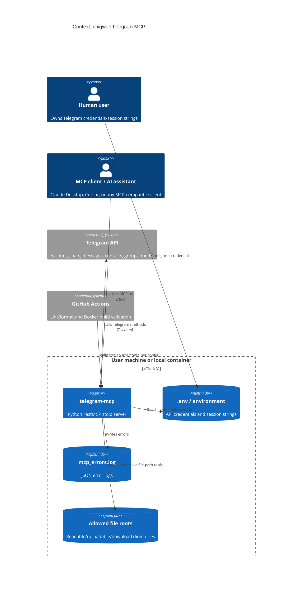

The project describes itself as a full-featured Telegram integration for Claude, Cursor, and MCP-compatible clients (`README.md:32`). The server is instantiated as `FastMCP("telegram")` and run with `mcp.run_stdio_async()` (`main.py:95`, `main.py:6164`). Telegram is reached through Telethon imports and `TelegramClient` construction (`main.py:23`, `main.py:119`, `main.py:131`).

What follows for the reader: there is no separate backend identity layer. The process authority is the configured Telegram account/session.

## 5. C4: Containers

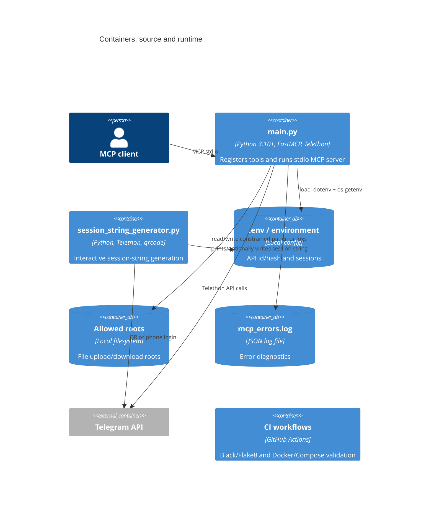

| Name | Technology | Purpose | Owner |
|---|---|---|---|
| `main.py` | Python, FastMCP, Telethon (`main.py:17`, `main.py:19`, `main.py:23`) | Runtime MCP server and Telegram tools (`main.py:95`, `main.py:6164`) | Maintainers listed as `chigwell` and `l1v0n1` (`pyproject.toml:10`, `pyproject.toml:11`, `pyproject.toml:12`) |
| `session_string_generator.py` | Python, Telethon, qrcode (`session_string_generator.py:27`, `session_string_generator.py:29`, `session_string_generator.py:35`) | Creates Telethon session strings (`session_string_generator.py:135`, `session_string_generator.py:144`) | same project |
| `.env` / environment | dotenv + process env (`main.py:90`, `main.py:92`, `main.py:127`) | Credentials/account discovery | local user |
| Allowed roots | `pathlib.Path`, MCP Roots (`main.py:306`, `main.py:701`, `main.py:711`) | Limits file path tools | local user/MCP client |
| Docker container | `python:3.13-alpine`, non-root user (`Dockerfile:2`, `Dockerfile:30`, `Dockerfile:31`) | Containerized stdio server | local deployer |
| CI | GitHub Actions (`.github/workflows/python-lint-format.yml:1`, `.github/workflows/docker-build.yml:1`) | Lint/format and Docker/Compose checks | GitHub repo maintainers |

What follows for the reader: source topology is a monolith in `main.py`; runtime topology adds env/session storage, optional Docker, and MCP client roots.

## 6. C4: Components

### `main.py` Runtime

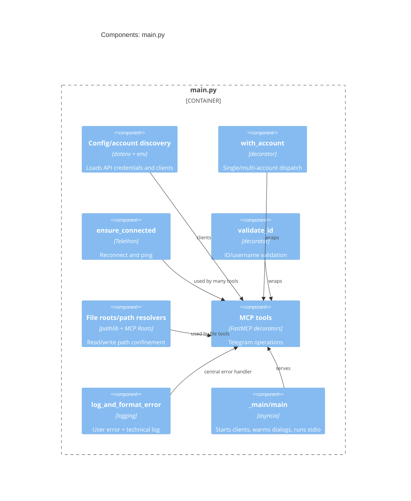

Config is loaded at import time with `load_dotenv()` and immediate env reads (`main.py:90`, `main.py:92`, `main.py:93`). `_discover_accounts` builds clients from suffixed/unsuffixed session env vars (`main.py:103`, `main.py:116`, `main.py:127`, `main.py:130`, `main.py:134`). `_main` starts all clients, warms dialog caches, and then runs stdio (`main.py:6154`, `main.py:6155`, `main.py:6160`, `main.py:6164`).

What follows for the reader: importing `main.py` has side effects. Any refactor or tests should isolate config/client creation from import.

### Tool Families

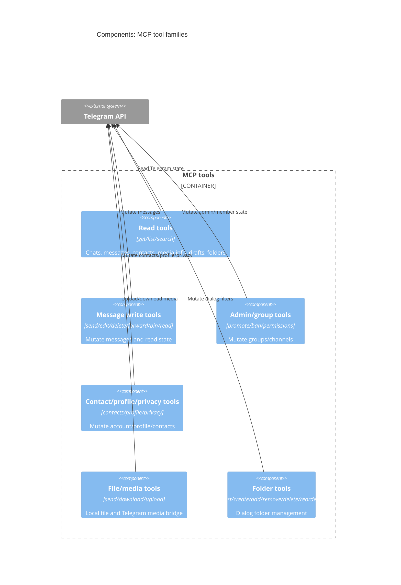

README lists feature families for chat/group management, messaging, contacts, profile, media, search, privacy/settings, drafts, and multi-account mode (`README.md:41`, `README.md:70`, `README.md:100`, `README.md:114`, `README.md:122`, `README.md:131`, `README.md:142`, `README.md:151`, `README.md:156`). Representative write implementations include `send_message`, `delete_chat_history`, `promote_admin`, `ban_user`, and `save_draft` (`main.py:967`, `main.py:3984`, `main.py:3135`, `main.py:3268`, `main.py:5214`).

What follows for the reader: new tools should fit one of these families and must be reviewed for destructive/account-state effects.

### File-Path Security

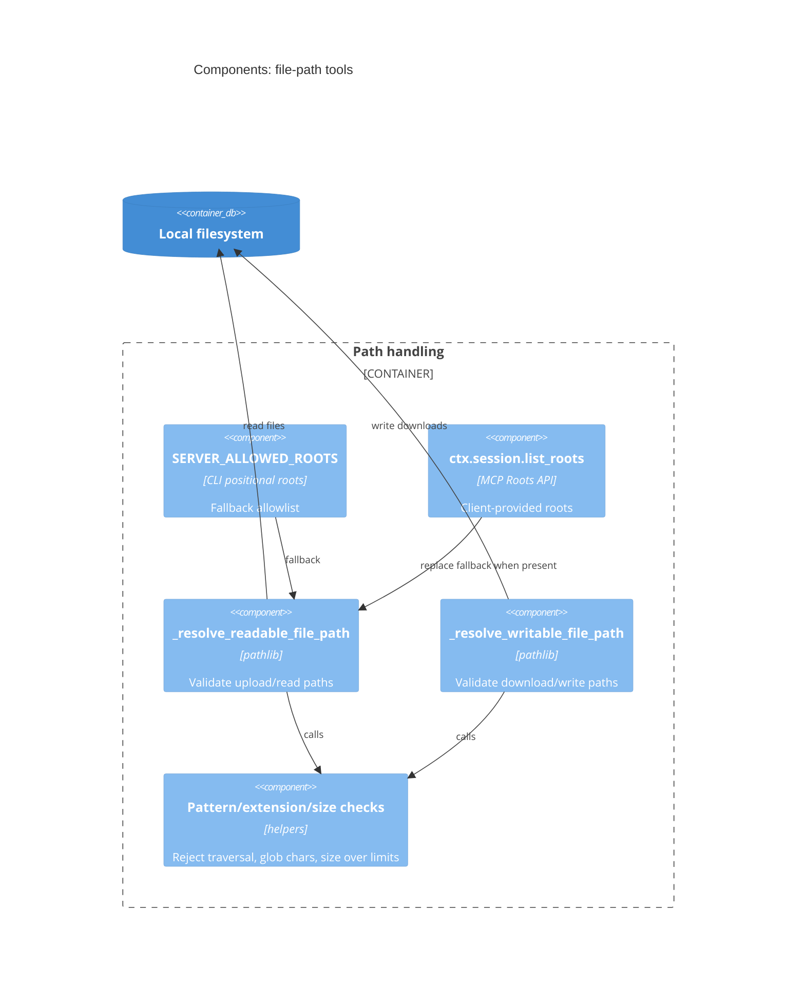

File tools are documented as disabled by default until roots are configured (`README.md:174`, `README.md:176`). The code uses server roots, MCP Roots replacement, deny-all on empty client roots, path pattern rejection, realpath checks, extension allowlists, and size limits (`main.py:306`, `main.py:308`, `main.py:309`, `main.py:315`, `main.py:621`, `main.py:631`, `main.py:731`, `main.py:734`, `main.py:791`, `main.py:802`).

What follows for the reader: this is one of the better-contained parts of the code, but write/download paths still deserve race-condition review.

## 7. Data Flows

### Flow A: Server Startup And Multi-Account Client Creation

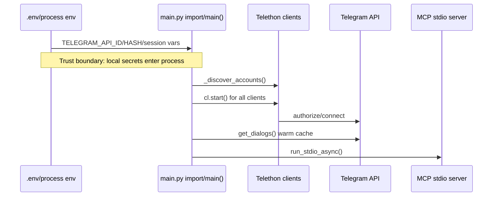

Evidence: env loading and client creation are in `main.py:90`, `main.py:92`, `main.py:93`, `main.py:119`, `main.py:131`; `_main` starts clients and warms dialogs (`main.py:6154`, `main.py:6155`, `main.py:6157`, `main.py:6160`); stdio serving is `main.py:6164`.

What follows for the reader: all configured accounts are connected before serving. A broken or locked session can prevent startup for the whole process.

### Flow B: Read-Only Multi-Account Fan-Out

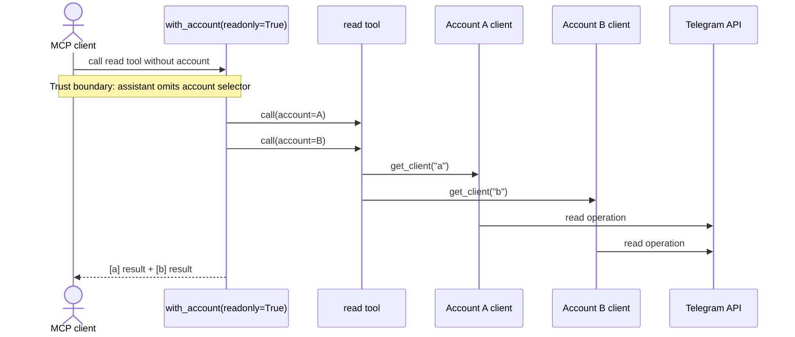

Evidence: multi-account readonly fan-out is implemented with `asyncio.gather` and result prefixing (`main.py:197`, `main.py:198`, `main.py:203`, `main.py:204`). README documents that read-only tools query all accounts when `account` is omitted (`README.md:159`, `README.md:160`).

What follows for the reader: this is convenient but privacy-sensitive. A single read prompt can expose all configured accounts.

### Flow C: Send Message / Scheduled Message

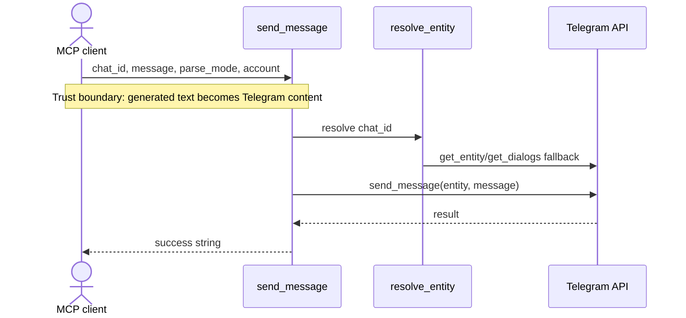

Evidence: `send_message` is destructive and takes `chat_id`, `message`, and optional `parse_mode` (`main.py:962`, `main.py:967`, `main.py:968`, `main.py:969`, `main.py:970`). It resolves the entity and sends the message (`main.py:984`, `main.py:985`). Scheduled send parses a future date and calls `send_message(..., schedule=dt)` (`main.py:1019`, `main.py:1022`, `main.py:1026`, `main.py:1033`).

What follows for the reader: this is a direct account write path, not a draft-only path. Confirmation/policy should live before the Telethon call.

### Flow D: File Send / Media Download

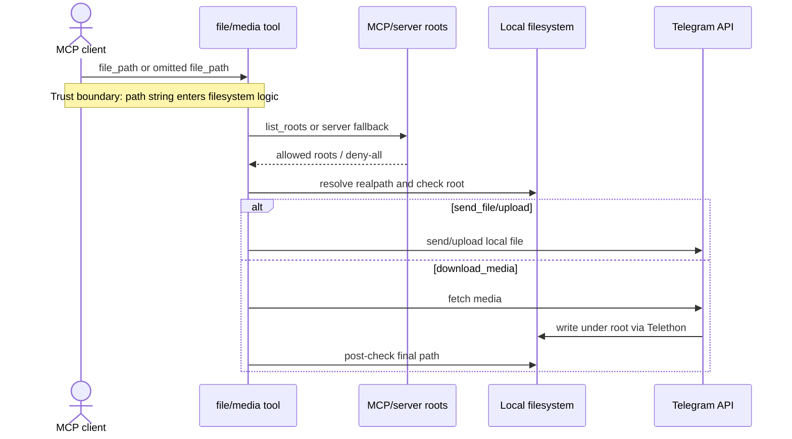

Evidence: `send_file` calls `_resolve_readable_file_path` before `cl.send_file` (`main.py:2607`, `main.py:2608`, `main.py:2616`). `download_media` resolves writable output, strips suffix, calls `cl.download_media`, then checks final resolved path is within roots (`main.py:2652`, `main.py:2665`, `main.py:2666`, `main.py:2670`, `main.py:2674`). Roots behavior is in `main.py:701`, `main.py:711`, `main.py:731`, `main.py:734`.

What follows for the reader: the path model is deny-by-default, but downloads still combine external Telegram content with local writes.

### Flow E: Destructive Admin / Deletion Operations

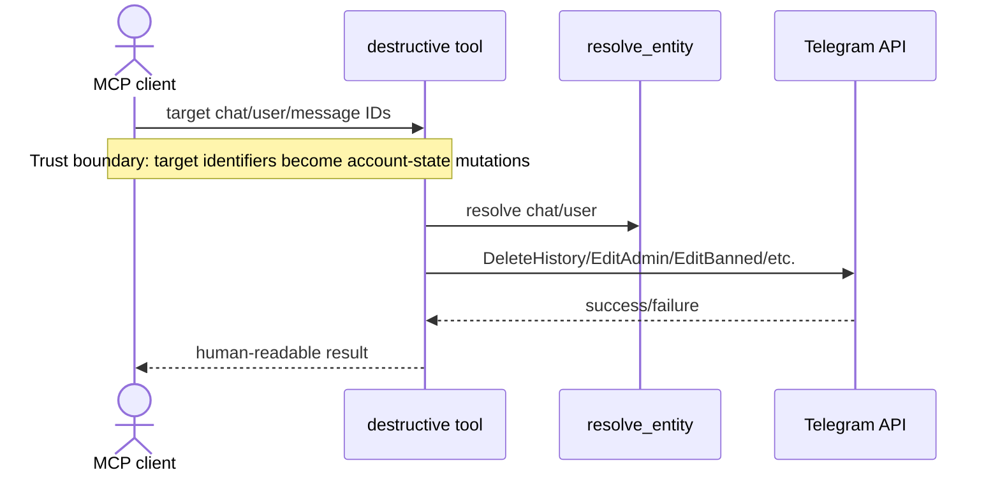

Evidence: `delete_chat_history` calls `functions.messages.DeleteHistoryRequest` (`main.py:3974`, `main.py:3984`, `main.py:3999`, `main.py:4000`). `promote_admin` grants broad default rights if no rights are supplied (`main.py:3155`, `main.py:3156`, `main.py:3160`, `main.py:3161`, `main.py:3186`). `ban_user` creates all-restrictions banned rights and calls `EditBannedRequest` (`main.py:3281`, `main.py:3282`, `main.py:3300`).

What follows for the reader: the destructive surface is large and heterogeneous. Review each new tool for reversibility, target ambiguity, and multi-account behavior.

## 8. Deployment / Runtime Topology

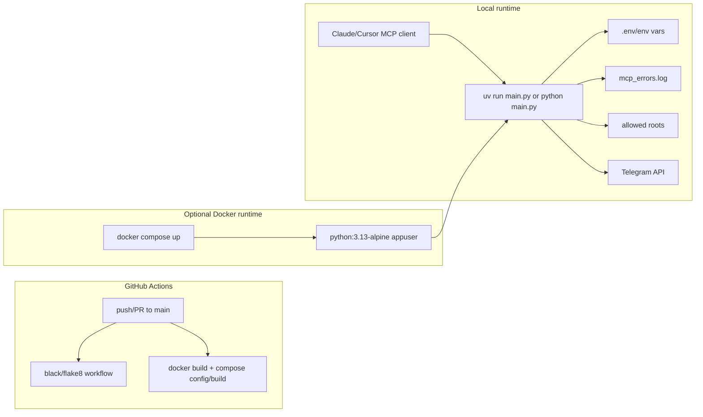

CI runs on push/PR to `main` and `workflow_dispatch` (`.github/workflows/python-lint-format.yml:3`, `.github/workflows/python-lint-format.yml:4`, `.github/workflows/python-lint-format.yml:6`, `.github/workflows/docker-build.yml:3`). Python workflow installs only Black/Flake8 and checks formatting/linting (`.github/workflows/python-lint-format.yml:25`, `.github/workflows/python-lint-format.yml:28`, `.github/workflows/python-lint-format.yml:32`, `.github/workflows/python-lint-format.yml:37`). Docker workflow builds Dockerfile and validates/builds Compose (`.github/workflows/docker-build.yml:24`, `.github/workflows/docker-build.yml:25`, `.github/workflows/docker-build.yml:42`, `.github/workflows/docker-build.yml:46`). The Dockerfile copies `main.py`, installs `requirements.txt`, switches to `appuser`, and runs `python main.py` (`Dockerfile:21`, `Dockerfile:23`, `Dockerfile:26`, `Dockerfile:30`, `Dockerfile:31`, `Dockerfile:47`).

What follows for the reader: CI does not run the repository tests. Docker validation builds images, but runtime still depends on real Telegram credentials supplied locally.

## 9. Dependencies And Integrations

| What | Version/source | Purpose | Criticality | Plan B on failure |
|---|---:|---|---|---|
| Python | `>=3.10` package requirement (`pyproject.toml:24`); Docker uses `python:3.13-alpine` (`Dockerfile:2`) | Runtime | Critical | use supported local Python/uv |
| `mcp[cli]` | `>=1.8.0` in `pyproject` (`pyproject.toml:28`), `>=1.4.1` in `requirements.txt` (`requirements.txt:3`) | MCP stdio server | Critical | align dependency files |
| Telethon | `>=1.42.0` in `pyproject` (`pyproject.toml:33`), `1.42.0` in `uv.lock` (`uv.lock:1089`, `uv.lock:1090`), `1.39.0` in `poetry.lock` (`poetry.lock:580`, `poetry.lock:581`) | Telegram API client | Critical | use one lock/source of truth |
| `python-dotenv` / `dotenv` | `>=1.1.0` / `>=0.9.9` (`pyproject.toml:26`, `pyproject.toml:30`) | Loads `.env` | High | direct env vars |
| `python-json-logger` | `>=3.3.0` (`pyproject.toml:31`) | JSON error logging | Medium | console logging |
| `qrcode` | `>=8.2` (`pyproject.toml:32`) | QR login in session generator | Medium | phone-code login |
| Local filesystem | `.env`, session files, allowed roots, logs (`.gitignore:131`, `.gitignore:176`, `main.py:276`, `main.py:306`) | Config, logs, file tools | High | session strings and no file roots |
| Telegram API | Telethon operations (`main.py:985`, `main.py:4000`) | Core integration | Critical | none |
| Docker/Compose | Dockerfile/Compose (`Dockerfile:2`, `docker-compose.yml:4`) | Optional deployment | Medium | local uv run |

Dependency vulnerability status is unknown because no `pip audit`, `uv`, `poetry`, or external scanner was run. A static consistency issue exists: Telethon and MCP dependency constraints differ across `pyproject.toml`, `requirements.txt`, `poetry.lock`, and `uv.lock` (`pyproject.toml:28`, `requirements.txt:3`, `poetry.lock:580`, `uv.lock:1090`).

What follows for the reader: choose one dependency manager path before changing dependencies. Today `uv` docs and `Dockerfile` may resolve different versions.

## 10. Hot Files Map

Frequency source: `git log --name-only --pretty=format:` over available local history; recent 30-day log shows heavy activity in `main.py` and README between 2026-03-27 and 2026-04-24.

| File | Count | Why it is hot |
|---|---:|---|
| `main.py` | 96 | Monolithic server, account handling, validation, all tools (`main.py:95`, `main.py:170`, `main.py:873`) |
| `README.md` | 48 | Tool catalog, setup, security docs (`README.md:37`, `README.md:207`, `README.md:617`) |
| `pyproject.toml` | 13 | Package metadata, scripts, dependency specs (`pyproject.toml:5`, `pyproject.toml:25`, `pyproject.toml:43`) |
| `uv.lock` | 11 | uv dependency lock (`uv.lock:1051`, `uv.lock:1089`) |
| `session_string_generator.py` | 10 | Auth/session bootstrap (`session_string_generator.py:92`, `session_string_generator.py:135`) |
| `.gitignore` | 8 | Secret/session/log/build exclusions (`.gitignore:131`, `.gitignore:176`) |
| `.env.example` | 5 | Credential/session template (`.env.example:1`, `.env.example:7`, `.env.example:14`) |
| `test_file_path_security.py` | 4 | Path-root security tests by static inspection (`test_file_path_security.py:50`, `test_file_path_security.py:238`) |
| `requirements.txt` | 4 | Docker dependency source (`requirements.txt:1`, `Dockerfile:21`) |
| `docker-compose.yml` | 3 | Local container runtime (`docker-compose.yml:4`, `docker-compose.yml:13`) |
| `.github/workflows/docker-build.yml` | 3 | Docker CI (`.github/workflows/docker-build.yml:24`, `.github/workflows/docker-build.yml:46`) |
| `test_validation.py` | 2 | ID validation tests (`test_validation.py:12`, `test_validation.py:18`) |

What follows for the reader: nearly every meaningful change touches `main.py`. Keep README/tool docs and tests synchronized with each tool change.

## 11. Reading Order

1. `README.md` for product scope, tool catalog, setup, and security notes (`README.md:32`, `README.md:37`, `README.md:617`).
2. `pyproject.toml` for package identity, scripts, and dependencies (`pyproject.toml:5`, `pyproject.toml:25`, `pyproject.toml:43`).
3. `.env.example` for config model (`.env.example:1`, `.env.example:11`).
4. `main.py:90-170` for env/account discovery (`main.py:90`, `main.py:103`, `main.py:148`).
5. `main.py:170-264` for multi-account dispatch and connection checks (`main.py:170`, `main.py:231`).
6. `main.py:266-392` for logging and centralized errors (`main.py:267`, `main.py:344`).
7. `main.py:395-550` for ID validation and entity resolution (`main.py:395`, `main.py:502`).
8. `main.py:605-870` for file-root handling (`main.py:605`, `main.py:701`, `main.py:849`).
9. `main.py:873-1148` for accounts/chats/messages/send/schedule (`main.py:873`, `main.py:893`, `main.py:962`).
10. `main.py:1470-1845` for message listing and chat metadata (`main.py:1474`, `main.py:1691`).
11. `main.py:2588-2685` for send/download media (`main.py:2589`, `main.py:2629`).
12. `main.py:3128-3335` for admin/ban operations (`main.py:3135`, `main.py:3268`).
13. `main.py:3900-4160` for message destructive operations (`main.py:3905`, `main.py:3984`, `main.py:4149`).
14. `main.py:5207-5375` for drafts/folders start (`main.py:5214`, `main.py:5354`).
15. `main.py:6151-6189` for runtime entrypoint (`main.py:6151`, `main.py:6182`).
16. `session_string_generator.py` for auth/session bootstrap (`session_string_generator.py:35`, `session_string_generator.py:66`, `session_string_generator.py:135`).
17. `test_file_path_security.py` and `test_validation.py` to understand intended checks (`test_file_path_security.py:50`, `test_validation.py:18`).
18. `Dockerfile`, `docker-compose.yml`, and `.github/workflows/*.yml` for packaging/CI (`Dockerfile:47`, `docker-compose.yml:4`, `.github/workflows/python-lint-format.yml:30`).

What follows for the reader: do not start with the bottom half of the tool catalog. First understand account dispatch, path checks, and logging.

## 12. Invariants And Gotchas

1. Importing `main.py` immediately reads env and creates global clients (`main.py:90`, `main.py:92`, `main.py:148`).
2. Missing session env causes `sys.exit(1)` during account discovery (`main.py:137`, `main.py:143`).
3. Multi-account write tools require explicit `account`; read-only tools fan out to all accounts when omitted (`main.py:193`, `main.py:195`, `main.py:197`, `main.py:204`).
4. `with_account` depends on wrapped tools accepting `account` and using `get_client(account)` (`main.py:179`, `main.py:180`).
5. Entity resolution warms dialogs on `ValueError`, which can turn one lookup into a broad dialog fetch (`main.py:516`, `main.py:518`, `main.py:541`).
6. File-path tools are deny-by-default unless server CLI roots or MCP Roots are configured (`main.py:306`, `main.py:758`, `README.md:176`).
7. MCP client roots replace server roots when present; empty client roots mean deny-all (`main.py:731`, `main.py:734`).
8. `download_media` strips user-supplied suffix before calling Telethon so the actual media extension is auto-detected (`main.py:2661`, `main.py:2665`).
9. `list_chats(with_about=True)` performs one extra API call per returned chat and warns to avoid large limits (`main.py:1707`, `main.py:1711`, `main.py:1788`).
10. Test files import `main`, so they inherit import-time env/session behavior (`test_file_path_security.py:9`, `test_file_path_security.py:12`, `test_validation.py:4`, `test_validation.py:6`).
11. CI lint workflow does not install project dependencies and does not run pytest (`.github/workflows/python-lint-format.yml:25`, `.github/workflows/python-lint-format.yml:30`, `.github/workflows/python-lint-format.yml:35`).
12. Docker uses `requirements.txt`, while README setup points at `uv sync`, so dependency resolution can differ (`Dockerfile:21`, `Dockerfile:23`, `README.md:219`).
13. `poetry.lock` and `uv.lock` disagree on Telethon version (`poetry.lock:580`, `poetry.lock:581`, `uv.lock:1089`, `uv.lock:1090`).
14. README explicitly states the session string gives full Telegram account access (`README.md:619`).

What follows for the reader: the highest blast-radius changes are account dispatch, path roots, and destructive tools. Test and dependency setup need cleanup before relying on automation.

## 13. Security Findings

### HIGH: MCP client can invoke broad destructive Telegram operations without app-level confirmation

- Category: STRIDE Tampering/Elevation of Privilege; OWASP A01 Broken Access Control; ASVS V4 authorization.
- Severity: High because impact includes sending messages, deleting history, changing admin rights, and banning users; likelihood is credible for MCP prompt/tool misuse.
- Evidence: `send_message` sends arbitrary `message` to resolved `chat_id` (`main.py:967`, `main.py:968`, `main.py:985`). `delete_chat_history` can delete all history when `max_id=0` (`main.py:3984`, `main.py:3992`, `main.py:4000`). `promote_admin` grants broad default rights (`main.py:3155`, `main.py:3160`, `main.py:3161`, `main.py:3186`). `ban_user` applies all restrictions and calls `EditBannedRequest` (`main.py:3281`, `main.py:3284`, `main.py:3300`).
- Exploit scenario: a malicious prompt convinces the assistant to clean up a chat, promote a user, or send a message. The server executes it with the user's Telegram session.
- Recommendation: add per-tool confirmation/policy gates, allow disabling destructive families, require explicit account and target confirmation, and add audited dry-run previews for high-risk operations.

### HIGH: Session strings are full-account secrets and are printed/written by the generator

- Category: STRIDE Information Disclosure; OWASP A02 Cryptographic Failures / secret exposure; ASVS V2/V7.
- Severity: High because README says a session string gives full Telegram account access, and generator output/write paths can leak it to terminal logs or an insecure `.env`.
- Evidence: README says never commit session strings and that they give full access (`README.md:617`, `README.md:618`, `README.md:619`). The generator prints the session string and an env assignment (`session_string_generator.py:142`, `session_string_generator.py:144`, `session_string_generator.py:146`). It optionally opens `.env` for reading/writing without permission hardening (`session_string_generator.py:154`, `session_string_generator.py:167`).
- Exploit scenario: shell scrollback, screen recording, MCP client logs, or a world-readable `.env` exposes a session string; an attacker can reuse it as the Telegram account.
- Recommendation: mask by default, write `.env` with `0600`, warn on insecure permissions, support copy-to-clipboard/manual mode without echoing full value, and document rotation/revocation steps.

### HIGH: Central error logging can persist sensitive tool parameters

- Category: STRIDE Information Disclosure; OWASP A09 Security Logging and Monitoring Failures; ASVS V7.
- Severity: High because tool parameters include message text, contact phone numbers, file paths, usernames, and account targets; likelihood is high because errors are expected in Telegram automation.
- Evidence: `log_and_format_error` stringifies all kwargs into log context and logs with `exc_info=True` (`main.py:382`, `main.py:383`, `main.py:386`). `edit_message` passes `new_text` to error logging (`main.py:3948`, `main.py:3950`). `add_contact` logs phone/username in exception handling (`main.py:2271`, `main.py:2272`, `main.py:2273`). `send_contact` logs `phone_number` (`main.py:4733`, `main.py:4735`). Logs go to `mcp_errors.log` in the project directory (`main.py:275`, `main.py:276`, `main.py:279`).
- Exploit scenario: an error on a private message edit or contact send stores sensitive content in `mcp_errors.log`; another local process or support bundle reads it.
- Recommendation: introduce structured redaction for message bodies, phone numbers, session/account values, paths, and usernames; make file logging opt-in; document log retention.

### HIGH: Read-only tools can fan out across all accounts and disclose cross-account data

- Category: STRIDE Information Disclosure; OWASP A01/A04; ASVS V1 data protection.
- Severity: High when work/personal accounts are configured together, because omitting `account` exposes all accounts to one tool call.
- Evidence: `with_account(readonly=True)` fans out to every client via `asyncio.gather` and prefixes results (`main.py:197`, `main.py:203`, `main.py:204`). README documents that read-only tools query all accounts when `account` is omitted (`README.md:159`, `README.md:160`). `list_accounts` itself returns labels, names, phone numbers, and status (`main.py:873`, `main.py:879`, `main.py:881`, `main.py:887`).
- Exploit scenario: a prompt asks "show unread messages" without specifying account; both work and personal account data enters the same assistant context.
- Recommendation: make fan-out opt-in, require explicit `account` by default in multi-account mode, or add per-account sensitivity policies.

### MEDIUM: Resource exhaustion risk from unbounded caller-controlled limits and broad cache warming

- Category: STRIDE Denial of Service; OWASP A04 Insecure Design; ASVS V1 resource management.
- Severity: Medium because impact is local process/API quota exhaustion; likelihood is plausible with automated MCP loops.
- Evidence: `get_messages` uses caller `page_size` directly as Telethon limit (`main.py:925`, `main.py:926`, `main.py:939`). `list_messages` iterates until caller `limit` (`main.py:1476`, `main.py:1538`, `main.py:1544`). `list_topics` passes caller `limit` to `GetForumTopicsRequest` (`main.py:1603`, `main.py:1636`). Startup warms all dialogs for every client (`main.py:6157`, `main.py:6160`).
- Exploit scenario: a client asks for very large limits or repeatedly calls list/search tools, causing slow responses, memory pressure, or Telegram flood waits.
- Recommendation: add max limits, rate limiting, pagination caps, and per-client concurrency controls; make startup cache warming optional or bounded.

### MEDIUM: File download path has post-write containment check, leaving TOCTOU/symlink concerns

- Category: STRIDE Tampering; OWASP A05 Security Misconfiguration / file handling; ASVS V12 files.
- Severity: Medium because allowed roots and post-checks exist, but the actual `download_media` write happens before final path validation.
- Evidence: `_resolve_writable_file_path` resolves candidate and parent before write (`main.py:831`, `main.py:832`, `main.py:833`, `main.py:842`). `download_media` calls Telethon to write to `out_path_for_dl` (`main.py:2665`, `main.py:2666`) and only after that resolves/checks `final_path` against roots (`main.py:2670`, `main.py:2674`).
- Exploit scenario: if an allowed directory or path is replaced by a symlink between validation and write, Telethon may write outside the intended root before the code detects the final path.
- Recommendation: avoid following symlinks for writable targets, open files safely where possible, re-check parent immediately before write, use private directories, and add race-focused tests.

### MEDIUM: Import-time configuration failure can break tests and embedding

- Category: STRIDE Denial of Service; OWASP A05 Security Misconfiguration.
- Severity: Medium because missing/malformed env prevents import and can break tooling, tests, and MCP server startup.
- Evidence: `TELEGRAM_API_ID = int(os.getenv("TELEGRAM_API_ID"))` runs at import (`main.py:90`, `main.py:92`). `_discover_accounts` prints an error and exits if no session is configured (`main.py:137`, `main.py:138`, `main.py:143`). Test files import `main` after setting only API id/hash, not session env (`test_file_path_security.py:9`, `test_file_path_security.py:10`, `test_file_path_security.py:12`, `test_validation.py:4`, `test_validation.py:5`, `test_validation.py:6`).
- Exploit scenario: a missing env var causes immediate process exit or failed import, making CI/local tests unreliable and preventing partial use of utility functions.
- Recommendation: move env parsing/client discovery into `main()`, allow pure import for tests, and validate config with explicit errors at startup.

### LOW: Dependency sources are inconsistent across lock/config files

- Category: OWASP A06 Vulnerable and Outdated Components; supply-chain hygiene.
- Severity: Low as a confirmed finding because no CVE was verified, but inconsistent dependency sources increase drift and audit ambiguity.
- Evidence: `pyproject.toml` requires `mcp[cli]>=1.8.0` and `telethon>=1.42.0` (`pyproject.toml:28`, `pyproject.toml:33`), while `requirements.txt` uses `mcp[cli]>=1.4.1` (`requirements.txt:3`). `uv.lock` has Telethon `1.42.0` (`uv.lock:1089`, `uv.lock:1090`), while `poetry.lock` has Telethon `1.39.0` (`poetry.lock:580`, `poetry.lock:581`).
- Exploit scenario: Docker, uv, and Poetry users may run different MCP/Telethon behavior, including different security fixes or bugs.
- Recommendation: choose a canonical dependency manager, regenerate/remove stale locks, and add dependency review/audit in CI.

Static checklist notes: no SQL queries, ORM, HTTP server routes, CORS, CSRF, cookies, template rendering, LDAP, subprocess shell execution, or pickle/deserialization paths were found in the inspected code. The project does use Telegram network APIs through Telethon, local file reads/writes for media/logs/env, and Docker/CI build definitions.

What follows for the reader: security work should prioritize MCP authorization/confirmation, secret handling, log redaction, multi-account privacy, and file-write race hardening.

## 14. Open Questions

- `PROJECT_BRIEF.md` filename conflict: the original task template says `PROJECT_BRIEF.md`, while the user's follow-up asked to do the same pattern for `research/mcp/chigwell`; this document follows the established output path `research/chigwell-mcp-codex.md`.
- Runtime behavior of all 110 tools is unknown. Verifying would require launching the MCP server and using Telegram/API calls, which is forbidden by read-only policy.
- Whether tests currently pass is unknown. Running `pytest` is forbidden; static inspection suggests import-time env/session behavior may affect tests (`test_file_path_security.py:12`, `main.py:143`).
- Actual permissions of generated `.env`, session files, and `mcp_errors.log` are unknown without running code or inspecting runtime files.
- Dependency vulnerability status is unknown because no audit/scanner was run.
- Docker image build success is unknown locally; Docker build/compose execution is forbidden.
- Whether MCP Roots are supported by each target client is unknown; the code has fallbacks for unsupported roots (`main.py:713`, `main.py:715`).
- Telegram flood-wait/rate-limit behavior under large limits is unknown without dynamic testing.
- Ownership/team boundaries beyond `pyproject` authors and README maintainers are unknown (`pyproject.toml:10`, `README.md:652`).

What follows for the reader: do not make production claims from this document alone. Close the dynamic questions in a controlled environment with a non-critical Telegram account.

## 15. Change Log

- 2026-04-24: Initial static read-only project brief for `research/mcp/chigwell`; created from source, docs, configs, tests, locks, and git history only.
- Verification: rechecked five security findings against source lines: destructive tools (`main.py:985`, `main.py:4000`, `main.py:3186`), session-string exposure (`README.md:619`, `session_string_generator.py:144`), log parameter leakage (`main.py:383`, `main.py:386`, `main.py:3950`), multi-account fan-out (`main.py:197`, `main.py:204`), and file download post-write check (`main.py:2666`, `main.py:2674`).
- Verification: Containers diagram matches observed runtime/deploy files: FastMCP stdio (`main.py:95`, `main.py:6164`), Telethon clients (`main.py:119`), env/session config (`main.py:127`), Docker runtime (`Dockerfile:47`), and CI workflows (`.github/workflows/docker-build.yml:25`).
- Verification: Quick start commands are marked `[NOT VERIFIED - read-only analysis]` and sourced from README/Docker config only.
- Confirmation: no tests, builds, dependency installs, project runs, project API calls, linters, formatters, Docker commands, or network requests were executed.

What follows for the reader: this is a static map and risk review, not a runtime certification. Treat all `[NOT VERIFIED]` commands and open questions accordingly.
