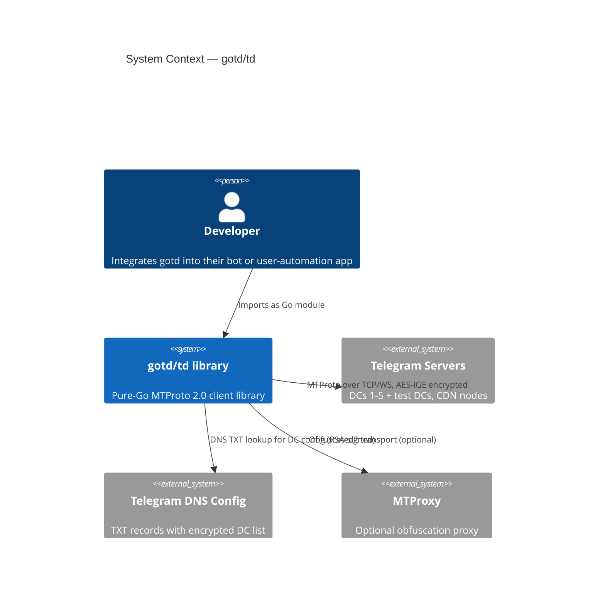
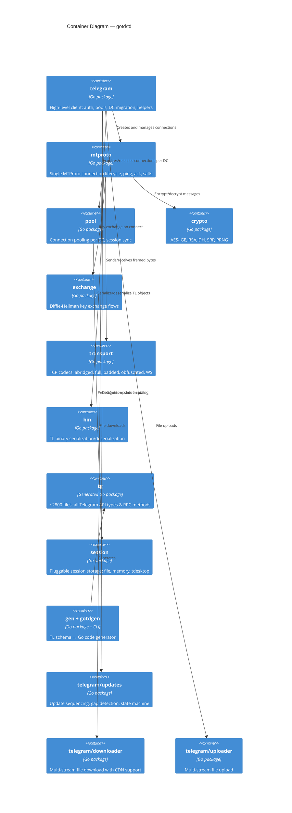
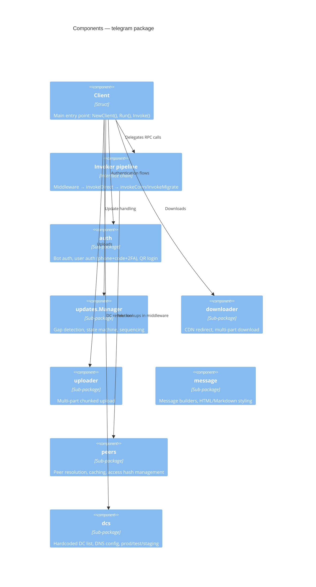
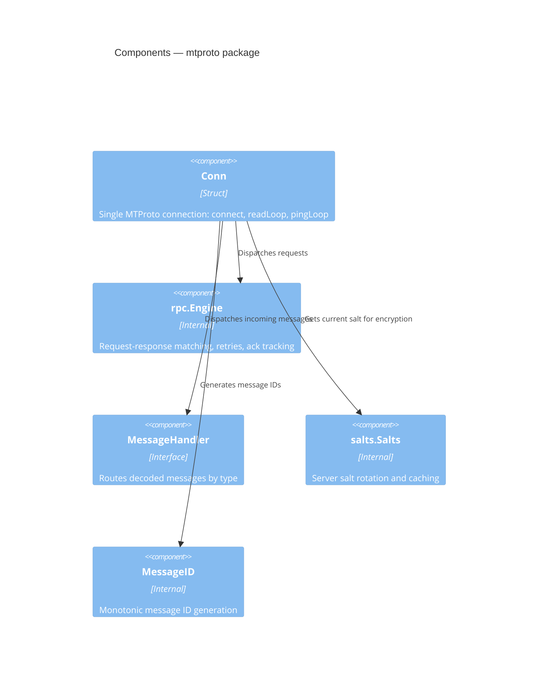
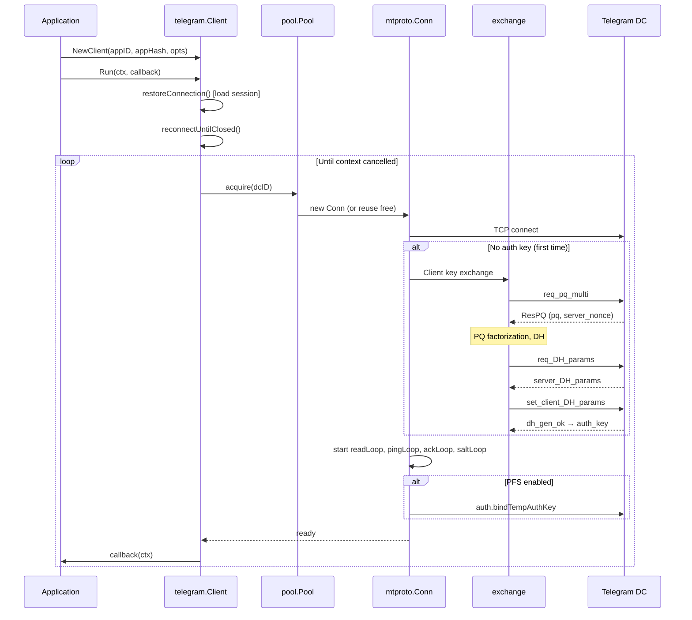
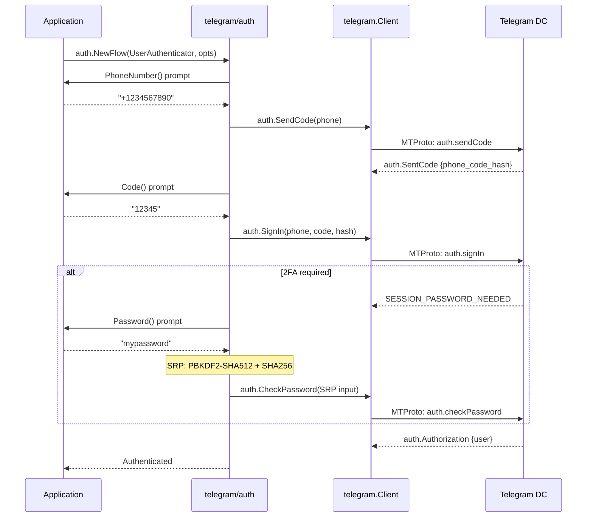
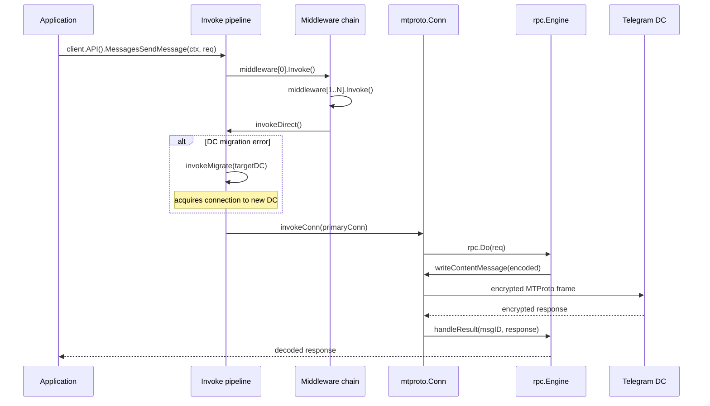
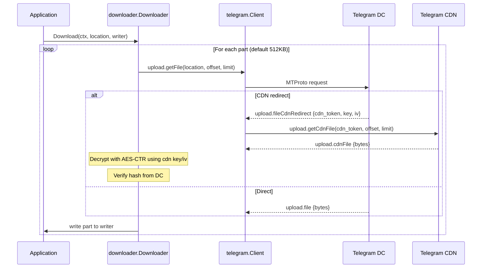
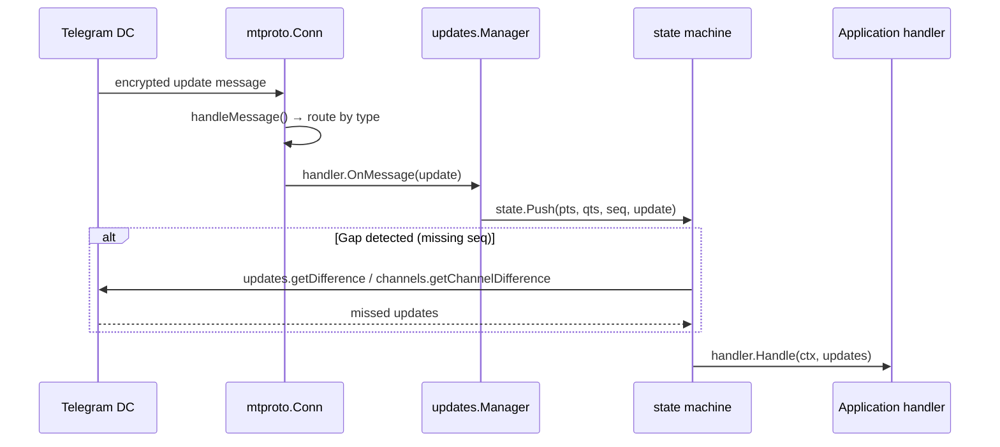
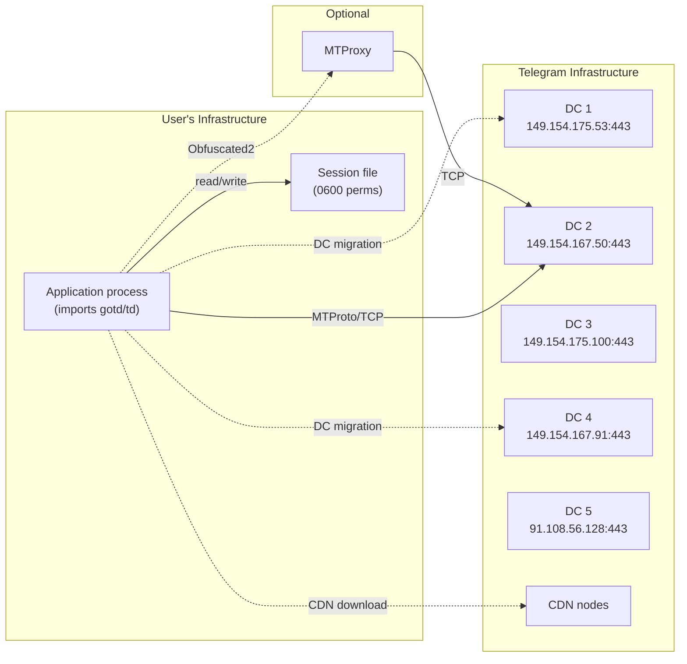

# PROJECT BRIEF: gotd/td

> **Change log**: 2026-04-24 — initial version.

---

## 1. TL;DR

**gotd/td** (`github.com/gotd/td`) is a production-grade **Telegram MTProto 2.0 API client**
written in pure Go. It targets bot and user-account automation on top of Telegram's binary
protocol. The stack is Go 1.25+, code-generated types from TL schemas, AES-IGE encryption
via a vendored `ige` library, and zero external C/C++ dependencies. It is open-source (MIT),
deployed as a library (not a standalone service), and tested against real Telegram servers in
CI. The main risk is **timing side-channels in RSA hash comparison** and
**incomplete DH parameter validation**.

---

## 2. Glossary

| Term | Meaning in this codebase |
|------|--------------------------|
| **Layer** | Telegram API schema version number; each schema update bumps the layer |
| **TL** | Type Language — Telegram's IDL for defining API types and RPC methods |
| **MTProto** | Mobile Transport Protocol — Telegram's encrypted binary RPC protocol |
| **DC** | Data Center — one of Telegram's geographically distributed server clusters |
| **Auth key** | 2048-bit key negotiated via DH; encrypts all session traffic |
| **PFS** | Perfect Forward Secrecy — mode where a temporary key wraps every session |
| **Salt** | 64-bit server-side nonce rotated periodically to prevent replay |
| **Invoker** | Interface `Invoke(ctx, encoder, decoder) error` — the core RPC call abstraction |
| **Middleware** | Wrapper around `Invoker` for cross-cutting concerns (flood-wait, tracing) |
| **Flood wait** | Telegram rate-limit response: retry after N seconds |
| **CDN** | Content Delivery Network nodes for media downloads |
| **SRP** | Secure Remote Password — used for 2FA password verification |
| **Obfuscated2** | Transport-layer obfuscation for MTProxy connections |
| **gotdgen** | Code generator: TL schema → Go source |
| **tg package** | ~2800 generated files representing all Telegram API types and methods |

---

## 3. Quick start

```bash
# Clone (already present in research/client/gotd)
cd research/client/gotd

# Dependencies
go mod download

# Run code generation (optional — generated code is committed)
go generate ./...

# Run all tests (unit only, no Telegram account needed)
go test --timeout 5m ./...

# Run a specific example (needs APP_ID, APP_HASH env vars)
export APP_ID=12345
export APP_HASH=abcdef0123456789abcdef0123456789
go run ./examples/bot-echo
```

The fastest path to a meaningful commit: pick any `TODO` in `crypto/` or `tgtest/`,
fix it, run `go test ./...`, and submit a PR following Conventional Commits.

---

## 4. C4: Context



gotd is a **library**, not a service. Developers import it and build their own bots
or automation. All network traffic goes to Telegram DCs over MTProto.

---

## 5. C4: Containers



| Container | Technology | Purpose | Owner |
|-----------|-----------|---------|-------|
| `telegram` | Go | High-level API, auth, DC migration, reconnects | gotd team |
| `mtproto` | Go | Single-connection MTProto lifecycle | gotd team |
| `pool` | Go | Connection pooling, session sync | gotd team |
| `crypto` | Go + `gotd/ige` | All cryptographic primitives | gotd team |
| `exchange` | Go | DH key exchange (client & server flows) | gotd team |
| `transport` | Go | TCP/WS codec layer | gotd team |
| `bin` | Go | Binary (de)serialization, zero-alloc | gotd team |
| `tg` | Generated Go | Telegram API types (layer-versioned) | auto-generated |
| `session` | Go | Pluggable session persistence | gotd team |
| `gen`/`gotdgen` | Go + text/template | Code generation pipeline | gotd team |
| `updates` | Go | Sequenced update delivery, gap fill | gotd team |
| `downloader` | Go | CDN-aware file downloads | gotd team |
| `uploader` | Go | Chunked file uploads | gotd team |

---

## 6. C4: Components

### 6.1 telegram package



### 6.2 mtproto package



---

## 7. Data flows

### 7.1 Client initialization and connection



**Trust boundary**: all data after key exchange is AES-IGE encrypted.
The auth key is the trust root — its compromise exposes the entire session.

_Source_: `telegram/connect.go:130-208`, `mtproto/conn.go:207-255`, `exchange/client_flow.go`.

### 7.2 Authentication (user account)



**Trust boundary**: phone code and password never leave the device unencrypted.
SRP ensures the password itself is never sent — only a zero-knowledge proof.

_Source_: `telegram/auth/flow.go:50-113`, `telegram/auth/user.go`, `crypto/srp/srp.go`.

### 7.3 RPC invocation pipeline



_Source_: `telegram/invoke.go:24-90`, `mtproto/rpc.go:14-48`.

### 7.4 File download with CDN



**Trust boundary**: CDN nodes are semi-trusted — files are AES-CTR encrypted,
and hashes are verified against the origin DC.

_Source_: `telegram/download.go:64-94`, `telegram/downloader/downloader.go`.

### 7.5 Update processing



**Important invariant** (`telegram/updates/manager.go:22-27`):
updates may contain **negative Pts/Qts/Seq** values. These must NOT be used in handlers.

_Source_: `mtproto/handle_message.go`, `telegram/updates/manager.go:84-162`.

---

## 8. Deployment / runtime topology

gotd/td is a **library**, not a deployable service. The runtime topology depends on the
consuming application. A typical deployment:



DC endpoints are **hardcoded** in `telegram/dcs/prod.go`. DNS-based config is RSA-signed.

---

## 9. Dependencies and integrations

| Dependency | Version | Purpose | Criticality | Fallback |
|-----------|---------|---------|-------------|----------|
| `gotd/ige` | v0.2.2 | AES-IGE block cipher | **Critical** — core encryption | None (protocol-mandated) |
| `gotd/tl` | v0.4.0 | TL schema parser | Build-time only | None |
| `gotd/getdoc` | v0.52.0 | Doc extraction for codegen | Build-time only | Generate without docs |
| `cenkalti/backoff/v4` | v4.3.0 | Exponential backoff | High — reconnection logic | Replace with custom |
| `go-faster/errors` | v0.7.1 | Error wrapping with frames | Medium | `fmt.Errorf` |
| `go-faster/xor` | v1.0.0 | Fast XOR for crypto | High — encryption path | `crypto/subtle.XORBytes` |
| `coder/websocket` | v1.8.14 | WebSocket transport | Medium — WASM support | TCP-only |
| `klauspost/compress` | v1.18.5 | GZIP for message compression | Medium | `compress/gzip` |
| `otel/*` | v1.43.0 | OpenTelemetry tracing | Low — observability | Disable tracing |
| `uber/zap` | v1.27.1 | Structured logging | Low — debug | `log/slog` |
| `golang.org/x/crypto` | v0.49.0 | SHA, PBKDF2, SRP primitives | **Critical** | None |
| `golang.org/x/sync` | v0.20.0 | Concurrency primitives | High | Custom sync |
| `stretchr/testify` | v1.11.1 | Test assertions | Test-only | `testing` stdlib |

---

## 10. Hot files map

Based on git history, these files are touched by nearly every significant change:

| File | Description |
|------|-------------|
| `telegram/client.go` | Core Client struct, NewClient(), Run() |
| `telegram/options.go` | All configurable client options |
| `telegram/connect.go` | Reconnection loop, session restore |
| `telegram/invoke.go` | RPC invocation pipeline, DC migration |
| `telegram/pool.go` | DC sub-connection management |
| `mtproto/conn.go` | MTProto connection lifecycle |
| `mtproto/rpc.go` | RPC dispatch, sequence numbers |
| `mtproto/handle_message.go` | Message type routing |
| `pool/pool.go` | Connection pool acquire/release/dead |
| `pool/session.go` | Session state, DC migration |
| `crypto/cipher_encrypt.go` | Message encryption |
| `crypto/cipher_decrypt.go` | Message decryption + validation |
| `exchange/client_flow.go` | DH key exchange (client side) |
| `bin/buffer.go` | Core binary buffer |
| `telegram/auth/flow.go` | Authentication state machine |
| `telegram/updates/manager.go` | Update sequencing engine |
| `tg/tl_update_gen.go` | Generated update types (changes every layer) |
| `go.mod` | Dependency versions |

---

## 11. Reading order

For a new engineer to understand the system in ~1 day:

1. **`ARCHITECTURE.md`** — 4-layer mental model (2 min)
2. **`telegram/client.go`** — Client struct, fields, NewClient() (15 min)
3. **`telegram/options.go`** — What's configurable (10 min)
4. **`telegram/connect.go`** — Connection lifecycle, Run(), reconnects (15 min)
5. **`telegram/invoke.go`** — RPC pipeline, DC migration (10 min)
6. **`telegram/middleware.go`** — Middleware wrapping pattern (5 min)
7. **`pool/pool.go`** — Connection pooling strategy (15 min)
8. **`pool/session.go`** — Session state management (10 min)
9. **`mtproto/conn.go`** — Single connection lifecycle (20 min)
10. **`mtproto/rpc.go`** — Request dispatch, sequence numbers (10 min)
11. **`mtproto/handle_message.go`** — Message type routing (5 min)
12. **`exchange/client_flow.go`** — DH key exchange (20 min)
13. **`crypto/cipher_encrypt.go` + `cipher_decrypt.go`** — AES-IGE envelope (15 min)
14. **`telegram/auth/flow.go`** — Auth state machine (10 min)
15. **`telegram/updates/manager.go`** — Update engine (15 min)
16. **`bin/buffer.go` + `bin/decode.go`** — Binary protocol (10 min)
17. **`examples/bot-echo/main.go`** — Simplest working example (5 min)
18. **`gen/make_structures.go`** (skim) — How types are generated (10 min)
19. **`telegram/downloader/downloader.go`** — CDN download flow (10 min)
20. **`tgtest/`** (skim) — How the mock Telegram server works (10 min)

---

## 12. Invariants and gotchas

1. **64-bit alignment**: `connsCounter` in `telegram/client.go:58-60` must be
   the first field in the struct for atomic operations on 32-bit platforms.
   Moving it will cause panics.

2. **PFS ordering**: In PFS mode, the read loop **must** start before the callback
   because `auth.bindTempAuthKey` needs the read loop to process the response
   (`mtproto/conn.go:234-239`).

3. **Content messages increment seqno**: Every `Invoke()` assumes the call is a
   content message and increments the sequence number (`mtproto/rpc.go:16`).
   Non-content messages would break sequence tracking.

4. **Negative Pts/Qts/Seq in updates**: Telegram may send negative values in
   update objects. These are **protocol artifacts** and must not be used in
   application logic (`telegram/updates/manager.go:22-27`).

5. **Upload part size constraints**: `partSize % 1024 == 0` AND
   `MaxPartSize % partSize == 0` (`telegram/uploader/part.go:19-22`).
   Violating this causes silent upload corruption.

6. **Session file is single-process**: The mutex in `session/storage_file.go`
   protects in-process concurrency only. Two processes sharing the same session
   file will corrupt it. `[ASSUMPTION]`

7. **DC endpoints are hardcoded**: `telegram/dcs/prod.go` contains static IP
   addresses. DNS-based discovery exists but is RSA-signature-verified.

8. **Salt expiration**: If server salt expires mid-session, MTProto returns
   `BadServerSalt`. The client automatically fetches a new salt and retries
   (`mtproto/rpc.go`). Do not treat this as a fatal error.

9. **Flood wait is retriable**: `FLOOD_WAIT_X` errors include a retry-after
   duration. The standard middleware handles this automatically. Custom invokers
   must respect it or risk account bans.

10. **Generated code is committed**: The `tg/` package (~2800 files) is checked
    into git. Running `go generate` is only needed after schema updates.
    Do not manually edit `tl_*_gen.go` files.

11. **Non-PFS dial timeout**: In non-PFS mode, the dial timeout covers both
    TCP connect AND key exchange (`mtproto/connect.go:19-23`). In PFS mode,
    key exchange has its own timeout.

12. **CDN connections are caller-managed**: `telegram/download.go:64-78` returns
    a closer for CDN pools. The downloader must NOT close CDN connections —
    the caller controls their lifecycle.

---

## 13. Security findings

### Critical: None found

### High: None found

### Medium

#### S-01: Timing side-channel in RSADecryptHashed
- **Category**: STRIDE/Information Disclosure; CWE-208
- **Severity**: Medium (impact: key material leakage; likelihood: low — requires
  network timing precision)
- **File**: `crypto/rsa_hashed.go:50-58`
- **Evidence**: Loop iterates `for i := 0; i <= len(paddedData); i++` with
  early `return` on `bytes.Equal(h[:], hash)` — variable iteration count
  leaks padding length through timing.
- **Exploit**: Attacker measures decryption time across many attempts to determine
  valid padding boundaries, reducing key exchange search space.
- **Recommendation**: Always iterate all positions; use constant-time comparison
  from `crypto/subtle.ConstantTimeCompare`.

#### S-02: Timing side-channel in RSAPad hash verification
- **Category**: STRIDE/Information Disclosure; CWE-208
- **Severity**: Medium (same rationale as S-01)
- **File**: `crypto/rsa_pad.go:155`
- **Evidence**: `bytes.Equal(hash, h.Sum(nil))` — while Go's `bytes.Equal` is
  constant-time for equal lengths, the surrounding control flow may leak timing.
- **Recommendation**: Use `subtle.ConstantTimeCompare` explicitly for clarity
  and defense-in-depth.

#### S-03: Incomplete DH parameter range check (documented FIXME)
- **Category**: STRIDE/Tampering; OWASP A02 (Cryptographic Failures)
- **Severity**: Medium (impact: weakened key exchange; likelihood: very low —
  server-controlled parameters)
- **File**: `crypto/check_dh.go:26-27`
- **Evidence**: `// FIXME(tdakkota): we check that 2^2047 <= p < 2^2048 but docs
  says to check 2^2047 < p < 2^2048.` Implementation uses `p.BitLen() != 2048`
  which accepts `p = 2^2047` (exactly 2048 bits, but spec requires strict `>`).
  Note: TDLib uses the same check (linked in comment on line 30).
- **Exploit**: A malicious server could supply `p = 2^2047` (exact boundary),
  which Telegram spec explicitly excludes.
- **Recommendation**: Add explicit check `p.Cmp(two2047) > 0` in addition to bit length.

#### S-04: Missing gB range validation in server-side DH flow
- **Category**: STRIDE/Tampering; OWASP A02
- **Severity**: Medium (impact: weak shared secret; likelihood: low — affects
  `tgtest` server, not production client path)
- **File**: `exchange/server_flow.go:261-266`
- **Evidence**: `gB` from client is used directly in `Exp(gB, a, dhPrime)` without
  checking `1 < gB < dhPrime - 1`.
- **Recommendation**: Add `crypto.CheckDHParams(gB, dhPrime)` before computing shared secret.

#### S-05: Session file symlink attack surface
- **Category**: STRIDE/Elevation of Privilege; CWE-59
- **Severity**: Medium (impact: session hijack; likelihood: low — requires local access)
- **File**: `session/storage_file.go:47`
- **Evidence**: `os.WriteFile(f.Path, data, 0600)` with `// TODO(tdakkota): use
  robustio/renameio?` on line 46. Permissions are correct, but no symlink
  resolution or parent directory ownership check.
- **Exploit**: Attacker with local access creates symlink at session path pointing
  to attacker-controlled file.
- **Recommendation**: Use `os.O_NOFOLLOW` or resolve symlinks before write.
  Consider atomic writes via temp file + rename.

#### S-06: DNS-based DC config (mitigated)
- **Category**: STRIDE/Spoofing; OWASP A08 (Software and Data Integrity)
- **Severity**: Medium (impact: DC redirection; likelihood: very low — RSA-signed)
- **File**: `telegram/dcs/dns.go`
- **Evidence**: DNS TXT record lookup for DC configuration. Mitigated by RSA
  signature verification with vendored public key.
- **Recommendation**: Document DNSSEC recommendation. Ensure RSA verification
  cannot be bypassed.

### Low

#### S-07: `Buffer.Skip()` lacks bounds checking
- **Category**: OWASP A03 (Injection — panic via OOB)
- **Severity**: Low (causes panic, not exploitation; callers generally check first)
- **File**: `bin/buffer.go` — `Skip(n)` does `b.Buf = b.Buf[n:]` without bounds check.
- **Recommendation**: Add `if n > len(b.Buf) { return io.ErrUnexpectedEOF }`.

#### S-08: SHA-1 usage in legacy RSA path
- **Category**: OWASP A02 (Cryptographic Failures)
- **Severity**: Low (protocol-mandated for MTProto v1 compatibility; SHA-256 used
  in v2 path)
- **File**: `crypto/rsa_hashed.go:6,27,53` — `#nosec G505` annotations present.
- **Recommendation**: No action needed. Protocol requirement. Document rationale.

#### S-09: Probabilistic primality test TODO
- **Category**: Informational
- **Severity**: Low
- **File**: `crypto/prime.go:7-12` — `// TODO: maybe it should be smaller?` for
  `probabilityN = 64` (Miller-Rabin rounds).
- **Recommendation**: 64 rounds gives ~2^-128 error probability. Remove TODO or
  document rationale. Current value is safe.

---

## 14. Open questions

1. **No formal security audit**: The project states it follows Telegram Security
   Guidelines and uses Full Disclosure, but no third-party audit has been performed.
   The crypto implementation may have subtle issues not caught by code review alone.

2. **E2E test reliability**: CI config shows `TEST_ACCOUNTS_BROKEN=1` — unclear
   whether E2E tests against real Telegram servers are currently passing.

3. **WASM/JS crypto PRNG**: `crypto/rand.go` has a JS-specific path for WASM.
   The quality of the PRNG in that environment is unknown.

4. **Secret chat implementation completeness**: `tg/e2e` package exists with
   generated types, but the level of secret chat support in the high-level API
   is unclear from code inspection alone.

5. **Multi-process session safety**: File-based session storage uses in-process
   mutexes only. Whether multi-process deployment is explicitly unsupported or
   just undocumented is unknown.

6. **CDN hash verification completeness**: The downloader supports CDN with
   hash verification, but whether all edge cases (partial chunks, retries after
   hash failure) are correctly handled requires deeper review.

7. **`go 1.25.0` requirement**: The go.mod specifies Go 1.25.0 which is
   a future/pre-release version. This may affect compatibility for consumers
   on stable Go releases.

---

## 15. Change log

| Date | Change |
|------|--------|
| 2026-04-24 | Initial document created from source analysis of gotd/td at commit `4131a53fe` |
