# PROJECT_BRIEF.md for `research/client/gotd`

## 1. TL;DR

`gotd/td` is a Go library implementing a Telegram MTProto API client for user and bot accounts; the README states this directly (`research/client/gotd/README.md:1`) and the implementation centers on `telegram.Client` (`research/client/gotd/telegram/client.go:55`). The stack is the Go module `github.com/gotd/td` on Go `1.25.0`, with generated TL code and Makefile commands for `test`, `coverage`, and `generate` (`research/client/gotd/go.mod:1`, `research/client/gotd/go.mod:3`, `research/client/gotd/Makefile:1`). The primary runtime artifact is a library, but the repository also contains a deployable `cmd/connclose` bot example: Docker image `connclose:latest`, a Kubernetes Deployment with 1 replica, and secrets `BOT_TOKEN`, `APP_ID`, and `APP_HASH` (`research/client/gotd/cmd/connclose/deployment.yml:21`, `research/client/gotd/cmd/connclose/deployment.yml:51`). CI runs unit/integration tests on Linux/macOS/Windows, e2e tests against Telegram/MTProxy, and workflows for schema updates and releases (`research/client/gotd/.github/workflows/ci.yml:1`, `research/client/gotd/.github/workflows/e2e.yml:1`, `research/client/gotd/.github/workflows/update-schema.yml:56`). The main risk is session/auth key handling: storage contains data that can authenticate as a user/bot and in some cases decrypt previous messages; the code itself warns about this (`research/client/gotd/session/session.go:98`).

What this means for the reader: treat the project as an MTProto library, not as one monolithic service. The riskiest changes are around crypto, session storage, transport, and update ordering, not around generated `tg/tl_*_gen.go` files.

## 2. Glossary

| Term | Meaning in this codebase |
|---|---|
| `telegram.Client` | High-level client that manages session, reconnects, migration, updates, and raw RPC (`research/client/gotd/telegram/client.go:55`, `research/client/gotd/telegram/client.go:162`). |
| `tg.Client` | Generated raw MTProto method client built on top of `tg.Invoker` (`research/client/gotd/tg/tl_client_gen.go:34`, `research/client/gotd/tg/tl_client_gen.go:39`). |
| `mtproto.Conn` | Low-level MTProto connection: key exchange, encryption, ping/ack/salt loops (`research/client/gotd/mtproto/conn.go:50`, `research/client/gotd/mtproto/conn.go:204`). |
| DC | Telegram datacenter; the resolver chooses primary/media/CDN endpoints (`research/client/gotd/telegram/dcs/resolver.go:12`, `research/client/gotd/telegram/dcs/plain.go:31`). |
| Session | `session.Data` with `AuthKey`, `AuthKeyID`, `Salt`, DC, and a subset of `Config` (`research/client/gotd/session/session.go:88`). |
| Auth key | MTProto key persisted/restored through session storage (`research/client/gotd/telegram/session.go:36`, `research/client/gotd/telegram/session.go:85`). |
| PFS | Temporary auth-key mode layered over a permanent key; enabled with `Options.EnablePFS` (`research/client/gotd/telegram/options.go:91`, `research/client/gotd/mtproto/options.go:79`). |
| TL schema | Telegram Type Language schema in `_schema/*.tl`, used to generate `tg`, `tg/e2e`, `mt`, and `tgtrace` (`research/client/gotd/td.go:4`). |
| Updates | Asynchronous Telegram updates delivered through `UpdateHandler` and optionally `telegram/updates.Manager` (`research/client/gotd/telegram/client.go:28`, `research/client/gotd/telegram/updates/manager.go:18`). |
| CDN flow | Optional downloader redirect path through Telegram CDN; enabled with `Options.AllowCDN` (`research/client/gotd/telegram/options.go:49`, `research/client/gotd/telegram/download.go:80`). |
| Test Account Manager | External service at `https://bot.gotd.dev` that issues accounts for e2e tests (`research/client/gotd/tgacc/tgacc.go:18`, `research/client/gotd/tgacc/tgacc.go:155`). |

What this means for the reader: the domain model is mostly protocol-oriented. Keep the boundary clear between `telegram` as the orchestration layer and `mtproto` as the crypto/transport layer.

## 3. Quick Start

Real commands from the root of the current repository:

```bash
cd research/client/gotd
go test ./...
make test
make generate
git diff --exit-code
```

`make test` calls `./go.test.sh`, which runs `go test --timeout 5m -race ./...` (`research/client/gotd/Makefile:1`, `research/client/gotd/go.test.sh:1`). CI runs `go test --timeout 5m ./...` directly on Linux/macOS/Windows and has a separate race run on Ubuntu (`research/client/gotd/.github/workflows/ci.yml:6`, `research/client/gotd/.github/workflows/ci.yml:41`). For TL schema changes, run `make download_schema` or a related target first, then `make generate`; CI verifies that generation leaves no dirty diff (`research/client/gotd/Makefile:9`, `research/client/gotd/.github/workflows/lint.yml:35`).

A good first meaningful commit for onboarding is a small change to a unit-tested helper such as `telegram/uploader/part.go`, followed by `go test ./telegram/uploader` and then `go test ./...`; that file contains local part-size logic without live Telegram runtime dependencies (`research/client/gotd/telegram/uploader/part.go:29`).

Verification in this sandbox: `go test` was not completed because dependencies were not already cached, network access to `proxy.golang.org` is blocked, and the default Go cache is outside writable roots. The commands above match the Makefile/CI, but a full quick start requires an environment with access to the Go module proxy or a pre-populated module cache.

What this means for the reader: fix the local Go module/cache environment first, otherwise test failures will be infrastructure noise. For schema changes, expect a large generated diff.

## 4. C4: Context

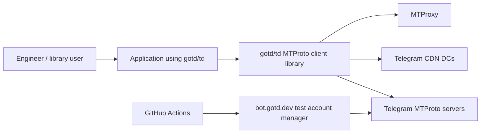

`gotd/td` is positioned as a Telegram MTProto API client for users and bots (`research/client/gotd/README.md:1`). An application creates `telegram.NewClient(appID, appHash, telegram.Options{})`, runs `Client.Run`, and gets the raw API through `client.API()` (`research/client/gotd/README.md:37`, `research/client/gotd/telegram/invoke.go:17`). External systems include Telegram MTProto DCs through the resolver (`research/client/gotd/telegram/dcs/plain.go:31`), MTProxy resolver (`research/client/gotd/telegram/dcs/mtproxy.go:109`), WebSocket transport (`research/client/gotd/telegram/dcs/websocket.go:90`), Telegram CDN config (`research/client/gotd/telegram/cdn.go:157`), and GitHub Actions plus the external account manager for e2e (`research/client/gotd/.github/workflows/e2e.yml:27`, `research/client/gotd/tgacc/tgacc.go:155`).

What this means for the reader: the production boundary usually lives in the consumer application, not in this repository. Security of external entrypoints depends on how the consumer wraps `gotd/td`.

## 5. C4: Containers

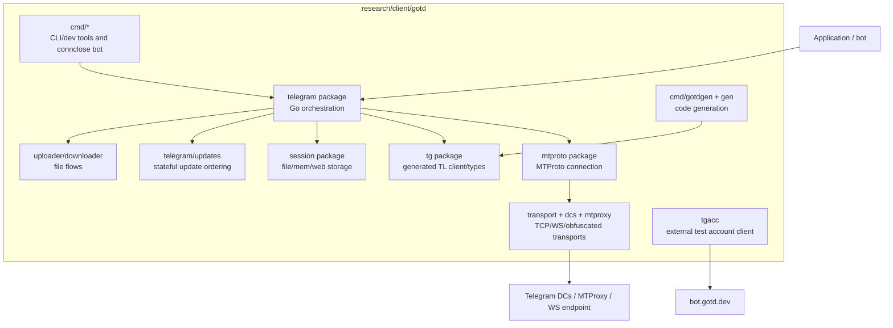

| Container | Technology | Purpose | Owner |
|---|---|---|---|
| `telegram` | Go | High-level client lifecycle, auth, reconnect, migration, CDN, update dispatch (`research/client/gotd/telegram/client.go:162`). | gotd maintainers |
| `mtproto` | Go | MTProto key exchange, encryption, replay checks, ack/ping/salt loops (`research/client/gotd/mtproto/conn.go:204`). | gotd maintainers |
| `transport`/`telegram/dcs`/`mtproxy` | Go | TCP, WebSocket, MTProxy, codec handshake, and DC resolution (`research/client/gotd/transport/protocol.go:27`, `research/client/gotd/telegram/dcs/plain.go:73`). | gotd maintainers |
| `session` | Go | Persistent/in-memory/web session storage (`research/client/gotd/session/session.go:98`, `research/client/gotd/session/storage_file.go:11`). | gotd maintainers + consumer implementation |
| `tg`/`mt`/`tg/e2e` | generated Go | Generated TL types, client, and server dispatcher (`research/client/gotd/tg/tl_client_gen.go:1`). | generated by `gotdgen` |
| `gen` + `cmd/gotdgen` | Go CLI + templates | Generate Go code from TL schema (`research/client/gotd/cmd/gotdgen/main.go:35`, `research/client/gotd/cmd/gotdgen/main.go:91`). | gotd maintainers |
| `cmd/connclose` | Go binary + Docker/K8s | Example/canary bot deployment (`research/client/gotd/cmd/connclose/main.go:17`, `research/client/gotd/cmd/connclose/deployment.yml:21`). | example/canary owner unknown |
| `tgacc` | Go + ogen client | Client for the external test account manager (`research/client/gotd/tgacc/tgacc.go:18`, `research/client/gotd/tgacc/tgacc.go:155`). | gotd CI |

Runtime topology differs from source topology: most containers are library packages, while the only deployable artifact in the repo is `cmd/connclose` plus GitHub Actions workflows. What this means for the reader: do not look for one `main` for the whole project; package boundaries matter more.

## 6. C4: Components

### `telegram.Client`

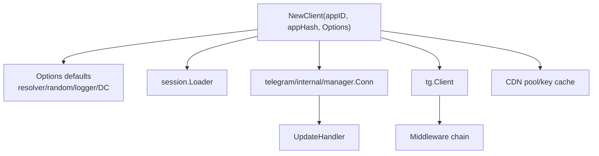

`NewClient` applies defaults, stores immutable dependencies, wires session storage through `session.Loader`, creates `tg.Client`, and creates the primary connection (`research/client/gotd/telegram/client.go:162`, `research/client/gotd/telegram/client.go:209`, `research/client/gotd/telegram/client.go:236`). `Run` restores the session, starts the reconnect loop, and invokes the caller callback only after readiness (`research/client/gotd/telegram/connect.go:130`, `research/client/gotd/telegram/connect.go:172`, `research/client/gotd/telegram/connect.go:188`). Update handling is disabled by default when no handler is provided (`research/client/gotd/telegram/options.go:164`).

### `mtproto.Conn`

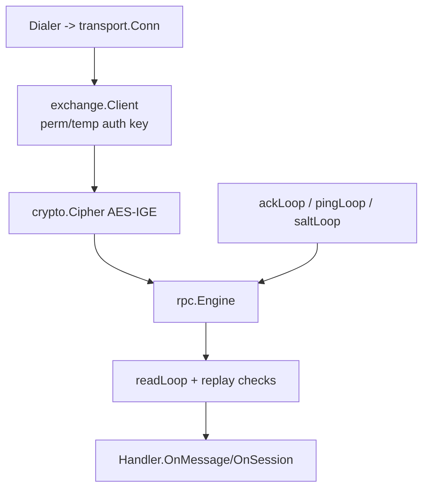

`mtproto.Conn` owns the transport, RSA public keys, auth keys, salt, session id, replay buffer, RPC engine, ack queue, and ping state (`research/client/gotd/mtproto/conn.go:50`). `Run` dials, performs key exchange if needed, starts read/ping/ack/salt loops, and optionally starts the PFS renewal loop (`research/client/gotd/mtproto/conn.go:204`, `research/client/gotd/mtproto/conn.go:221`, `research/client/gotd/mtproto/conn.go:241`). Incoming encrypted messages validate session id, message time window, and duplicate ids before handling (`research/client/gotd/mtproto/read.go:52`).

### Code Generation

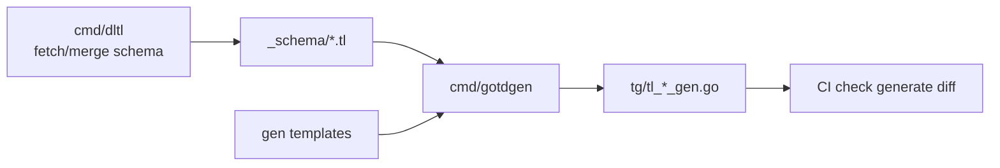

Root `td.go` declares `go:generate` commands for Telegram, encrypted, trace, and MTProto schemas (`research/client/gotd/td.go:4`). `gotdgen` parses schema, optionally cleans `tl_*_gen.go`, creates the generator, and writes formatted Go source (`research/client/gotd/cmd/gotdgen/main.go:55`, `research/client/gotd/cmd/gotdgen/main.go:68`, `research/client/gotd/cmd/gotdgen/main.go:91`). CI runs `make generate` and then `git diff --exit-code` (`research/client/gotd/.github/workflows/lint.yml:35`).

What this means for the reader: direct edits to generated code are almost always wrong; change the schema/generator/templates and verify a clean generated diff. For runtime bugs, start with `telegram.Client` and `mtproto.Conn`.

## 7. Data Flows

### 7.1 Client startup and session restore

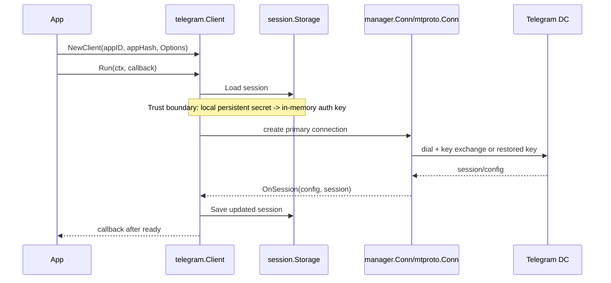

`Run` calls `restoreConnection` before starting reconnect groups (`research/client/gotd/telegram/connect.go:172`). `restoreConnection` loads session data, validates the key id, and stores auth key/salt/DC in memory (`research/client/gotd/telegram/session.go:17`, `research/client/gotd/telegram/session.go:41`). `onSession` updates in-memory config/session and persists the current state (`research/client/gotd/telegram/session.go:100`, `research/client/gotd/telegram/session.go:117`).

Trust change: bytes from disk become a live Telegram identity. What this means for the reader: session storage must be treated like a password vault.

### 7.2 Bot authentication from environment

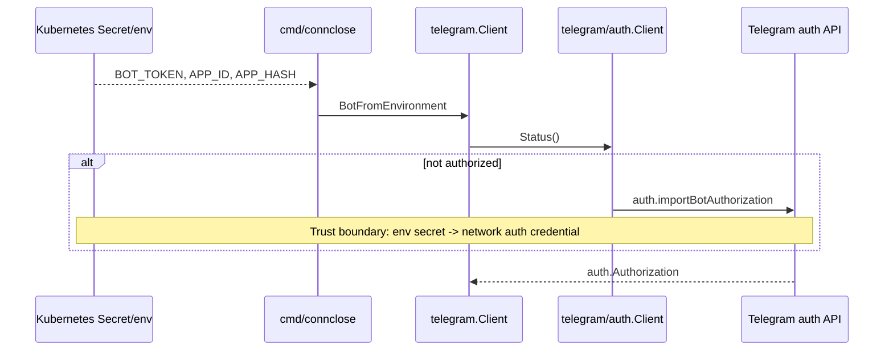

`cmd/connclose` uses `telegram.BotFromEnvironment` and registers an `OnNewMessage` echo handler (`research/client/gotd/cmd/connclose/main.go:21`, `research/client/gotd/cmd/connclose/main.go:27`). `BotFromEnvironment` reads `BOT_TOKEN` and calls `Auth().Bot` when the session is not authorized (`research/client/gotd/telegram/bot.go:39`, `research/client/gotd/telegram/bot.go:45`). Kubernetes injects `BOT_TOKEN`, `APP_ID`, and `APP_HASH` from the `config` secret (`research/client/gotd/cmd/connclose/deployment.yml:51`).

Trust change: a Kubernetes secret/env value becomes Telegram bot authorization. What this means for the reader: deployment operators must rotate both env secrets and session files if compromised.

### 7.3 Raw RPC invoke and DC migration

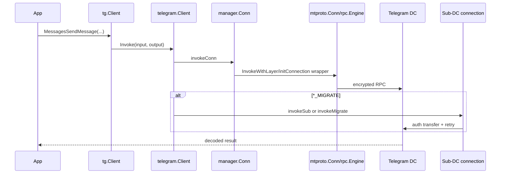

`tg.Client` only depends on `Invoker` (`research/client/gotd/tg/tl_client_gen.go:34`). `telegram.Client.Invoke` adds tracing and delegates to the middleware/invoker chain (`research/client/gotd/telegram/invoke.go:22`). `_MIGRATE` errors trigger either sub-DC invoke for file/stats or primary DC migration (`research/client/gotd/telegram/invoke.go:53`, `research/client/gotd/telegram/invoke.go:66`). `manager.Conn.Invoke` wraps requests in `invokeWithLayer`, and data mode additionally uses `invokeWithoutUpdates` (`research/client/gotd/telegram/internal/manager/conn.go:200`, `research/client/gotd/telegram/internal/manager/conn.go:293`).

Trust change: an app-level typed request becomes encrypted MTProto bytes; Telegram RPC errors can redirect connection topology. What this means for the reader: migration and auth transfer paths are part of the normal write path, not obscure edge-case code.

### 7.4 Incoming updates ordering

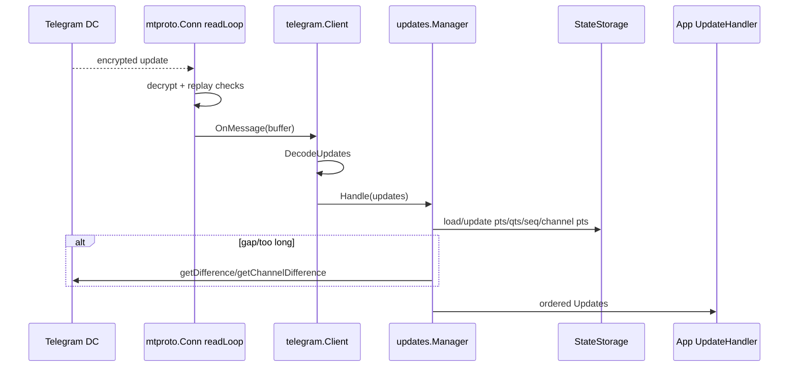

`readLoop` spawns one goroutine per incoming message after receiving from transport (`research/client/gotd/mtproto/read.go:175`, `research/client/gotd/mtproto/read.go:202`). `telegram.Client` decodes `tg.UpdatesClass` and passes it to the configured handler (`research/client/gotd/telegram/handle_updates.go:48`). `updates.Manager` either passes updates through when `Run` was not called or pushes them into internal state queues (`research/client/gotd/telegram/updates/manager.go:49`, `research/client/gotd/telegram/updates/manager.go:66`). State storage owns `pts/qts/date/seq` and per-channel pts (`research/client/gotd/telegram/updates/storage.go:23`).

Trust change: untrusted network bytes become typed updates only after crypto/session/replay validation. What this means for the reader: handler code should not rely on raw `Pts/Qts/Seq` in manager-produced updates because comments warn they may be negative for difference results (`research/client/gotd/telegram/updates/manager.go:20`).

### 7.5 Upload from URL

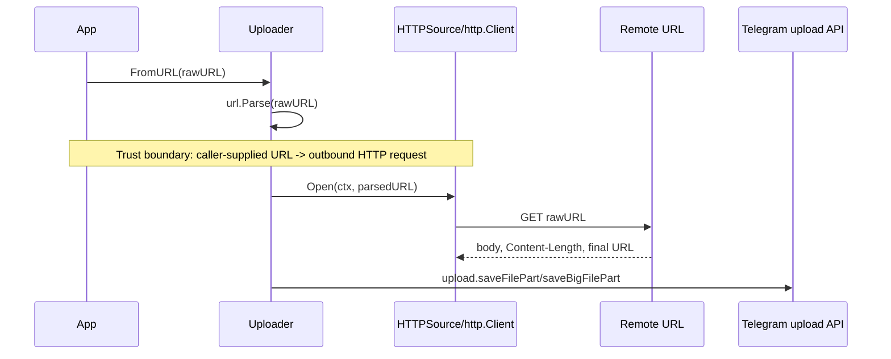

`FromURL` delegates to `FromSource`, parses caller-provided `rawURL`, opens it through `source.Source`, validates that the file name is non-empty, and then uploads the stream (`research/client/gotd/telegram/uploader/helpers.go:74`, `research/client/gotd/telegram/uploader/helpers.go:80`, `research/client/gotd/telegram/uploader/helpers.go:94`). The default source is `HTTPSource` with `http.DefaultClient` (`research/client/gotd/telegram/uploader/uploader.go:27`, `research/client/gotd/telegram/uploader/source/http.go:19`). `HTTPSource.Open` performs `GET` and follows the default `http.Client` redirect behavior (`research/client/gotd/telegram/uploader/source/http.go:53`).

Trust change: if `rawURL` is user-controlled, the application has delegated outbound network access to that user. What this means for the reader: applications exposing `FromURL` need their own allowlist, private-IP blocking, size/time limits, and redirect policy.

## 8. Deployment / Runtime Topology

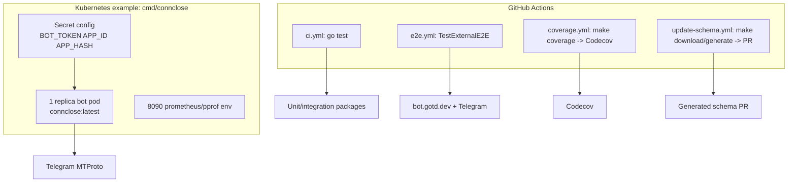

The CI matrix tests Go `oldstable`/`stable`, Ubuntu/macOS/Windows, and a race run on Ubuntu (`research/client/gotd/.github/workflows/ci.yml:6`, `research/client/gotd/.github/workflows/ci.yml:25`). E2E installs `github.com/9seconds/mtg/v2@v2.1.13` and runs `go test -v -run ^TestExternalE2E ./...` with GitHub env vars and an MTProxy address (`research/client/gotd/.github/workflows/e2e.yml:27`, `research/client/gotd/.github/workflows/e2e.yml:31`). `cmd/connclose` deploys as one Kubernetes replica with `Recreate` strategy and env-based secrets (`research/client/gotd/cmd/connclose/deployment.yml:9`, `research/client/gotd/cmd/connclose/deployment.yml:11`).

What this means for the reader: "production" for the library is its consumers; repository-owned runtime evidence is mostly CI plus the `connclose` example/canary. Read the container diagram as a source/runtime hybrid.

## 9. Dependencies and Integrations

| What | Version / source | Purpose | Criticality | Fallback plan |
|---|---:|---|---|---|
| Go | `1.25.0` | Build/runtime language (`research/client/gotd/go.mod:3`). | Critical | Use CI-supported stable/oldstable if compatible. |
| Telegram MTProto | external | Main API/backend; client connects to DCs through resolver (`research/client/gotd/telegram/dcs/resolver.go:12`). | Critical | Retry/backoff, DC migration, MTProxy/WebSocket resolver. |
| Telegram CDN | external | Optional file download redirect path (`research/client/gotd/telegram/options.go:49`). | Medium | `AllowCDN=false` keeps the master DC path. |
| MTProxy | external | Proxy transport (`research/client/gotd/telegram/dcs/mtproxy.go:109`). | Medium | Plain DC resolver or WebSocket resolver. |
| `github.com/coder/websocket` | `v1.8.14` | WebSocket transport client/listener (`research/client/gotd/go.mod:7`). | Medium | Plain TCP transport. |
| `golang.org/x/crypto` | `v0.49.0` | SRP/crypto helpers (`research/client/gotd/go.mod:28`). | Critical | Update dependency and rerun crypto tests. |
| `github.com/gotd/ige` | `v0.2.2` | AES-IGE block mode (`research/client/gotd/go.mod:14`, `research/client/gotd/crypto/cipher_encrypt.go:7`). | Critical | No simple fallback; the protocol requires compatibility. |
| `github.com/gotd/tl` | `v0.4.0` | TL parser/generator input (`research/client/gotd/go.mod:16`, `research/client/gotd/cmd/gotdgen/main.go:13`). | High | Pin/update generator; compare generated diff. |
| OpenTelemetry | `v1.43.0` | Tracing/metrics hooks (`research/client/gotd/go.mod:29`). | Low | Disable tracer provider/exporters. |
| Codecov | GitHub Action v6 | Coverage upload (`research/client/gotd/.github/workflows/coverage.yml:34`). | Low | Keep local `profile.out`. |
| bot.gotd.dev | hardcoded URL | CI external test accounts (`research/client/gotd/tgacc/tgacc.go:155`). | Medium | Disable external account manager via env or use Telegram test DC accounts. |
| Kubernetes | YAML only | `cmd/connclose` deployment (`research/client/gotd/cmd/connclose/deployment.yml:1`). | Low | Run the binary locally with env secrets. |

Dependency vulnerability status: the lock file was considered through `go.mod`, but live vulnerability/audit lookup was not possible without network access. What this means for the reader: before shipping dependency changes, run `govulncheck ./...` or an equivalent scan in a networked CI/dev environment.

## 10. Hot Files Map

Top changed files by `git log --name-only --all`: `go.mod` 456, `go.sum` 451, `telegram/client.go` 152, `tg/tl_update_gen.go` 112, `_schema/tdapi.tl` 112, `README.md` 112, `tg/tl_message_action_gen.go` 105, `tg/tl_registry_gen.go` 102, `_schema/telegram.tl` 93, `tg/tl_chat_full_gen.go` 82, `tg/tl_user_full_gen.go` 78, `telegram/client_e2e_test.go` 75, `tg/tl_user_gen.go` 74, `tg/tl_server_gen.go` 72, `tg/tl_chat_gen.go` 72, `_schema/tdesktop.tl` 71, `tg/tl_message_gen.go` 69, `tg/tl_messages_send_message_gen.go` 68, `tg/tl_message_media_gen.go` 68, `tg/tl_input_media_gen.go` 68.

| File | Why it is hot |
|---|---|
| `go.mod` | Dependency bumps and Go version (`research/client/gotd/go.mod:1`). |
| `go.sum` | Dependency integrity lock; changes with `go.mod`. |
| `telegram/client.go` | Core client struct and constructor (`research/client/gotd/telegram/client.go:55`). |
| `telegram/client_e2e_test.go` | E2E coverage for client behavior; frequently tracks protocol behavior. |
| `_schema/telegram.tl` | Source of the generated Telegram layer (`research/client/gotd/td.go:4`). |
| `_schema/tdesktop.tl` | Telegram Desktop schema input for merged schema targets (`research/client/gotd/Makefile:13`). |
| `_schema/tdapi.tl` | TDLib schema input. |
| `tg/tl_registry_gen.go` | Generated registry/type mapping; changes on schema updates. |
| `tg/tl_server_gen.go` | Generated server dispatcher; changes on schema updates. |
| `tg/tl_update_gen.go` | Generated update types; central to update handling. |
| `tg/tl_message_gen.go` | Generated message type; broad protocol surface. |
| `tg/tl_message_media_gen.go` | Generated media type; broad file/media flows. |
| `README.md` | Public API examples and project positioning (`research/client/gotd/README.md:35`). |

In the 30 days before `2026-04-24`: an OpenTelemetry dependency bump landed on `2026-04-06`, a schema update on `2026-04-04`, a polling helper fix on `2026-04-04`, and a Codecov action bump on `2026-03-27`. What this means for the reader: most churn is generated/protocol drift; hand-written core changes are much rarer and deserve more review.

## 11. Reading Order

1. `README.md` — purpose, public API, and examples (`research/client/gotd/README.md:1`).
2. `ARCHITECTURE.md` — official high-level layering (`research/client/gotd/ARCHITECTURE.md:1`).
3. `go.mod` — dependencies and Go version (`research/client/gotd/go.mod:1`).
4. `Makefile` — common local commands (`research/client/gotd/Makefile:1`).
5. `.github/workflows/ci.yml` — normal verification (`research/client/gotd/.github/workflows/ci.yml:1`).
6. `td.go` — generation entrypoints (`research/client/gotd/td.go:4`).
7. `telegram/options.go` — client configuration and defaults (`research/client/gotd/telegram/options.go:26`).
8. `telegram/client.go` — central state and constructor (`research/client/gotd/telegram/client.go:55`).
9. `telegram/connect.go` — `Run`, reconnect, and readiness (`research/client/gotd/telegram/connect.go:121`).
10. `telegram/session.go` — session restore/save (`research/client/gotd/telegram/session.go:17`).
11. `telegram/internal/manager/conn.go` — initConnection wrappers and mode behavior (`research/client/gotd/telegram/internal/manager/conn.go:160`).
12. `mtproto/conn.go` — low-level connection lifecycle (`research/client/gotd/mtproto/conn.go:50`).
13. `mtproto/connect.go` — key exchange and PFS connect (`research/client/gotd/mtproto/connect.go:13`).
14. `mtproto/read.go` — decrypt/replay/read loop (`research/client/gotd/mtproto/read.go:19`).
15. `transport/protocol.go` — MTProto transport codecs (`research/client/gotd/transport/protocol.go:27`).
16. `telegram/dcs/plain.go` — DC resolution/dial racing (`research/client/gotd/telegram/dcs/plain.go:134`).
17. `telegram/auth/flow.go` — user authentication flow (`research/client/gotd/telegram/auth/flow.go:50`).
18. `telegram/updates/manager.go` — update ordering manager (`research/client/gotd/telegram/updates/manager.go:18`).
19. `telegram/uploader/helpers.go` — file/URL upload entrypoints (`research/client/gotd/telegram/uploader/helpers.go:74`).
20. `cmd/connclose/main.go` — concrete deployable bot example (`research/client/gotd/cmd/connclose/main.go:17`).

What this means for the reader: do not start with generated `tg` files except to inspect exact TL method/type signatures. The hand-written reading path above builds the mental model faster.

## 12. Invariants and Gotchas

1. The `Client.Run` callback is valid only while `Run` is active; the README example explicitly says the API is valid while the callback has not returned (`research/client/gotd/README.md:44`).
2. `telegram.Client` has alignment-sensitive fields: a comment says the `connsCounter` order must not be changed arbitrarily because of atomic alignment (`research/client/gotd/telegram/client.go:55`).
3. If no update handler is passed, `NoUpdates` is enabled and a no-op handler is installed (`research/client/gotd/telegram/options.go:164`). Code expecting updates must pass a handler explicitly.
4. Session storage is security-critical and contains enough data to impersonate users/bots (`research/client/gotd/session/session.go:98`). Do not log, copy, or commit session files.
5. `FileStorage.StoreSession` writes directly to the target file and a TODO says robust rename is not implemented (`research/client/gotd/session/storage_file.go:46`). Crashes can leave partial state.
6. PFS mode treats a restored legacy key as the permanent key and clears the runtime temporary key until a new temporary key is generated (`research/client/gotd/mtproto/conn.go:169`). Changing key persistence can break auth continuity.
7. Incoming message processing spawns a goroutine per message for utilization reasons (`research/client/gotd/mtproto/read.go:202`). Handler code must tolerate concurrency.
8. `updates.Manager` can emit updates with negative `Pts/Qts/Seq` after difference recovery; comments say not to use those values in handlers (`research/client/gotd/telegram/updates/manager.go:20`).
9. Downloader CDN flow is disabled unless explicitly allowed; comments call this legacy master-DC behavior (`research/client/gotd/telegram/downloader/builder.go:135`).
10. CDN connections have special init wrapping and raw retry behavior, modeled after TDesktop (`research/client/gotd/telegram/internal/manager/conn.go:226`). Do not simplify it as normal RPC.
11. Code generation deletes only `tl_*_gen.go` files when `--clean` is set (`research/client/gotd/cmd/gotdgen/main.go:68`). Generated file naming is part of cleanup safety.
12. `go generate` fetches docs from `https://core.telegram.org/` in root generation commands (`research/client/gotd/td.go:4`); offline generation may differ or fail.
13. `cmd/dltl` records source URL and SHA256 in generated schema output, but fetches live remote content (`research/client/gotd/cmd/dltl/main.go:148`).
14. `tgacc` external account tokens are UUIDs used to receive Telegram codes and send heartbeats (`research/client/gotd/tgacc/tgacc.go:136`). Treat them as secrets in CI logs.
15. `cmd/connclose` echoes incoming message text back to the sender (`research/client/gotd/cmd/connclose/main.go:27`). Do not use it as a safe generic bot without abuse/rate controls.

What this means for the reader: many “small” changes have hidden protocol or security invariants. Check comments before refactoring loops, storage, key handling, and generated cleanup.

## 13. Security Findings

### High — Plaintext session/auth key storage can become account takeover

- Category: OWASP A02 Cryptographic Failures; ASVS V6 Secrets Management.
- Severity: High = high impact (Telegram identity/session compromise) × medium likelihood (file/local storage commonly copied, backed up, or mounted).
- Evidence: `session.Storage` warns that an attacker can use storage for authenticated access and sometimes decrypt previous messages (`research/client/gotd/session/session.go:98`); `FileStorage` stores bytes with `os.WriteFile(..., 0600)` only (`research/client/gotd/session/storage_file.go:47`).
- Quote: `AuthKey []byte` is part of `session.Data` (`research/client/gotd/session/session.go:93`).
- Exploitation: an attacker who reads `session.json` can restore auth material in another client or exfiltrate it from backups. Partial writes can also corrupt the only session state.
- Recommendation: document encrypted-at-rest storage as the production default; provide or endorse keychain/KMS-backed `SessionStorage`; use atomic write/rename for file storage; never mount session files into broadly readable volumes.

### High — Browser `localStorage` session storage is exposed to XSS/extensions

- Category: OWASP A02 Cryptographic Failures / A05 Security Misconfiguration.
- Severity: High = high impact × medium likelihood for browser apps using WASM and any XSS-prone host app.
- Evidence: `WebLocalStorage` is a Web Storage based session storage (`research/client/gotd/session/storage_js.go:13`) and `StoreSession` writes `string(data)` to `localStorage.setItem` (`research/client/gotd/session/storage_js.go:71`).
- Quote: `store.Call("setItem", w.Key, string(data))` (`research/client/gotd/session/storage_js.go:84`).
- Exploitation: any script executing in the same origin can read the session key and replay it outside the browser context.
- Recommendation: avoid `WebLocalStorage` for high-value accounts; prefer origin-isolated apps, short-lived sessions, WebCrypto wrapping with non-exportable keys where feasible, and strong CSP in the host app.

### High — `Uploader.FromURL` can be SSRF if exposed to untrusted input

- Category: OWASP A10 SSRF; STRIDE Information Disclosure/Elevation via outbound network pivot.
- Severity: High = potentially internal network access × medium likelihood if an app exposes URL uploads.
- Evidence: `FromSource` parses arbitrary `rawURL` and opens it through the provided source (`research/client/gotd/telegram/uploader/helpers.go:80`); the default `HTTPSource` uses `http.DefaultClient` and performs GET (`research/client/gotd/telegram/uploader/source/http.go:19`, `research/client/gotd/telegram/uploader/source/http.go:53`).
- Quote: `http.NewRequestWithContext(ctx, http.MethodGet, u.String(), nil)` (`research/client/gotd/telegram/uploader/source/http.go:54`).
- Exploitation: if a bot endpoint lets users provide URLs, an attacker can request cloud metadata, localhost services, or private IPs and upload the response to Telegram.
- Recommendation: provide a safe source wrapper with scheme allowlist, DNS/IP private-range blocking after redirects, max bytes, timeouts, redirect limits, and content-type policy; warn prominently in `FromURL` docs.

### Medium — WebSocket listener accepts unauthenticated cross-origin upgrades by default

- Category: STRIDE Spoofing/Denial of Service; OWASP A05 Security Misconfiguration.
- Severity: Medium = unauthenticated connection handling × medium likelihood if the listener is internet-facing.
- Evidence: `WebsocketListener` returns an `http.Handler` (`research/client/gotd/transport/websocket.go:23`); `ServeHTTP` calls `websocket.Accept` with only subprotocol config and no origin/auth checks (`research/client/gotd/transport/websocket.go:33`).
- Quote: `websocket.Accept(w, r, &websocket.AcceptOptions{Subprotocols: []string{"binary"}})` (`research/client/gotd/transport/websocket.go:34`).
- Exploitation: a public listener can be driven by arbitrary websites or clients to consume accept queue/read-loop resources.
- Recommendation: document that callers must wrap the handler with AuthN/AuthZ, Origin checks, TLS, rate limits, and request size/time limits; consider adding optional `AcceptOptions`/policy hooks.

### Medium — Test account token endpoints use token-in-path as sole authorization

- Category: STRIDE Information Disclosure/Authorization; OWASP A01 Broken Access Control.
- Severity: Medium = Telegram login code disclosure × low-to-medium likelihood if UUID tokens leak through logs/proxies.
- Evidence: OpenAPI has `security: tokenAuth` for acquire only (`research/client/gotd/tgacc/tgacc.openapi.yaml:51`) but heartbeat and receive-code paths take `{token}` as a path parameter without a security block (`research/client/gotd/tgacc/tgacc.openapi.yaml:18`, `research/client/gotd/tgacc/tgacc.openapi.yaml:34`). The client polls `ReceiveTelegramCode` with that token (`research/client/gotd/tgacc/tgacc.go:136`).
- Quote: `Token: a.token` in the receive-code request (`research/client/gotd/tgacc/tgacc.go:142`).
- Exploitation: a leaked UUID from access logs can be used to receive CI Telegram login codes until the account lease expires.
- Recommendation: require a GitHub token or secondary bearer token for receive/heartbeat, avoid token-in-path for secrets, reduce token lifetime, and scrub path params from logs.

### Medium — Schema/key download commands trust live remote content during generation

- Category: Supply Chain; OWASP A08 Software and Data Integrity Failures.
- Severity: Medium = generated code/public keys can be influenced × low-to-medium likelihood due to HTTPS defaults but mutable branches.
- Evidence: `dltl` accepts `-base`, `-branch`, `-dir`, and `-f`, fetches with `http.Get`, parses schema, then writes output (`research/client/gotd/cmd/dltl/main.go:49`, `research/client/gotd/cmd/dltl/main.go:65`, `research/client/gotd/cmd/dltl/main.go:76`). `dlkey` similarly downloads `mtproto_dc_options.cpp` and extracts keys (`research/client/gotd/cmd/dlkey/main.go:18`, `research/client/gotd/cmd/dlkey/main.go:33`).
- Quote: `base = "https://raw.githubusercontent.com/tdlib/td"` (`research/client/gotd/cmd/dltl/main.go:50`).
- Exploitation: a compromised upstream branch, DNS/TLS trust failure, or malicious `-base` in automation can alter the generated API surface or embedded public keys.
- Recommendation: pin to commit SHAs for release generation, review generated source URL/SHA headers, require code review for `_schema` and public key diffs, and consider signature/hash allowlists.

### Medium — `cmd/connclose` echo bot has no local abuse/rate controls

- Category: STRIDE Denial of Service / Abuse; OWASP A04 Insecure Design.
- Severity: Medium = bot can amplify inbound messages × medium likelihood if deployed publicly.
- Evidence: the handler replies with incoming message text for every non-outgoing message (`research/client/gotd/cmd/connclose/main.go:27`, `research/client/gotd/cmd/connclose/main.go:33`); deployment exposes one replica with fixed CPU/memory limits (`research/client/gotd/cmd/connclose/deployment.yml:21`, `research/client/gotd/cmd/connclose/deployment.yml:25`).
- Quote: `sender.Reply(entities, u).Text(ctx, m.Message)` (`research/client/gotd/cmd/connclose/main.go:33`).
- Exploitation: attackers can drive message volume and force outgoing replies, hitting Telegram flood limits or resource ceilings.
- Recommendation: keep this as a test/canary only; add per-chat rate limits, message size policy, flood-wait handling strategy, and allowlist before production exposure.

### Low — Caller-supplied weak random source can degrade protocol security

- Category: OWASP A02 Cryptographic Failures; ASVS V6.3 Random Values.
- Severity: Low = catastrophic only on misuse × low likelihood because the default is secure.
- Evidence: `Options.Random` is user-configurable (`research/client/gotd/telegram/options.go:64`) and defaults to `crypto.DefaultRand()` (`research/client/gotd/telegram/options.go:134`); the non-JS default is `crypto/rand.Reader` (`research/client/gotd/crypto/rand_notjs.go:11`).
- Quote: `Random is random source. Defaults to crypto.` (`research/client/gotd/telegram/options.go:64`).
- Exploitation: tests or applications could accidentally pass deterministic randomness into production clients, weakening auth keys, padding, or ids.
- Recommendation: warn in docs that `Random` must be cryptographically secure in production; consider debug/test-only helpers for deterministic randomness.

### Low — File path upload reads caller-provided paths

- Category: OWASP A01/A05 depending on caller; path traversal by integration misuse.
- Severity: Low = library helper only × medium likelihood in bots that accidentally expose file paths.
- Evidence: `FromPath` delegates to `FromFS` using `osFS`, and `osFS.Open` calls `os.Open(filepath.Clean(name))` (`research/client/gotd/telegram/uploader/helpers.go:36`, `research/client/gotd/telegram/uploader/helpers.go:41`).
- Quote: `return os.Open(filepath.Clean(name))` (`research/client/gotd/telegram/uploader/helpers.go:44`).
- Exploitation: if a service maps user input directly to `FromPath`, users can read local files accessible to the process.
- Recommendation: do not expose `FromPath` to external users; use scoped `fs.FS`, allowlists, and path normalization relative to a safe root.

What this means for the reader: most findings are integration hazards typical for a low-level library. The code provides primitives; production applications must add policy, storage hardening, and request controls at their own boundary.

## 14. Open Questions

1. unknown: whether `cmd/connclose` is actually a production canary or just an example; deployment manifests exist, but no external runtime inventory was found (`research/client/gotd/cmd/connclose/deployment.yml:1`).
2. unknown: current dependency vulnerability status; network access to `proxy.golang.org` and audit sources was unavailable in this environment.
3. unknown: whether consumers commonly expose `Uploader.FromURL` to untrusted users; the finding is integration-context dependent.
4. unknown: exact operational controls for `bot.gotd.dev`; only the client OpenAPI/spec is in this repo (`research/client/gotd/tgacc/tgacc.openapi.yaml:1`).
5. unknown: whether generated public keys are independently verified during release beyond code review; `dlkey` extracts from remote source (`research/client/gotd/cmd/dlkey/main.go:56`).
6. unknown: CI cache state and exact local quick-start duration; local verification was blocked by sandbox/network.

What this means for the reader: before changing security posture, talk to maintainers about deployment reality and consumer patterns. The repository alone is enough for code architecture, not for full operational risk.

## 15. Document Change Log

- 2026-04-24: initial `research/gotd-codex.md` created from local repository discovery. Covered stack/build, entrypoints, CI/CD, C4 context/containers/components, five data flows, security findings, hot files, and gotchas.
- 2026-04-24: translated the document from Russian to English without changing evidence links or findings.

Verification performed:

- Security spot-check re-read 5 findings against local files: session storage (`session/session.go`, `session/storage_file.go`), WebLocalStorage (`session/storage_js.go`), SSRF path (`telegram/uploader/helpers.go`, `telegram/uploader/source/http.go`), WebSocket listener (`transport/websocket.go`), tgacc token paths (`tgacc/tgacc.openapi.yaml`, `tgacc/tgacc.go`).
- Containers diagram matched deploy evidence: only `cmd/connclose` has Docker/K8s manifests; other boxes are library/source containers.
- Quick start was attempted but not completed because sandbox cannot fetch Go modules and the default Go cache was outside writable roots; this is recorded in Quick Start and Open Questions.

What this means for the reader: this document is useful for onboarding now, but verification should be repeated on a networked dev machine before treating test status as green.
