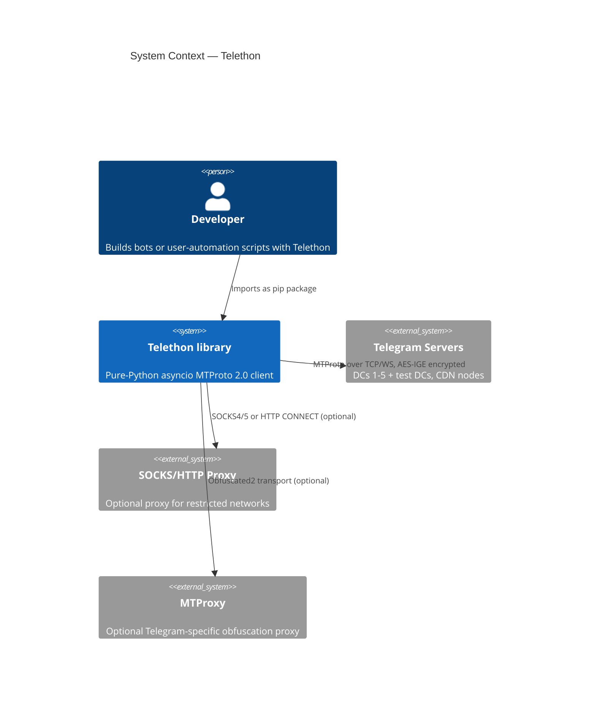
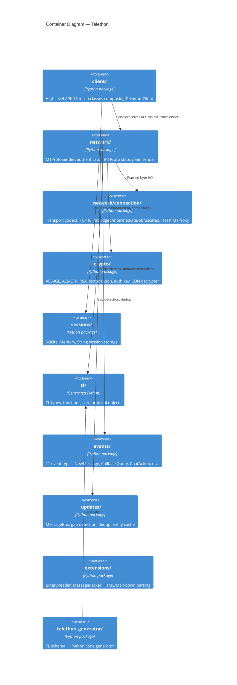
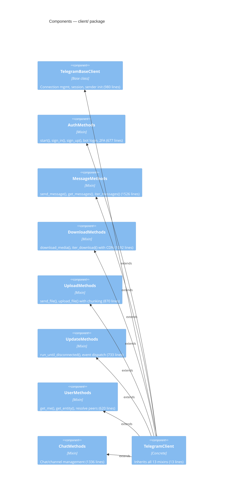
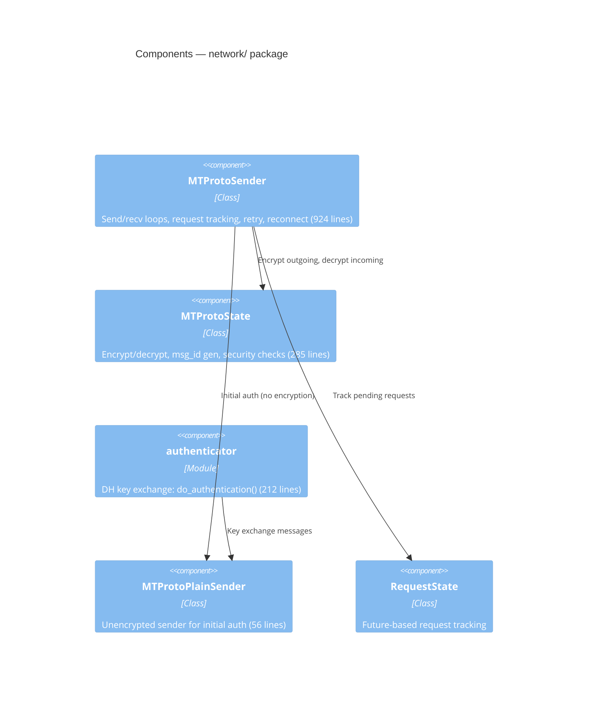
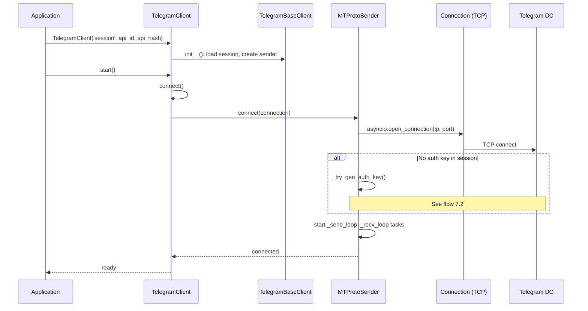
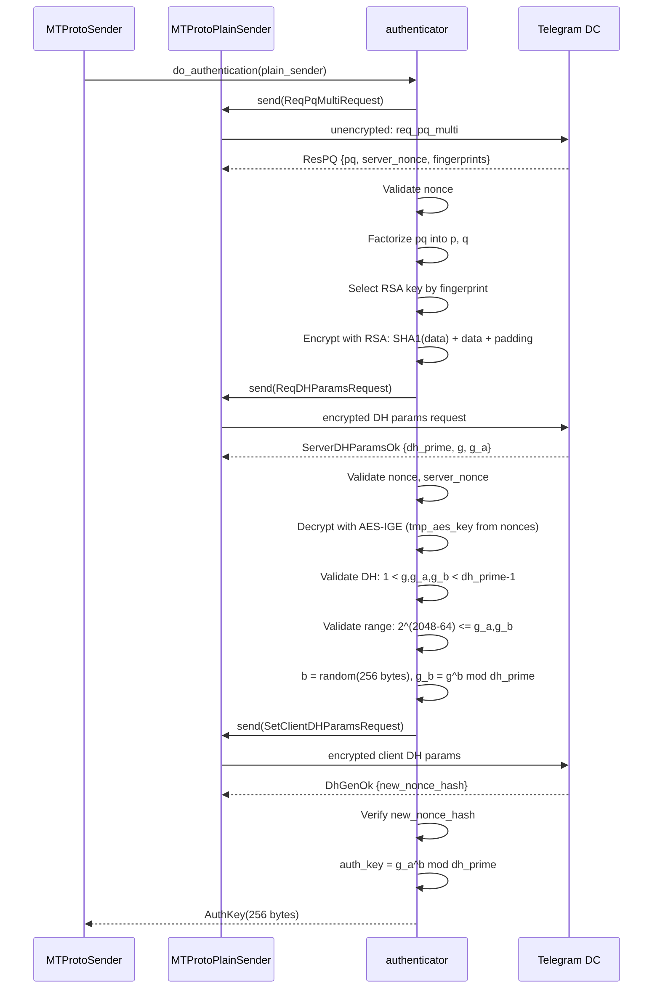
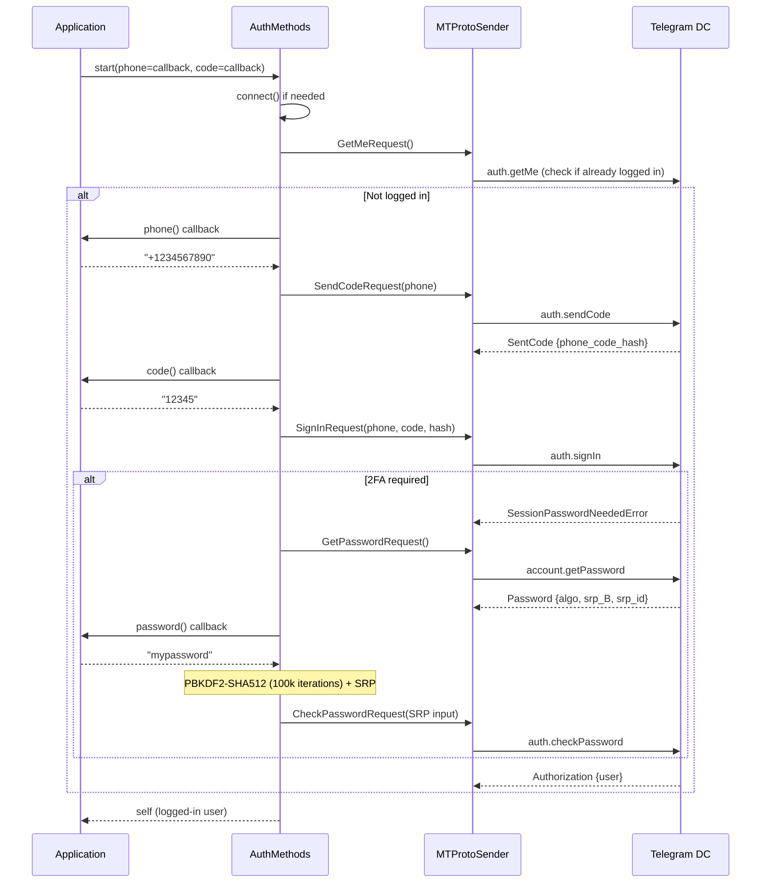
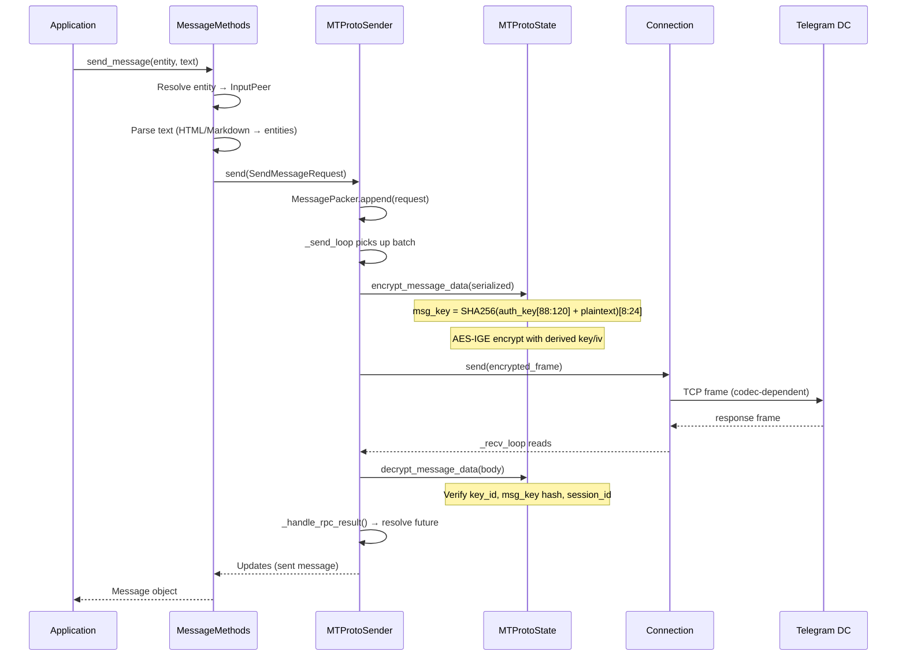
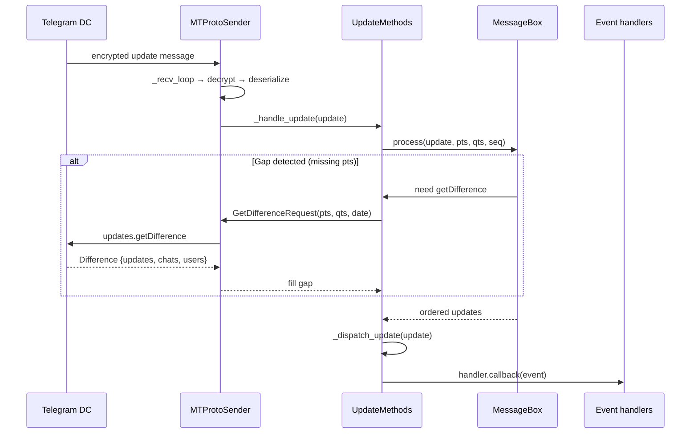
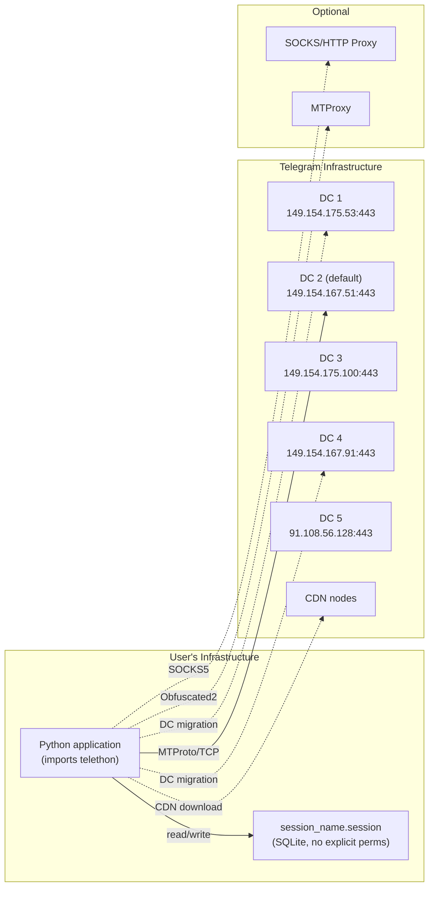

# PROJECT BRIEF: Telethon

> **Change log**: 2026-04-24 — initial version.

---

## 1. TL;DR

**Telethon** (`github.com/LonamiWebs/Telethon`, now on Codeberg) is an asyncio-based
**Python 3 MTProto client library** for Telegram, supporting both user and bot accounts.
The stack is Python 3.5+, pure-Python crypto (`pyaes` + `rsa`) with optional C acceleration
(`cryptg`), code-generated types from TL schemas, and SQLite-based session storage.
It is open-source (MIT), deployed as a pip-installable library. The main risks are
**weak SSL cipher suite for proxy connections** (ADH — no authentication) and
**missing salt/sequence validation** in message decryption.

---

## 2. Glossary

| Term | Meaning in this codebase |
|------|--------------------------|
| **Layer** | Telegram API schema version; current is 222 (`tl/alltlobjects.py`) |
| **TL** | Type Language — Telegram's IDL for types and RPC methods |
| **MTProto** | Mobile Transport Protocol — Telegram's encrypted binary protocol |
| **DC** | Data Center — Telegram server cluster (1–5 + test DCs) |
| **Auth key** | 256-byte shared secret from DH exchange; encrypts all traffic |
| **PFS** | Perfect Forward Secrecy — recently added (`#4618`), uses temp auth keys |
| **Salt** | 64-bit server nonce rotated per session to prevent replay |
| **Invoker** | Not used; Telethon calls RPC directly via `MTProtoSender.send()` |
| **Flood wait** | Telegram rate-limit: `FloodWaitError` with retry-after seconds |
| **CDN** | Content Delivery Network for media downloads |
| **SRP** | Secure Remote Password — 2FA password verification (`password.py`) |
| **Session** | SQLite file (`.session`) storing auth key, DC info, entity cache |
| **Entity** | User, Chat, or Channel — resolved by ID, username, or phone |
| **MessageBox** | Update deduplication engine with gap detection (`_updates/messagebox.py`) |
| **TelegramClient** | Main facade class, composed of 13 mixin classes |

---

## 3. Quick start

```bash
# Already cloned at research/client/telethon
cd research/client/telethon

# Install in development mode
pip install -e .

# Or with optional dependencies
pip install -e .[cryptg,socks]

# Regenerate TL types (optional — generated code is committed)
python setup.py gen

# Run tests
pip install pytest pytest-asyncio
pytest

# Run a simple bot
python -c "
from telethon import TelegramClient
client = TelegramClient('test', api_id=12345, api_hash='abcdef...')
client.start(bot_token='BOT_TOKEN')
client.run_until_disconnected()
"
```

Fastest meaningful commit: fix any `TODO` in `network/mtprotostate.py` or
`network/authenticator.py`, run `pytest`, submit a PR.

---

## 4. C4: Context



Telethon is a **library**, not a service. Developers import it and build their own
bots or user-account automation. All Telegram traffic is MTProto-encrypted.

---

## 5. C4: Containers



| Container | Technology | Purpose | Owner |
|-----------|-----------|---------|-------|
| `client/` | Python (asyncio) | High-level API: auth, messages, uploads, downloads | Lonami |
| `network/` | Python (asyncio) | MTProto sender/state, key exchange, request tracking | Lonami |
| `connection/` | Python (asyncio) | Transport codecs over TCP/HTTP | Lonami |
| `crypto/` | Python + optional C (`cryptg`) | AES-IGE, RSA, DH factorization | Lonami |
| `sessions/` | Python + SQLite | Auth key persistence, entity cache | Lonami |
| `tl/` | Generated Python | All Telegram API types and RPC methods | Auto-generated |
| `events/` | Python | Event system: 11 handler types | Lonami |
| `_updates/` | Python | MessageBox: update ordering, gap recovery | Lonami |
| `extensions/` | Python | Binary I/O, message packing, text parsing | Lonami |
| `telethon_generator/` | Python | TL schema → Python code pipeline | Lonami |

---

## 6. C4: Components

### 6.1 client/ package (TelegramClient composition)



### 6.2 network/ package



---

## 7. Data flows

### 7.1 Client initialization and connection



_Source_: `client/telegrambaseclient.py`, `network/mtprotosender.py:120-270`.

### 7.2 Key exchange (DH authentication)



**Trust boundary**: After key exchange, all traffic is AES-IGE encrypted with the
shared auth key. The key is the trust root.

_Source_: `network/authenticator.py:22-200`.

### 7.3 Authentication (user login)



_Source_: `client/auth.py:20-250`, `password.py`.

### 7.4 Message sending & RPC pipeline



_Source_: `client/messages.py`, `network/mtprotosender.py:273-689`,
`network/mtprotostate.py:94-200`.

### 7.5 Update processing



**Important invariants**:
- Gap timeout: 0.5s before fetching difference (`_updates/messagebox.py:36`)
- No-updates timeout: 15 minutes triggers getDifference (`_updates/messagebox.py:46`)
- Updates may arrive out of order; MessageBox reorders by pts

_Source_: `client/updates.py:41-503`, `_updates/messagebox.py`.

---

## 8. Deployment / runtime topology

Telethon is a **library**, not a deployable service.



DC endpoints are hardcoded in `client/telegrambaseclient.py`. Default DC is 2.

---

## 9. Dependencies and integrations

| Dependency | Version | Purpose | Criticality | Fallback |
|-----------|---------|---------|-------------|----------|
| `pyaes` | any | Pure-Python AES implementation | **Critical** — core encryption | `cryptg` or `libssl` |
| `rsa` | any | RSA operations for key exchange | **Critical** — auth | None |
| `cryptg` | optional | C-based AES-IGE (10-50x faster) | High — performance | `pyaes` (slow) |
| `python-socks[asyncio]` | optional | SOCKS4/5/HTTP proxy support | Medium — network access | Direct connection |
| `hachoir` | optional | File format detection for uploads | Low — media | Guess MIME |
| `pillow` (PIL) | optional | Image resizing for thumbnails | Low — media | Skip thumbnails |
| `isal` | optional | Fast zlib compression | Low — performance | `zlib` stdlib |
| `sqlite3` | stdlib | Session persistence | High — session storage | `MemorySession` (ephemeral) |
| `asyncio` | stdlib | Async I/O | **Critical** | None |
| `hashlib` | stdlib | SHA-1, SHA-256, PBKDF2 | **Critical** — crypto | None |
| `struct` | stdlib | Binary packing | **Critical** — protocol | None |

---

## 10. Hot files map

Based on git history (most changed files across all commits):

| File | Changes | Description |
|------|---------|-------------|
| `client/telegrambaseclient.py` | 174 | Core client init, connection, session |
| `client/messages.py` | 174 | Message send/get/iter/delete |
| `network/mtprotosender.py` | 164 | MTProto send/recv loops, retry, reconnect |
| `client/updates.py` | 151 | Update dispatch, run_until_disconnected |
| `tl/custom/message.py` | 143 | High-level Message wrapper |
| `client/uploads.py` | 118 | File upload, chunking, thumbnails |
| `utils.py` | 201 | Utility functions (1600+ lines) |
| `client/users.py` | 92 | Entity resolution, get_me |
| `client/auth.py` | 86 | Login flows, 2FA |
| `client/downloads.py` | 82 | File download, CDN, DC migration |
| `events/common.py` | ~50 | Base event class |
| `events/newmessage.py` | ~50 | Message event handler |
| `network/mtprotostate.py` | ~40 | Encryption state, msg_id |
| `sessions/sqlite.py` | ~35 | SQLite session storage |
| `network/authenticator.py` | ~30 | DH key exchange |
| `crypto/aes.py` | ~25 | AES-IGE implementation |
| `_updates/messagebox.py` | ~20 | Update dedup, gap detection |

---

## 11. Reading order

For a new engineer to understand the system in ~1 day:

1. **`__init__.py`** — Public API surface (2 min)
2. **`client/telegramclient.py`** — See which 13 mixins compose the client (2 min)
3. **`client/telegrambaseclient.py`** — Core init, connection setup, session (30 min)
4. **`network/mtprotoplainsender.py`** — Simplest sender: unencrypted auth (5 min)
5. **`network/authenticator.py`** — DH key exchange protocol (20 min)
6. **`crypto/authkey.py`** — Auth key structure (5 min)
7. **`crypto/rsa.py`** — RSA encryption + hardcoded server keys (10 min)
8. **`crypto/aes.py`** — AES-IGE encrypt/decrypt (10 min)
9. **`network/mtprotostate.py`** — Encryption state, msg_id, security checks (20 min)
10. **`network/mtprotosender.py`** — Send/recv loops, retry, reconnect (30 min)
11. **`network/connection/connection.py`** — Transport base, TLS, proxy (10 min)
12. **`client/auth.py`** — Login flow: phone, code, 2FA, bot token (15 min)
13. **`client/updates.py`** — Update handling, event dispatch (20 min)
14. **`_updates/messagebox.py`** — Gap detection, dedup engine (20 min)
15. **`client/messages.py`** — Message operations (skim, 15 min)
16. **`client/downloads.py`** — Download flow, CDN, DC migration (15 min)
17. **`client/uploads.py`** — Upload chunking (10 min)
18. **`sessions/sqlite.py`** — Session persistence schema (10 min)
19. **`events/newmessage.py`** — Event pattern: how handlers work (10 min)
20. **`telethon_generator/parsers/tlobject/tlobject.py`** — How TL types are generated (10 min)

---

## 12. Invariants and gotchas

1. **64-bit msg_id from wall clock**: Message IDs are `(int(time) << 32) | (ns << 2)`.
   System clock changes will break message ordering and cause `BadMsgNotification`.
   No monotonic clock is used (`network/mtprotostate.py:239-252`).

2. **Salt is NOT validated on incoming messages**: Despite the comment at line 160
   of `mtprotostate.py` ("TODO Check salt, session_id and sequence_number"),
   salt validation is missing. Session ID IS checked (line 178). Sequence number
   is NOT checked.

3. **Album grouping is a timing hack**: `events/album.py:19` uses `HACK_DELAY = 0.5`
   seconds to group photos into albums. Non-monotonic system clocks can break this.

4. **Auth key callback is EXTREMELY important**: `mtprotosender.py:306-311` — when
   the auth key changes (PFS rotation), the callback MUST fire to persist the new
   key. Failure means silent session loss on reconnect.

5. **Upload part size constraints**: Part sizes must be divisible by 1024 and
   `<= 512KB` (`client/uploads.py:681-686`). Violation causes silent corruption.

6. **Download chunk alignment**: Chunk sizes must be multiples of the smallest
   size (4KB). `MAX_CHUNK_SIZE = 512 * 1024` (`client/downloads.py:23-25`).

7. **File references expire**: When messages are edited, file references become
   invalid. Downloads must refetch the message for a fresh reference
   (`client/downloads.py:118-139`).

8. **Bots cannot use CDN**: `FileCdnRedirect` is only for user accounts
   (`client/downloads.py:93`).

9. **Session is single-process**: SQLite with `check_same_thread=False`
   (`sessions/sqlite.py:260`). No file locking. Two processes sharing a
   session file will corrupt it.

10. **Flood wait threshold**: By default, `FloodWaitError` with wait < 60s is
    auto-slept. Above 60s, it raises. Configurable via `flood_sleep_threshold`.

11. **DH retry_id is hardcoded to 0**: `network/authenticator.py:163` has
    `retry_id=0` with a TODO. No actual retry mechanism for DH exchange.

12. **Reconnection resets session ID**: On every reconnect, a new random session ID
    is generated (`mtprotosender.py:375`). Pending requests from the old session
    may be lost.

13. **Generated code is committed**: The `tl/` types are checked into the repo.
    Running `python setup.py gen` is only needed after schema updates. Do not
    manually edit generated files.

14. **AES-CTR uses private pyaes API**: `crypto/aesctr.py:24` directly sets
    `_aes._counter._counter` — fragile if pyaes updates internals.

15. **PFS partially reverted**: Commit `302a9a8c` partially reverts the PFS
    implementation (`5a3a94eb`). PFS state may be incomplete.

---

## 13. Security findings

### Critical

#### S-01: Weak SSL cipher suite for proxy connections (ADH — no authentication)
- **Category**: STRIDE/Spoofing + Tampering; OWASP A02 (Cryptographic Failures)
- **Severity**: Critical (impact: full MITM on proxy path; likelihood: high when
  proxy is used)
- **File**: `network/connection/connection.py:61-65`
- **Evidence**:
  ```python
  return ssl_mod.wrap_socket(
      sock,
      do_handshake_on_connect=True,
      ssl_version=ssl_mod.PROTOCOL_SSLv23,
      ciphers='ADH-AES256-SHA')
  ```
- **Exploit**: ADH (Anonymous Diffie-Hellman) provides **zero server authentication**.
  Any network attacker on the proxy path can intercept the TLS connection. Combined
  with deprecated `PROTOCOL_SSLv23`, this allows protocol downgrade attacks.
- **Mitigation**: MTProto encryption underneath provides a second layer, so the
  actual Telegram traffic is still encrypted with the auth key. However, the proxy
  credential exchange (username/password) is exposed to MITM.
- **Recommendation**: Use `ssl.create_default_context()` with proper certificate
  verification. At minimum, use authenticated cipher suites (ECDHE-RSA-AES256-GCM).

### High

#### S-02: Missing salt and sequence number validation in message decryption
- **Category**: STRIDE/Tampering + Repudiation; OWASP A02
- **Severity**: High (impact: replay/reorder attacks; likelihood: low — requires
  active MITM)
- **File**: `network/mtprotostate.py:160`
- **Evidence**:
  ```python
  # TODO Check salt, session_id and sequence_number
  ```
  Salt is read but discarded (line 177: `reader.read_long()  # remote_salt`).
  Session ID IS now validated (line 178-179). Sequence number is read but not
  validated (line 192).
- **Exploit**: Without salt validation, a replay of an old message with a valid
  auth key but stale salt would be accepted. Without sequence validation,
  message reordering is undetected.
- **Recommendation**: Validate that incoming salt matches current session salt.
  Track and validate sequence numbers per Telegram security guidelines.

#### S-03: DH retry_id hardcoded to 0
- **Category**: STRIDE/Tampering; OWASP A07 (Authentication Failures)
- **Severity**: High (impact: auth key negotiation could be replayed; likelihood:
  low — requires active MITM during auth)
- **File**: `network/authenticator.py:163`
- **Evidence**:
  ```python
  retry_id=0,  # TODO Actual retry ID
  ```
- **Exploit**: Per MTProto spec, `retry_id` should be the auth key hash from the
  previous failed attempt, or 0 only on the first attempt. Always sending 0
  means the server cannot distinguish retries from new attempts.
- **Recommendation**: Track retry attempts and send the previous auth key hash
  as `retry_id` on subsequent attempts.

#### S-04: Primality test via factorization (awfully slow, may be skipped)
- **Category**: OWASP A02 (Cryptographic Failures)
- **Severity**: High (impact: weak DH if check times out; likelihood: medium —
  large primes are slow to factorize)
- **File**: `password.py:14-15`
- **Evidence**:
  ```python
  # TODO This is awfully slow
  if factorization.Factorization.factorize(prime)[0] != 1:
  ```
- **Exploit**: If factorization takes too long, applications may timeout or skip
  the validation, accepting non-prime DH parameters that weaken key exchange.
- **Recommendation**: Use Miller-Rabin probabilistic primality test (like gotd
  uses 64 rounds). Cache results for known Telegram primes.

### Medium

#### S-05: Session file created without explicit permissions
- **Category**: STRIDE/Information Disclosure; CWE-732
- **Severity**: Medium (impact: full account access via stolen session; likelihood:
  medium — depends on environment)
- **File**: `sessions/sqlite.py:259`
- **Evidence**: `sqlite3.connect(self.filename, ...)` — SQLite creates the file
  with default umask permissions. No explicit `os.chmod(path, 0o600)`.
- **Exploit**: On shared systems, other users may read the `.session` file
  containing the auth key, gaining full account access.
- **Recommendation**: Set `0o600` permissions after creating the session file.
  The SQLiteSession docstring (line 25-30) warns users but doesn't enforce it.

#### S-06: AES-CTR accesses private pyaes API
- **Category**: OWASP A06 (Vulnerable Components)
- **Severity**: Medium (impact: silent breakage on pyaes update; likelihood: low)
- **File**: `crypto/aesctr.py:24`
- **Evidence**:
  ```python
  self._aes._counter._counter = list(iv)
  ```
- **Recommendation**: Submit PR to pyaes for IV support, or vendor the CTR mode.

#### S-07: SQLite `check_same_thread=False` without locking
- **Category**: STRIDE/Tampering; CWE-362
- **Severity**: Medium (impact: session corruption; likelihood: low — asyncio is
  single-threaded, but sync wrapper runs in thread)
- **File**: `sessions/sqlite.py:260`
- **Evidence**: `check_same_thread=False` — disables SQLite's thread safety check.
- **Recommendation**: Use proper locking if multi-threaded access is possible
  (especially with `telethon.sync` wrapper).

#### S-08: Message ID derived from wall clock (not monotonic)
- **Category**: STRIDE/Repudiation; CWE-367 (TOCTOU)
- **Severity**: Medium (impact: message ID collision/rejection; likelihood: low)
- **File**: `network/mtprotostate.py:239-252`
- **Evidence**: `now = time.time() + self.time_offset` — uses wall clock.
  If system clock jumps backward, msg_id collision is possible despite the
  `if self._last_msg_id >= new_msg_id` guard (it only increments by 4).
- **Recommendation**: Use `time.monotonic()` for sequencing, wall clock only
  for the protocol-required timestamp component.

### Low

#### S-09: RSA uses PKCS#1 v1.5 style padding (protocol-mandated)
- **Category**: OWASP A02
- **Severity**: Low (protocol requirement, not a library bug)
- **File**: `crypto/rsa.py:74`
- **Evidence**: `to_encrypt = sha1(data).digest() + data + os.urandom(235 - len(data))`
- **Recommendation**: No action needed. This follows Telegram's MTProto spec.

#### S-10: `assert` used for validation (removed with `-O`)
- **Category**: CWE-617
- **Severity**: Low (impact: bypass validation in optimized mode)
- **File**: `crypto/aesctr.py:19,22,23`
- **Evidence**: `assert isinstance(key, bytes)`, `assert len(iv) == 16`
- **Recommendation**: Replace `assert` with `if not ... : raise ValueError(...)`.

#### S-11: Path traversal in downloads (FIXED)
- **Category**: CWE-22
- **Severity**: Low (already fixed in commit `369bfe1a`)
- **File**: `client/downloads.py`
- **Evidence**: Recent commit message: "Fix path traversal when downloading documents".
- **Status**: Resolved.

---

## 14. Open questions

1. **PFS implementation completeness**: Commit `302a9a8c` partially reverts the PFS
   implementation (`5a3a94eb`). The current state of PFS support and whether
   temporary auth keys are properly rotated is unclear.

2. **No formal security audit**: The project has had no published third-party
   security audit. Crypto code is community-reviewed but not professionally
   audited.

3. **ADH cipher suite intentionality**: Is `ADH-AES256-SHA` intentional (because
   MTProto handles authentication underneath) or a bug? The code has no comment
   explaining the choice.

4. **Factorization-based primality**: Whether the slow factorization test
   (`password.py:14-15`) actually completes in practice for Telegram's 2048-bit
   primes, or is effectively a no-op due to timeout.

5. **Entity cache consistency**: Entity caches in `_updates/entitycache.py` and
   `sessions/sqlite.py` are not synchronized. Whether this causes stale entity
   resolution in practice is unknown.

6. **Repository migration impact**: The project migrated from GitHub to Codeberg
   (`dab6bc4d`). Whether CI/CD, PyPI publishing, and contributor workflows are
   fully operational on Codeberg is unclear.

7. **trio/gevent support**: `telegrambaseclient.py:74` has a TODO for trio support.
   Current limitation is asyncio-only.

8. **CDN hash verification**: Whether downloaded CDN chunks are fully hash-verified
   against the origin DC (as the MTProto spec requires) needs deeper review.

---

## 15. Change log

| Date | Change |
|------|--------|
| 2026-04-24 | Initial document created from source analysis of Telethon v1.42.0 at commit `dab6bc4d` |
