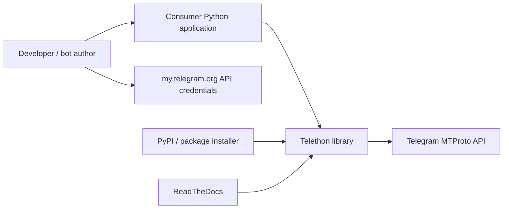
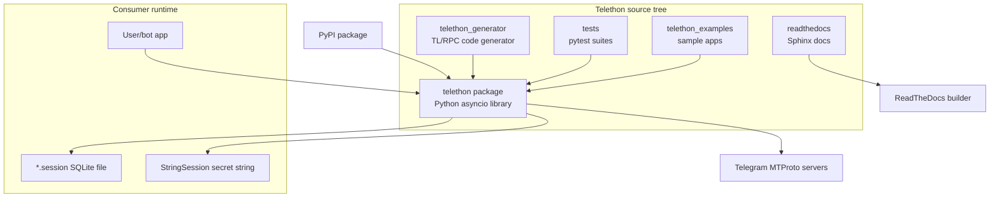
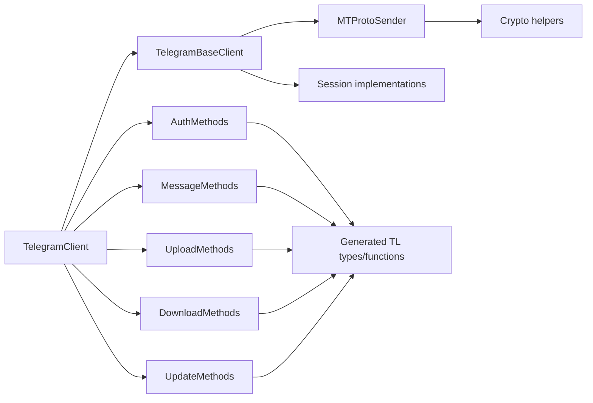
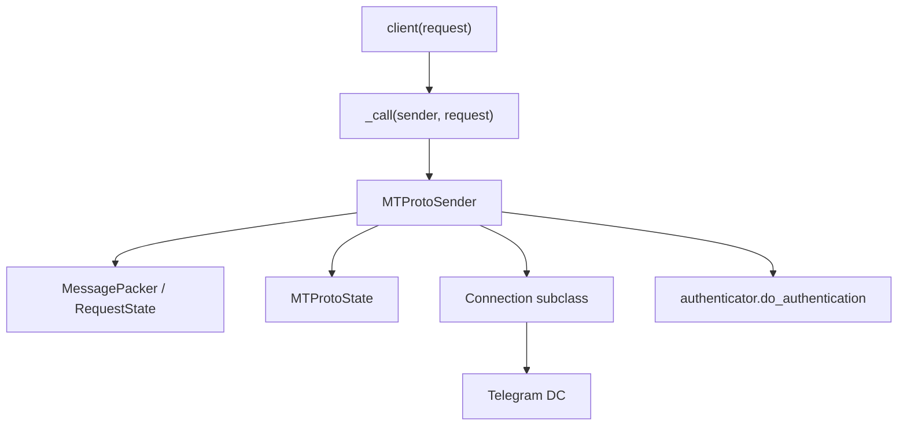
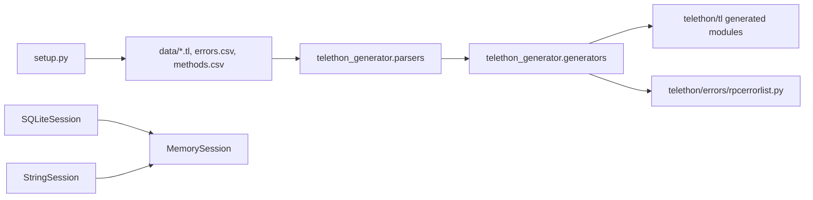
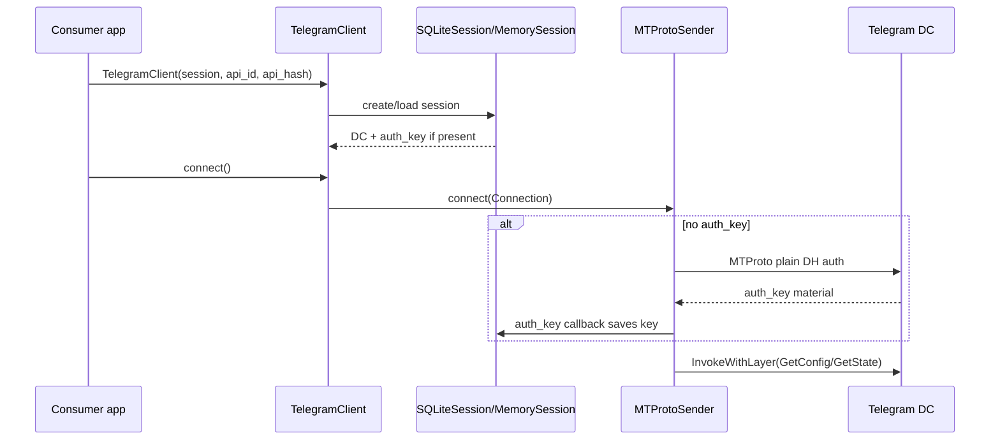
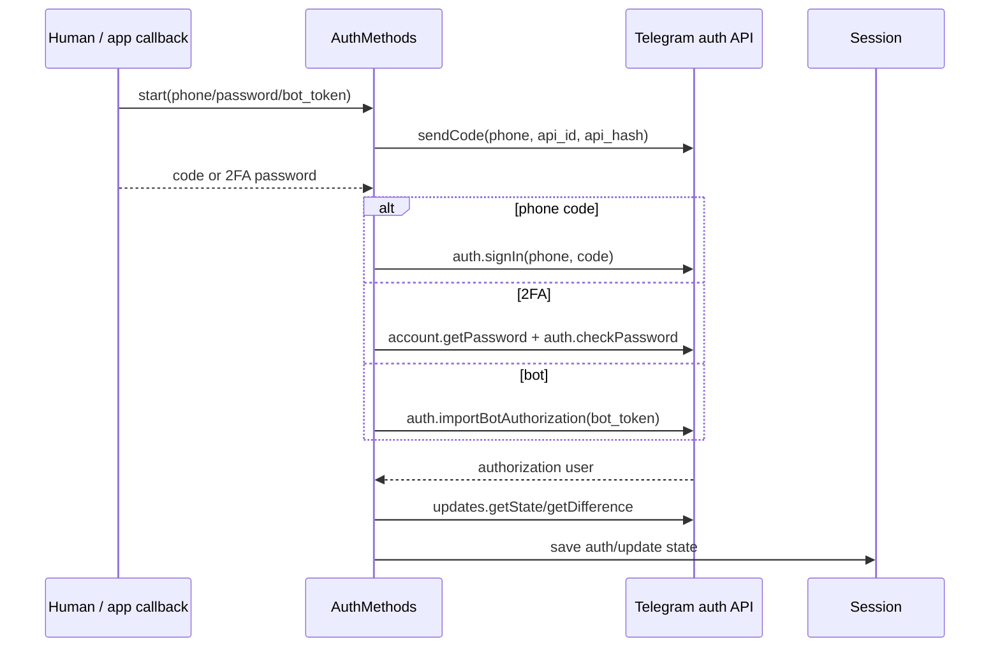
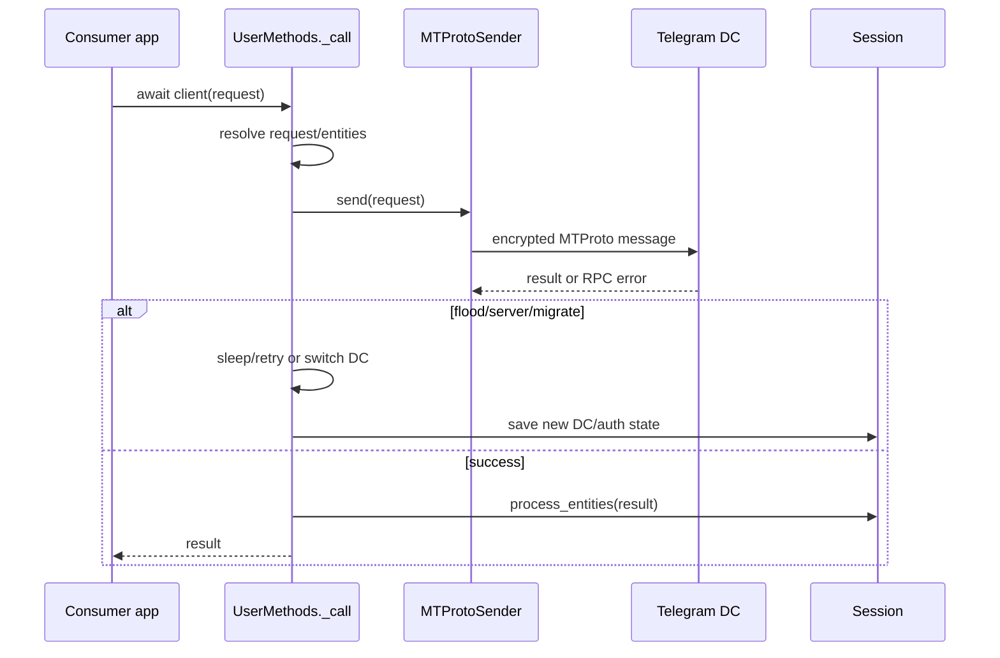
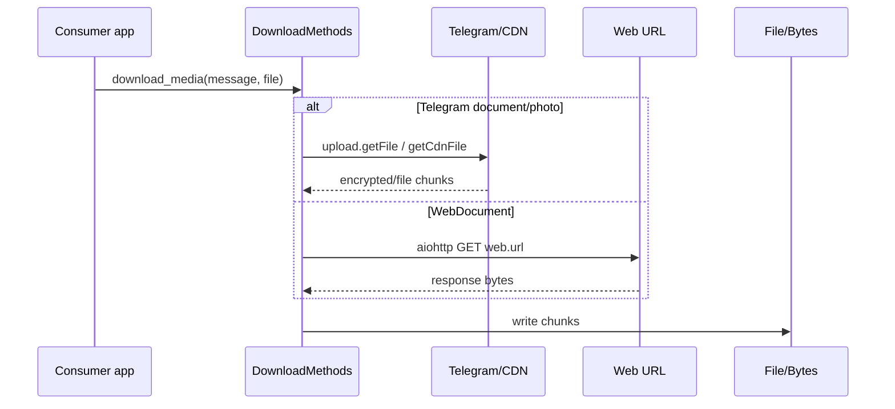
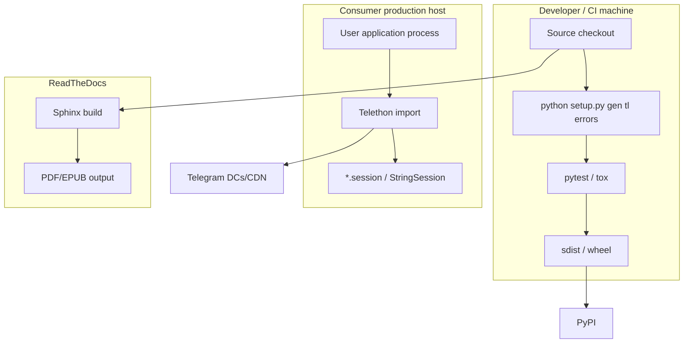

# PROJECT_BRIEF.md - Telethon

## 1. TL;DR

Telethon is an asyncio-based Python 3 MTProto client library for interacting with Telegram as either a user account or a bot account (`research/client/telethon/README.rst:11`). The main public surface is `TelegramClient`, a mixin aggregate over auth, messages, uploads, downloads, updates, dialogs, chats, bot, account, parse, and user methods (`research/client/telethon/telethon/client/telegramclient.py:8`). It builds with setuptools/wheel through `pyproject.toml`, with generation of TL objects and RPC errors handled by `setup.py gen` (`research/client/telethon/pyproject.toml:2`, `research/client/telethon/setup.py:68`). There is no application deployment container in the repository; runtime deployment is library-consumer dependent, while ReadTheDocs builds documentation on Ubuntu 22.04 with Python 3.11 (`research/client/telethon/.readthedocs.yaml:4`). The main security risk is credential/session handling: `.session` files and `StringSession` contain an MTProto auth key that grants account access if leaked (`research/client/telethon/telethon/sessions/sqlite.py:24`, `research/client/telethon/telethon/sessions/string.py:56`).

Reader implication: treat this as a library and code generator, not a standalone service. Most production risk is inherited by applications embedding it.

## 2. Glossary

| Term | Meaning in this repository | Evidence |
|---|---|---|
| `TelegramClient` | Main user-facing client class composed from method mixins. | `research/client/telethon/telethon/client/telegramclient.py:8` |
| MTProto | Telegram protocol layer used by the network sender and authenticator. | `research/client/telethon/telethon/network/mtprotosender.py:33` |
| Session | Stored DC, auth key, update state, entities, and cached sent files. | `research/client/telethon/telethon/sessions/abstract.py:14` |
| SQLite session | Default on-disk session when `session` is a string/path. | `research/client/telethon/telethon/client/telegrambaseclient.py:294` |
| Auth key | MTProto key created during authentication and persisted in session storage. | `research/client/telethon/telethon/network/mtprotosender.py:45` |
| TL object | Generated Python representation of Telegram Type Language constructors/functions. | `research/client/telethon/setup.py:94` |
| RPC error | Generated Telegram API error classes from `errors.csv`. | `research/client/telethon/setup.py:102` |
| Entity cache | Cached users/chats/channels used for peer resolution and update handling. | `research/client/telethon/telethon/client/telegrambaseclient.py:220` |
| Update loop | Background loop that catches up, diffs, preprocesses, and dispatches updates. | `research/client/telethon/telethon/client/updates.py:267` |
| Exported sender | Temporary sender borrowed for a different data center. | `research/client/telethon/telethon/client/telegrambaseclient.py:830` |
| CDN client | Separate client/session clone for Telegram CDN downloads. | `research/client/telethon/telethon/client/telegrambaseclient.py:914` |
| Friendly method | High-level wrapper around raw API methods, referenced in docs and generator metadata. | `research/client/telethon/setup.py:57` |

Reader implication: when reading code, separate the stable public client API from generated raw TL API. Session data is authentication material, not just cache.

## 3. Quick Start

```sh
git clone https://codeberg.org/Lonami/Telethon telethon
cd telethon
python3 -m venv .venv
. .venv/bin/activate
python -m pip install -U pip
python -m pip install -e . pytest pytest-asyncio
python setup.py gen tl errors
python -m pytest tests/telethon/crypto/test_rsa.py tests/telethon/extensions/test_html.py
```

The repository declares setuptools/wheel as the build backend (`research/client/telethon/pyproject.toml:2`) and the install dependencies are `pyaes` and `rsa` (`research/client/telethon/setup.py:255`). `setup.py` can generate TL objects and RPC errors before packaging or local use (`research/client/telethon/setup.py:8`, `research/client/telethon/setup.py:202`). Tests are intended to run under pytest/tox (`research/client/telethon/readthedocs/developing/testing.rst:5`, `research/client/telethon/pyproject.toml:19`).

First meaningful commit path:

```sh
python setup.py gen tl errors
python -m pytest tests/telethon/crypto/test_rsa.py tests/telethon/extensions/test_html.py
git status --short
git add telethon tests
git commit -m "Add focused Telethon fix"
```

Verification note: in this workspace, `python3 -m pytest ...` failed because `pytest` is not installed, and `python3 -c "import telethon"` failed because generated `telethon.tl.functions/types` are absent in the checked-out tree; this is consistent with `setup.py` being responsible for generation (`research/client/telethon/setup.py:202`). Reader implication: generate TL/errors and install dev dependencies before assuming import or tests work from a raw checkout.

## 4. C4: Context



Telethon exists to let Python programs interact with Telegram via MTProto as users or bots (`research/client/telethon/README.rst:11`). Users must bring their own `api_id` and `api_hash` from Telegram API Development (`research/client/telethon/README.rst:46`). The README states that the canonical repository moved to Codeberg, while GitHub may be deleted in the future (`research/client/telethon/README.rst:1`).

Reader implication: the trust boundary is between the consumer application and Telegram, with Telethon in the middle holding credentials. Repository location and generated artifacts matter for supply-chain review.

## 5. C4: Containers



| Name | Technology | Purpose | Owner |
|---|---|---|---|
| `telethon` package | Python 3, asyncio | Public library, client API, sessions, network, crypto. | Author listed as Lonami Exo (`research/client/telethon/setup.py:223`) |
| `telethon_generator` | Python scripts, TL/CSV data | Generates `telethon/tl` and RPC errors from `.tl` and `.csv`. | unknown |
| Tests | pytest, pytest-asyncio, tox | Unit-style tests for crypto, parsers, helpers, serialization, docs references. | unknown |
| Examples | Python scripts, optional frameworks such as Quart | Demonstrate bot, web login, payments, GUI, updates. | unknown |
| ReadTheDocs docs | Sphinx on Ubuntu 22.04/Python 3.11 | Builds docs, PDF, EPUB. | unknown |
| Session file | SQLite | Persists auth key, DC, entity cache, update state, file cache. | Runtime app owner |
| Telegram MTProto | External API | Remote messaging/auth/storage API. | Telegram |

The active package build uses setuptools (`research/client/telethon/pyproject.toml:2`). The only workflow file is under `.github/workflows.disabled`, so it is not an active GitHub Actions workflow by path despite containing push/pull_request triggers (`research/client/telethon/.github/workflows.disabled/python.yml:3`). Reader implication: production topology is defined by the embedding app; the repository itself only defines packaging, docs, examples, tests, and generation.

## 6. C4: Components

### 6.1 `telethon` Package



`TelegramClient` is a thin class composed from method mixins and `TelegramBaseClient` (`research/client/telethon/telethon/client/telegramclient.py:1`). `TelegramBaseClient.__init__` selects a session implementation, validates `api_id/api_hash`, configures retries, proxy, update settings, and creates `MTProtoSender` (`research/client/telethon/telethon/client/telegrambaseclient.py:244`, `research/client/telethon/telethon/client/telegrambaseclient.py:436`). Auth methods call generated raw functions such as `auth.SignInRequest`, `account.GetPasswordRequest`, and `auth.ImportBotAuthorizationRequest` (`research/client/telethon/telethon/client/auth.py:339`, `research/client/telethon/telethon/client/auth.py:343`, `research/client/telethon/telethon/client/auth.py:348`).

Reader implication: most public behavior is mixin code that eventually becomes raw TL requests through `self(request)`. Debugging a user-visible method usually ends at `client/users.py` and `MTProtoSender`.

### 6.2 Network / MTProto Sender



`MTProtoSender` wraps requests into `TLMessage`, sends and receives them, reconnects on temporary network issues, and generates a new auth key when none exists (`research/client/telethon/telethon/network/mtprotosender.py:33`). It starts separate send and receive tasks after connecting (`research/client/telethon/telethon/network/mtprotosender.py:272`). `MTProtoState` encrypts and decrypts MTProto 2.0 payloads and validates auth key ID, session ID, message key, duplicate/old/new message IDs (`research/client/telethon/telethon/network/mtprotostate.py:130`, `research/client/telethon/telethon/network/mtprotostate.py:151`). `Connection` wraps `asyncio.open_connection`, optional proxy setup, packet codecs, and send/receive queues (`research/client/telethon/telethon/network/connection/connection.py:20`, `research/client/telethon/telethon/network/connection/connection.py:221`).

Reader implication: transport, encryption, retries, and response demultiplexing are tightly coupled. Changes here require protocol-level tests or very careful manual review.

### 6.3 Sessions and Code Generation



`setup.py generate()` parses errors, methods, and TL files, then writes generated TL objects and RPC error classes (`research/client/telethon/setup.py:68`). Generated files include an explicit "all changes will be erased" notice (`research/client/telethon/telethon_generator/generators/tlobject.py:12`). `SQLiteSession` creates tables for sessions, entities, sent files, and update state (`research/client/telethon/telethon/sessions/sqlite.py:77`), while `StringSession` serializes DC, IP, port, and auth key into a base64 string (`research/client/telethon/telethon/sessions/string.py:56`).

Reader implication: do not hand-edit generated TL modules. Session APIs are extensibility points, but also credential boundaries.

## 7. Data Flows

### 7.1 Client Startup and Session Restore



Trust boundary: app-provided `api_id`, `api_hash`, session path, and proxy settings enter trusted Telethon state at construction (`research/client/telethon/telethon/client/telegrambaseclient.py:244`). Telegram network data becomes trusted only after MTProto decryption and checks in `MTProtoState.decrypt_message_data` (`research/client/telethon/telethon/network/mtprotostate.py:151`). Reader implication: a wrong or stolen session bypasses interactive login; protect session paths like credentials.

### 7.2 User or Bot Login



Trust boundary: user-entered phone, code, password, or bot token crosses from application/UI into Telethon (`research/client/telethon/telethon/client/auth.py:20`). `start()` caps interactive code/password retries with `max_attempts`, but rate limiting is ultimately Telegram-side (`research/client/telethon/telethon/client/auth.py:74`, `research/client/telethon/telethon/client/auth.py:186`). Reader implication: embedding apps must protect login forms, bot tokens, and callbacks; Telethon is not a web auth framework.

### 7.3 RPC Request, Retry, and Data Center Migration



Trust boundary: app-provided raw TL requests enter `_call`, then generated serialization is sent to Telegram (`research/client/telethon/telethon/client/users.py:37`). Telegram errors drive retry, flood sleep, or `_switch_dc` logic (`research/client/telethon/telethon/client/users.py:95`, `research/client/telethon/telethon/client/users.py:126`). Reader implication: application-level idempotency is not guaranteed just because Telethon retries; write paths should be reviewed for duplicate effects.

### 7.4 Update Dispatch Pipeline

```mermaid
sequenceDiagram
    participant TG as Telegram DC
    participant Sender as MTProtoSender
    participant Queue as _updates_queue
    participant Loop as UpdateMethods._update_loop
    participant Handler as User event handler
    participant Session as Session

    TG-->>Sender: encrypted updates
    Sender->>Queue: put_nowait(update)
    Loop->>Queue: get update or deadline
    Loop->>Loop: getDifference if gap
    Loop->>Session: process_entities/save state
    Loop->>Handler: callback(event)
```

Trust boundary: remote updates are untrusted until decrypted and checked by `MTProtoState`, then transformed into events before user callbacks (`research/client/telethon/telethon/network/mtprotosender.py:533`, `research/client/telethon/telethon/client/updates.py:556`). If `sequential_updates=True`, long handlers back up an unbounded queue (`research/client/telethon/telethon/client/telegrambaseclient.py:162`). Reader implication: handler code is part of the runtime safety story; slow handlers can become memory pressure.

### 7.5 Media and Web Document Download



Trust boundary: `web.url` originates in a Telegram object and becomes an outbound HTTP request in `_download_web_document` (`research/client/telethon/telethon/client/downloads.py:1011`). File paths passed by application are written directly by the library (`research/client/telethon/telethon/client/downloads.py:1008`). Reader implication: do not download untrusted web documents from privileged networks without application-side URL policy and output path policy.

## 8. Deployment / Runtime Topology



There is no Dockerfile, docker-compose file, Makefile, or active `.github/workflows/*.yml` found in this checkout; the only workflow file is in `.github/workflows.disabled` (`research/client/telethon/.github/workflows.disabled/python.yml:1`). The disabled workflow would have tested Python 3.5 to 3.8 with tox and flake if it were active (`research/client/telethon/.github/workflows.disabled/python.yml:10`, `research/client/telethon/.github/workflows.disabled/python.yml:20`). `setup.py pypi` checks the API reference site, regenerates code, imports the package, builds sdist/wheel, and uploads via twine (`research/client/telethon/setup.py:160`, `research/client/telethon/setup.py:196`).

Reader implication: production deployability cannot be inferred from this repo alone. For a real service, inspect the consumer app that imports Telethon.

## 9. Dependencies and Integrations

| What | Version | Purpose | Criticality | Fallback if down/missing |
|---|---:|---|---|---|
| Python | `>=3.5` | Runtime language. | Critical | unknown |
| `pyaes` | unpinned | AES implementation fallback. | High | `cryptg` or libssl if available (`research/client/telethon/telethon/crypto/aes.py:17`) |
| `rsa` | unpinned | Telegram RSA fingerprint encryption. | High | none, import raises (`research/client/telethon/telethon/crypto/rsa.py:7`) |
| `cryptg` | optional extra | Faster crypto. | Medium | fallback to libssl or Python AES (`research/client/telethon/telethon/crypto/aes.py:17`) |
| `aiohttp` | optional | WebDocument download. | Low/Medium | raises ValueError if missing (`research/client/telethon/telethon/client/downloads.py:991`) |
| `python_socks` | optional | Proxy support. | Medium | proxy ignored warning in base client if absent (`research/client/telethon/telethon/client/telegrambaseclient.py:349`) |
| SQLite `sqlite3` | stdlib optional | Default on-disk sessions. | High | MemorySession with re-login warning (`research/client/telethon/telethon/client/telegrambaseclient.py:294`) |
| Telegram MTProto API | external | All auth, messaging, media, updates. | Critical | none |
| `sphinx-rtd-theme` | `~=1.3.0` | Docs build theme. | Low | docs build degraded/fails (`research/client/telethon/readthedocs/requirements.txt:2`) |
| `tox`, `pytest`, `pytest-asyncio`, `pytest-cov` | dev docs only | Test execution. | Medium for maintainers | direct pytest can run if deps installed (`research/client/telethon/readthedocs/developing/testing.rst:5`) |

Reader implication: dependency pinning is minimal in this checkout, so reproducible builds depend on external environment or constraints supplied elsewhere. Network outages to Telegram are application outages.

## 10. Hot Files Map

Top changed files from `git log --name-only --all` in this checkout:

| Count | File | Why it is hot |
|---:|---|---|
| 416 | `telethon/telegram_client.py` | Legacy/old monolithic client history. |
| 209 | `telethon/telegram_bare_client.py` | Legacy base client history. |
| 201 | `telethon/utils.py` | Core conversions and helpers. |
| 174 | `telethon/client/telegrambaseclient.py` | Current base client, session, sender, lifecycle. |
| 174 | `telethon/client/messages.py` | High-level message write/read behavior. |
| 164 | `telethon/network/mtprotosender.py` | MTProto send/receive/retry core. |
| 151 | `telethon/client/updates.py` | Update catch-up and event dispatch. |
| 144 | `telethon/version.py` | Release version. |
| 143 | `telethon/tl/custom/message.py` | Rich message wrapper behavior. |
| 137 | `telethon/network/mtproto_sender.py` | Legacy sender path in history. |
| 118 | `telethon_generator/data/errors.csv` | Telegram RPC error catalog. |
| 118 | `telethon/client/uploads.py` | File sending and media upload behavior. |
| 100 | `telethon_generator/data/api.tl` | Telegram API schema. |
| 92 | `telethon/client/users.py` | Raw request dispatch and entity resolution. |
| 86 | `telethon/client/auth.py` | Login, 2FA, QR, auth methods. |
| 82 | `telethon_generator/tl_generator.py` | Legacy generator history. |
| 82 | `telethon/client/downloads.py` | File download, CDN, web document behavior. |
| 80 | `telethon_generator/data/methods.csv` | Friendly method/error metadata. |
| 76 | `telethon/client/chats.py` | Chat/channel operations. |
| 73 | `setup.py` | Generation, packaging, release workflow. |

No commits appeared in the last 30 days from `git log --since='30 days ago' --oneline --name-status`. Reader implication: modern work should focus on current split modules under `telethon/client`, `telethon/network`, and generator data, while legacy filenames explain historical churn.

## 11. Reading Order

1. `README.rst`: purpose, install, basic client creation (`research/client/telethon/README.rst:11`).
2. `pyproject.toml`: build backend and tox commands (`research/client/telethon/pyproject.toml:2`).
3. `setup.py`: generator, package metadata, dependencies, release script (`research/client/telethon/setup.py:68`).
4. `telethon/client/telegramclient.py`: public class composition (`research/client/telethon/telethon/client/telegramclient.py:8`).
5. `telethon/client/telegrambaseclient.py`: lifecycle, sessions, sender, updates queue (`research/client/telethon/telethon/client/telegrambaseclient.py:244`).
6. `telethon/client/users.py`: `__call__`, request retries, flood/migrate handling (`research/client/telethon/telethon/client/users.py:28`).
7. `telethon/client/auth.py`: login, bot auth, 2FA, code handling (`research/client/telethon/telethon/client/auth.py:20`).
8. `telethon/network/mtprotosender.py`: send/receive loops, reconnect, update routing (`research/client/telethon/telethon/network/mtprotosender.py:33`).
9. `telethon/network/mtprotostate.py`: MTProto encryption/decryption checks (`research/client/telethon/telethon/network/mtprotostate.py:130`).
10. `telethon/network/authenticator.py`: DH auth key creation (`research/client/telethon/telethon/network/authenticator.py:22`).
11. `telethon/network/connection/connection.py`: TCP/proxy/codec abstraction (`research/client/telethon/telethon/network/connection/connection.py:20`).
12. `telethon/sessions/abstract.py`: session contract (`research/client/telethon/telethon/sessions/abstract.py:14`).
13. `telethon/sessions/sqlite.py`: default persistent session (`research/client/telethon/telethon/sessions/sqlite.py:24`).
14. `telethon/sessions/string.py`: portable secret session format (`research/client/telethon/telethon/sessions/string.py:14`).
15. `telethon/client/updates.py`: update difference and dispatch (`research/client/telethon/telethon/client/updates.py:267`).
16. `telethon/client/messages.py`: send message flow (`research/client/telethon/telethon/client/messages.py:841`).
17. `telethon/client/uploads.py`: file upload API (`research/client/telethon/telethon/client/uploads.py:113`).
18. `telethon/client/downloads.py`: download/CDN/web documents (`research/client/telethon/telethon/client/downloads.py:36`).
19. `telethon_generator/generators/tlobject.py`: generated code shape (`research/client/telethon/telethon_generator/generators/tlobject.py:54`).
20. `tests/telethon/crypto/test_rsa.py`: example focused test style (`research/client/telethon/tests/telethon/crypto/test_rsa.py:21`).

Reader implication: read lifecycle and request dispatch before individual high-level methods. Generated output should be understood through generator inputs and code, not by reading thousands of generated classes.

## 12. Invariants and Pitfalls

1. A session file is enough to regain access to the Telegram account; the class docstring explicitly warns not to share it (`research/client/telethon/telethon/sessions/sqlite.py:24`).
2. String sessions include the auth key in a base64 string, not an encrypted token (`research/client/telethon/telethon/sessions/string.py:56`).
3. The checked-out tree may not import until generated `telethon/tl` and RPC error modules exist; `setup.py` generates them when installing from GitHub/source (`research/client/telethon/setup.py:202`).
4. The event loop cannot change after the client connects; `TelegramBaseClient.connect` rejects that scenario (`research/client/telethon/telethon/client/telegrambaseclient.py:523`).
5. Infinite retries are allowed for requests/connections but explicitly discouraged because programs can get stuck (`research/client/telethon/telethon/client/telegrambaseclient.py:138`, `research/client/telethon/telethon/client/telegrambaseclient.py:145`).
6. `sequential_updates=True` uses an unbounded queue; long handlers can exhaust memory (`research/client/telethon/telethon/client/telegrambaseclient.py:162`).
7. Proxy configuration is silently downgraded to no proxy if `python-socks` is absent, with only a warning (`research/client/telethon/telethon/client/telegrambaseclient.py:349`).
8. Albums use a short-lived hack because Telegram may split album updates across data centers (`research/client/telethon/telethon/client/telegrambaseclient.py:408`).
9. Entity cache limits affect performance; too-low limits can cause excessive flushing and warnings (`research/client/telethon/telethon/client/telegrambaseclient.py:220`, `research/client/telethon/telethon/client/updates.py:295`).
10. `setup.py pypi` uses `shell=True` for build/upload commands and should be treated as a maintainer-only release path (`research/client/telethon/setup.py:196`).
11. Web document downloads fetch `web.url` with `aiohttp` and no URL policy in the library (`research/client/telethon/telethon/client/downloads.py:1011`).
12. Generated files must not be edited by hand; generator output warns that changes are erased (`research/client/telethon/telethon_generator/generators/tlobject.py:12`).
13. Password/SRP prime validation is intentionally slow in one path (`research/client/telethon/telethon/password.py:14`).
14. The update system includes backported v2 pieces in an ad-hoc way (`research/client/telethon/telethon/client/telegrambaseclient.py:429`).

Reader implication: most bugs come from lifecycle, generated-code state, session leakage, and update ordering assumptions. Make small changes with focused tests around those boundaries.

## 13. Security Findings

### High - Session files store account-bearing auth keys in plaintext-like SQLite blobs

- Category: STRIDE Information Disclosure / Elevation of Privilege; OWASP A02 Cryptographic Failures.
- Severity: High because impact is full Telegram account/session takeover if a `.session` file leaks, and likelihood is realistic because the default string/path session creates a local SQLite file.
- Evidence: `research/client/telethon/telethon/sessions/sqlite.py:24` says the session contains required login information and warns that sharing it grants access; `research/client/telethon/telethon/sessions/sqlite.py:211` inserts `auth_key` into the `sessions` table. Quote: `auth_key blob`.
- Exploit scenario: malware, accidental artifact upload, CI cache leak, or support bundle exposure copies `anon.session`. The attacker reuses the auth key to connect as the victim until Telegram sessions are revoked.
- Recommendation: document secure file permissions prominently, support optional encrypted session storage, avoid storing sessions in project directories by default in examples, and add a helper to check unsafe file modes.

### High - `StringSession` is a portable bearer secret

- Category: STRIDE Information Disclosure / Elevation of Privilege; OWASP A02 Cryptographic Failures.
- Severity: High because a copied string contains the auth key and is easy to paste into logs, environment variables, chats, or CI settings.
- Evidence: `research/client/telethon/telethon/sessions/string.py:16` says the string stores data necessary for connection/authentication; `research/client/telethon/telethon/sessions/string.py:56` packs DC/IP/port and `self.auth_key.key`. Quote: `self.auth_key.key`.
- Exploit scenario: a developer posts a StringSession in an issue or log. Anyone with the string can authenticate as the same Telegram session.
- Recommendation: label StringSession as a bearer credential in docs/examples, add redaction helpers, and avoid printing it except behind explicit confirmation.

### High - WebDocument download can SSRF from Telegram-controlled URLs

- Category: STRIDE Information Disclosure / SSRF; OWASP A10 Server-Side Request Forgery.
- Severity: High for server-side apps running Telethon in privileged networks; likelihood depends on whether the app downloads media from untrusted chats.
- Evidence: `research/client/telethon/telethon/client/downloads.py:1011` creates `aiohttp.ClientSession`; `research/client/telethon/telethon/client/downloads.py:1014` calls `session.get(web.url)`. Quote: `session.get(web.url)`.
- Exploit scenario: an attacker sends a message containing a web document URL to an internal metadata service or admin endpoint. A bot that auto-downloads media fetches it from the server network.
- Recommendation: add application-side allow/deny lists for schemes, hosts, and private IP ranges; expose a downloader policy hook; set timeouts and size caps.

### Medium - Proxy configuration can be ignored when `python-socks` is missing

- Category: STRIDE Information Disclosure.
- Severity: Medium because impact is IP/network metadata exposure; likelihood is moderate when deployments rely on proxies for privacy or access control.
- Evidence: `research/client/telethon/telethon/client/telegrambaseclient.py:349` warns that `proxy argument will be ignored because python-socks is not installed`. Quote: `proxy argument will be ignored`.
- Exploit scenario: an app expects all Telegram traffic to go through a proxy, but production image lacks `python-socks`; traffic connects directly.
- Recommendation: fail closed when `proxy` is configured but proxy support is unavailable, or provide a strict proxy mode option.

### Medium - Unbounded sequential update queue can cause memory exhaustion

- Category: STRIDE Denial of Service; OWASP A05 Security Misconfiguration / ASVS resource exhaustion.
- Severity: Medium because attackers can trigger many updates in bots/chats, and a slow handler with `sequential_updates=True` backs up memory.
- Evidence: `research/client/telethon/telethon/client/telegrambaseclient.py:162` states updates are put into an unbounded queue and long handlers should not run. Quote: `unbounded queue`.
- Exploit scenario: a bot joins a busy chat or receives a burst of messages while a handler performs slow I/O. The process memory grows until killed.
- Recommendation: support bounded queues/backpressure, document handler timeouts, and encourage worker pools for long processing.

### Medium - Release command uses shell execution for packaging/upload

- Category: STRIDE Tampering; OWASP A08 Software and Data Integrity Failures.
- Severity: Medium because this is a maintainer-only path with high supply-chain impact if run in a compromised environment.
- Evidence: `research/client/telethon/setup.py:196` runs `python3 setup.py sdist` with `shell=True`; `research/client/telethon/setup.py:198` runs `twine upload dist/*` with `shell=True`. Quote: `shell=True`.
- Exploit scenario: a malicious `twine` earlier in PATH or shell environment manipulation affects the release upload.
- Recommendation: use argument lists with `subprocess.run([...], check=True)`, pin release tooling, and run release in a clean build environment.

### Medium - Example Quart login app has unsafe demo defaults

- Category: STRIDE Spoofing / Information Disclosure; OWASP A01 Broken Access Control / A02 Cryptographic Failures.
- Severity: Medium if copied into production; likelihood is moderate because examples are often adapted directly.
- Evidence: `research/client/telethon/telethon_examples/quart_login.py:60` sets `app.secret_key = 'CHANGE THIS TO SOMETHING SECRET'`; `research/client/telethon/telethon_examples/quart_login.py:43` uses `type='text'` for Telegram password. Quote: `CHANGE THIS`.
- Exploit scenario: a copied web login example uses the hard-coded secret key and exposes 2FA passwords as visible text.
- Recommendation: mark the example as non-production, use environment secret loading, `type='password'`, CSRF protection, and per-user server-side state.

### Low - Interactive login allows repeated code/password attempts without local rate limiting beyond `max_attempts`

- Category: STRIDE Spoofing / Denial of Service.
- Severity: Low because Telegram enforces server-side limits, and Telethon defaults to three attempts, but embedding apps can call repeatedly.
- Evidence: `research/client/telethon/telethon/client/auth.py:74` documents `max_attempts`; `research/client/telethon/telethon/client/auth.py:186` loops until attempts reach the limit. Quote: `max_attempts`.
- Exploit scenario: a web wrapper repeatedly invokes login methods for the same phone number, causing Telegram flood errors or user lockout.
- Recommendation: add application-level rate limiting by phone/account/IP and persist cooldowns outside the process.

### Low - Dependency versions are unpinned

- Category: OWASP A06 Vulnerable and Outdated Components.
- Severity: Low/Medium depending on deployment; exact vulnerable versions are unknown because the repo does not pin `pyaes` or `rsa`.
- Evidence: `research/client/telethon/requirements.txt:1` lists `pyaes`; `research/client/telethon/requirements.txt:2` lists `rsa`; `research/client/telethon/setup.py:255` uses `install_requires=['pyaes', 'rsa']`. Quote: `install_requires`.
- Exploit scenario: a future incompatible or vulnerable dependency version is resolved in CI or production.
- Recommendation: publish constraints for release/test environments and run dependency scanning in active CI.

Reader implication: the library handles MTProto cryptographic checks carefully, but local credential management and embedding-app choices dominate security exposure. Treat examples as educational code unless hardened.

## 14. Open Questions

1. unknown: active CI/CD for the canonical Codeberg repository; this checkout only has disabled GitHub workflow config (`research/client/telethon/.github/workflows.disabled/python.yml:1`).
2. unknown: production runtime topology, because Telethon is a library and no consumer deployment manifests exist in this tree.
3. unknown: exact dependency versions used by maintainers; `requirements.txt` and `setup.py` do not pin `pyaes` or `rsa` (`research/client/telethon/requirements.txt:1`, `research/client/telethon/setup.py:255`).
4. unknown: why `optional-requirements.txt` and `dev-requirements.txt` are referenced by tox but are absent in this checkout; tox references them at `research/client/telethon/pyproject.toml:17`.
5. unknown: whether generated `telethon/tl/functions` and `telethon/tl/types` are intentionally omitted from this checkout or missing due to partial export; source imports them at `research/client/telethon/telethon/client/auth.py:9`.
6. unknown: latest upstream security posture after the move to Codeberg; this research is limited to local files.

Reader implication: resolve generation and upstream CI questions before making broad release or packaging changes. Do not assume this checkout is a complete installable artifact without running generation.

## 15. Change Log of This Document

- 2026-04-24: Initial Telethon brief created from local source under `research/client/telethon`.
- Verification: five security findings were rechecked against source lines: SQLite auth key (`sqlite.py:24`, `sqlite.py:211`), StringSession auth key (`string.py:56`), WebDocument SSRF (`downloads.py:1011`, `downloads.py:1014`), proxy ignored (`telegrambaseclient.py:349`), and unbounded queue (`telegrambaseclient.py:162`).
- Verification: Containers diagram matches the local runtime/deployment evidence: package/generator/tests/docs exist, ReadTheDocs config exists, and active app deployment manifests are unknown.
- Verification: Quick start could not be fully executed in this workspace because `pytest` is missing and generated TL modules are absent; this is called out in Quick Start and Open Questions.

Reader implication: this brief is source-based and intentionally conservative. Any `unknown` item should be closed with upstream CI/package context before onboarding a release engineer.
